# Active Backlog Pruning and Context Hygiene in Agentic Roadmaps

> [!IMPORTANT]
> **The Active Backlog Invariant**: In human-centric agile development, roadmaps and issue boards retain completed tasks with strikethroughs or `[COMPLETED]` checkmarks to provide visibility for project managers. In **agentic software engineering, retaining completed tasks in active roadmap files is toxic to model reasoning**. It saturates the finite context window, dilutes model attention across historical trivia, and triggers conversational drift. A high-assurance agent harness enforces **Active Backlog Pruning (Zero Retention)**: the moment a milestone step is verified, it is completely deleted from the active backlog, while historical evolution is offloaded to an append-only engineering chronicle.

```mermaid
flowchart TD
    subgraph ToxicRetention["The Stale Backlog Trap (Context Bloat & Attention Dilution)"]
        A1["Task 1 [COMPLETED: 120 lines of detail]"] --> A2["Task 2 [COMPLETED: 85 lines of detail]"]
        A2 --> A3["Task 3 [COMPLETED: 150 lines of detail]"]
        A3 --> A4["Task 4 [ACTIVE: Next pending work]"]
        A4 -.-> A5["Result: 80% of prompt context consumed by dead history;\nModel hallucinates past constraints into current code."]
    end

    subgraph ActivePruning["Active Backlog Pruning (Zero-Retention Pattern)"]
        B1["1. Verify Step N\n(Pass all unit, integration, and architecture gates)"] --> B2["2. Log to Living Chronicle\n(Record technical rationale & files in DIARY.md)"]
        B2 --> B3["3. Completely Delete Step N from ROADMAP.md\n(Zero [COMPLETED] tags retained)"]
        B3 --> B4["4. Update Concise Baseline Summary\n(1-line high-level capability in Section 1)"]
        B4 --> B5["5. Renumber Remaining Steps\n(Next active step is always contiguous Step 1)"]
    end
```



---

## Executive Summary & Core Invariants

1. **Active Roadmaps Are Not Archives**: The file representing upcoming work (e.g. `ROADMAP.md` or `PLAN.md`) must strictly serve as an operational flight plan for upcoming turns. It is not an archival record, a scrum burndown chart, or a changelog.
2. **Zero Retention of Completed Items**: Completed tasks, sub-steps, and verbose implementation specs must be completely deleted from the active backlog section upon passing verification gates. Retaining `[COMPLETED]` tags or strikethrough text degrades model focus and wastes input token budgets.
3. **Strict Separation of Concerns**: Historical narratives, files modified, architectural trade-offs, and verification logs belong strictly in a dedicated engineering chronicle (`DIARY.md`) and Git commit history. The active roadmap contains exclusively **pending** and **in-progress** milestones.
4. **Contiguous Step Renumbering**: When a step is deleted, remaining items are immediately renumbered and reordered into a clean, contiguous sequence ($1, 2, 3\dots$). This eliminates model confusion regarding skipped numbers or phantom dependencies.
5. **High-Level Baseline Synchronization**: When an entire architectural phase or subsystem block finishes, the verified capability is summarized in a concise, single-bullet point under a "Baseline Deliverables" section at the top of the roadmap, keeping the context overhead of established capabilities under 20 lines.

---

## 1. The Context Poisoning of Completed Backlog Items

Large language models do not possess biological memory; they construct their world-view entirely from the prompt context presented at the start of each turn.

When an agentic repository maintains a shared roadmap file that accumulates completed items, it triggers three compounding failure modes:

```text
COMPLETED BACKLOG POISONING:
Turn 1:  ROADMAP.md has 10 pending steps (2,000 tokens) ──► Sharp Focus
Turn 10: ROADMAP.md has 5 completed steps (6,000 tokens) ──► Attention Dilution Begins
Turn 30: ROADMAP.md has 25 completed steps (25,000 tokens)──► Catastrophic Prompt Bloat
                                                              │
                                                              ▼
               ┌─────────────────────────────────────────────────────────┐
               │ - Model confuses old refactoring tasks with new goals.  │
               │ - Model hallucinates superseded data structures.        │
               │ - Model wastes output tokens discussing past decisions. │
               │ - Critical negative boundaries get pushed out of focus. │
               └─────────────────────────────────────────────────────────┘
```

1. **Attention Needle-in-a-Haystack Degradation**: As the backlog accumulates hundreds of lines of completed historical tasks, the model's attention mechanism must distribute weights across obsolete implementation details rather than focusing sharply on the active acceptance criteria.
2. **Zombie Code Mimicry**: When an agent reads completed task descriptions explaining how temporary shims or legacy adapters were wired five iterations ago, it frequently attempts to reuse those obsolete shims in new code, undoing recent cleanups.
3. **Financial and Latency Tax**: Transmitting 30,000 tokens of dead backlog history on every turn balloons API costs and injects multi-second latency into every interactive coding cycle.

---

## 2. The Zero-Retention Rule in Practice

To maintain pristine context hygiene, the development harness must mandate **Zero Retention**:

> [!CAUTION]
> **The Strikethrough Fallacy**: Marking tasks as `~~Step 2: Completed on Sept 14~~` or adding `[COMPLETED]` headers is an anti-pattern. If a task is done and verified, **delete it completely from the active execution section**.

### The Completion Protocol
Whenever an agent finishes implementing a milestone step and passes all automated tests:
1. **Pass All Gates**: Verify unit tests, integration tests, and automated architecture tests.
2. **Commit Narrative to Chronicle**: Append the full technical story (what changed, trade-offs, files touched) into the engineering chronicle (`DIARY.md`) via out-of-context tooling.
3. **Prune Active Section**: Open `ROADMAP.md` and completely delete the completed step's heading, bullet points, and sub-steps from Section 2 ("Remaining Milestones").
4. **Update Baseline Capabilities**: If the step completed a major capability, add a 1-sentence summary to Section 1 ("Verified Baseline Deliverables").
5. **Renumber Sequence**: Ensure remaining steps are numbered sequentially without gaps.

---

## 3. Separation of Concerns: Roadmap vs. Chronicle vs. Git

A disciplined agentic harness separates planning, chronicle, and version control into three distinct tiers:

```text
┌────────────────────────────────────────────────────────────────────────┐
│               THE THREE-TIER HARNESS INFORMATION TOPOLOGY              │
├────────────────────────────────────────────────────────────────────────┤
│ 1. ACTIVE BACKLOG (ROADMAP.md)                                         │
│    - Role: Flight plan for upcoming turns.                             │
│    - Content: ONLY pending and in-progress steps.                      │
│    - Retention: ZERO completed items. Scaled to < 500 lines.           │
│                                                                        │
│ 2. LIVING ENGINEERING CHRONICLE (DIARY.md)                             │
│    - Role: Permanent narrative memory and evolutionary history.        │
│    - Content: Append-only chronological log of all technical changes.   │
│    - Ingestion: Handled via CLI tools, NEVER read directly into context│
│                                                                        │
│ 3. VERSION CONTROL (Git Commit History)                                │
│    - Role: Ground-truth atomic code snapshots.                         │
│    - Content: Granular conventional commits linking code and tests.    │
└────────────────────────────────────────────────────────────────────────┘
```

| Dimension | Active Roadmap (`ROADMAP.md`) | Engineering Chronicle (`DIARY.md`) | Git Log |
| :--- | :--- | :--- | :--- |
| **Audience** | Agent active working context & human lead. | Human retrospective, audits & fresh agents. | Automated CI/CD & rollbacks. |
| **Lifecycle** | Ephemeral, constantly pruned. | Permanent, append-only, periodically compacted. | Immutable cryptographic chain. |
| **Context Cost** | Kept minimal (under 3,000 tokens). | Zero prompt overhead (updated via tools). | Zero prompt overhead. |
| **Contents** | What must be built next. | Why decisions were made and how they were tested. | Exact byte diffs and commit messages. |

---

## 4. Structural Disciplines: Contiguous Renumbering

When steps are pruned dynamically, keeping numbers contiguous prevents conversational desynchronization between human and model:

```text
INCORRECT (Gaps and Dead Markers):
  - Step 2.1: [COMPLETED]
  - Step 2.2: [COMPLETED]
  - Step 2.3: Active Bus Routing
  - Step 2.5: Machine Reset (Step 2.4 was skipped)

CORRECT (Active Pruning & Contiguous Sequence):
  ### Section 1: Verified Baseline Deliverables
  - Subsystem Bus Routing & Hierarchical Chipset Integration (Verified across 114 tests).

  ### Section 2: Remaining Milestones
  - Step 1: Host Audio Playback & Presentation Buffers
  - Step 2: Host Input Subsystem & Game Controller Mapping
  - Step 3: Silicon Test Suite Direct-Injection Harness
```

Under the correct pattern:
- The human operator can simply command: *"Implement Step 1."*
- There is zero ambiguity about whether "Step 1" refers to historical work or current work.
- The model's attention is 100% focused on the active acceptance criteria.

---

## 5. Pre-Flight Integration and Automated Enforcement

Active backlog pruning should not depend solely on human discipline; it must be backed by automated checks:

1. **Pre-Flight Linter**: A pre-flight script or architecture test can scan `ROADMAP.md` for banned strings like `[COMPLETED]`, `[x]`, or `(Done)` in the active milestones section. If detected, the gate fails with:
   `"Backlog Hygiene Violation: Found completed tasks in active roadmap. Prune finished items to preserve context window per roadmap-maintenance rule."`
2. **Prompt Size Safety**: Enforce a strict line or byte ceiling on the active roadmap file (e.g. $\le 40\text{ KB}$). If the backlog exceeds the threshold, the agent is forced to prune or decompose upcoming work before proceeding.

---

## 6. Synthesis & Relationship to the Knowledge Graph

Active Backlog Pruning is a fundamental pillar of context engineering in agentic software development. It recognizes that in LLM-driven development, **context is an expensive, easily polluted resource**. By ruthlessly deleting completed tasks from prompt-facing files and offloading history to dedicated chronicles, the harness preserves model reasoning sharpness across multi-week engineering campaigns.

### Related Notes

- **[[Agentic Coding Harness and Controlled Development Workflows]]**: The broader harness framework detailing file responsibilities, state transitions, and execution loops.
- **[[The Living Engineering Chronicle - Context-Safe Logging, Evolution, and Compaction]]**: The companion pattern detailing where pruned historical narratives are preserved and how they are accessed without prompt bloat.
- **[[The Minimal Frame Pattern - Proving System Topology on Atomic Slices]]**: How decomposed roadmap steps are validated on atomic operational slices before scale-out.
- **[[Context Attractors and Recency Bias in Long-Horizon Agent Sessions]]**: The underlying cognitive mechanics explaining why stale text in prompts corrupts model decision-making.
- **[[Executable Architecture Tests for Coding Agent Guardrails]]**: Automated test suites that enforce repository hygiene, line ceilings, and file rules.
- **[[How Context Narrows an AI's Solution Space]]**: Theoretical analysis of attention dilution and solution-space collapse in large context windows.
