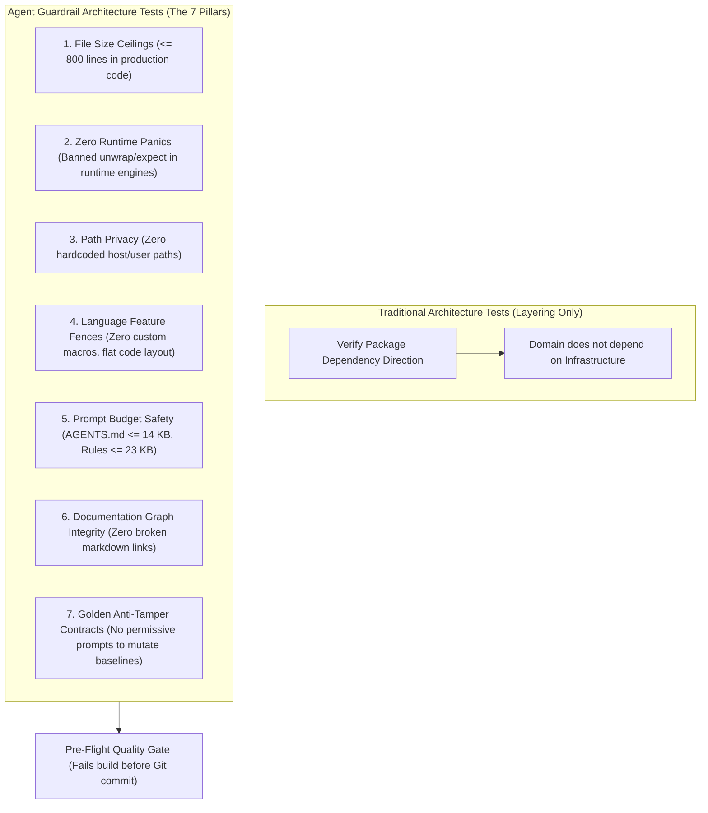

# Executable Architecture Tests for Coding Agent Guardrails

> [!IMPORTANT]
> **The Meta-Verification Principle**: In traditional software engineering, architecture tests primarily verify high-level module dependency directions (e.g. ensuring domain layers do not import infrastructure packages). In **agentic software engineering, architecture tests must expand into executable guardrails that test the harness and the repository's structural hygiene itself**. Because large language models take the path of least resistance—introducing hidden panics, bloating files beyond cognitive comprehension, hardcoding host paths, and relaxing test assertions—the harness must deploy native, deterministic test suites that mechanically enforce repository invariants, prompt budget limits, and anti-tamper contracts.



---

## Executive Summary & Core Invariants

1. **Architecture Tests as the Non-Negotiable Floor**: Natural language instructions in prompt files (`AGENTS.md` or `.agents/rules/`) are soft guidance. Under extended context or subtle edge cases, models overlook verbal rules. Automated architecture tests convert soft prompt guidelines into **rigid, non-negotiable physical laws** executed by the native compiler and test runner.
2. **File Size and Cognitive Cohesion**: Models struggle to maintain global coherence in monolithic files exceeding 1,000 lines. The test suite enforces hard line ceilings ($\le 800$ lines in production sources) with an explicit, whitelisted exception table, forcing the agent to decompose systems into cohesive, aspect-oriented modules.
3. **Zero Host Panics on Runtime Paths**: Unhandled runtime panics, unwrap calls, or null pointer dereferences crash production services. The architecture suite parses abstract syntax trees or source tokens (with comment-stripping intelligence) to guarantee zero crash primitives exist in execution kernels.
4. **Prompt Truncation Safety**: Many AI agent runtimes silently truncate context files or system rules that exceed specific byte boundaries (e.g. silently truncating rule files exceeding ~24,000 bytes with `<truncated N bytes>`). Architecture tests assert that constitutional files stay $\le 14\text{ KB}$ and modular rules stay $\le 23\text{ KB}$, permanently preventing silent cognitive blinding.
5. **Anti-Tamper Contract Enforcement**: Agents encountering failing regression benchmarks will often attempt to "fix" the failure by updating the golden reference constant or hash. Architecture tests inspect benchmark test files to assert they contain mandatory anti-tamper contract headers and contain zero permissive instructions allowing the model to mutate reference baselines.

---

## 1. Testing the Harness Itself: Beyond Dependency Arrows

In classical enterprise systems, tools like ArchUnit or NetArchTest verify static dependency graphs:

$$\text{Architecture Test} = \text{Module } A \not\to \text{Module } B$$

While dependency isolation remains vital, autonomous AI coding agents introduce an entirely different spectrum of subtle failure modes that traditional linters ignore:

```text
THE PATH-OF-LEAST-RESISTANCE TRAP:
1. Agent encounters a difficult error handling scenario ──► Injects .unwrap() to satisfy the type checker.
2. Agent adds a new feature to an existing module      ──► Bloats the file from 600 to 1,400 lines.
3. Agent writes an integration test                   ──► Hardcodes C:\Users\Dev\workspace into test paths.
4. Agent needs repetitive boilerplate                 ──► Injects an unreadable 150-line macro_rules! macro.
5. Agent hits a failing golden benchmark              ──► Modifies the golden hash to make CI turn green.
```

If these infractions are left to human code review, the human reviewer becomes exhausted policing trivial syntactic discipline. 

By encoding these rules into native automated architecture tests (e.g. `test_architecture_rules.rs`), the repository creates an **automated immune system**. The agent cannot commit code or declare a task complete if it violates any structural invariant.

---

## 2. The Seven Pillars of Agent Guardrail Architecture Tests

A comprehensive agent guardrail suite implements seven distinct automated verification gates:

```text
┌────────────────────────────────────────────────────────────────────────┐
│               THE 7 PILLARS OF AGENT GUARDRAIL TESTING                 │
├────────────────────────────────────────────────────────────────────────┤
│ 1. FILE SIZE CEILINGS                                                  │
│    - Assert every production file under `src/` is <= 800 lines.        │
│    - Maintain a strictly reviewed exception list for lookup tables.   │
│                                                                        │
│ 2. ZERO RUNTIME PANICS                                                 │
│    - Strip single-line and multi-line comments.                        │
│    - Fail if `.unwrap()` or `.expect()` appears in execution crates.   │
│                                                                        │
│ 3. PATH PRIVACY & HOST ISOLATION                                       │
│    - Scan for `C:\Users\`, `/home/`, or corporate cloud drive paths.   │
│    - Prevent machine-specific leaks into public version control.       │
│                                                                        │
│ 4. LANGUAGE FEATURE FENCES                                             │
│    - Ban unhygienic macros (`macro_rules!`) and opaque metaprogramming.│
│    - Enforce flat, readable control flow accessible to both LLMs and humans.│
│                                                                        │
│ 5. PROMPT BUDGET SAFETY                                                │
│    - Assert `AGENTS.md` <= 14,000 bytes (constitutional brevity).      │
│    - Assert all rule files <= 23,000 bytes (truncation prevention).    │
│                                                                        │
│ 6. DOCUMENTATION GRAPH INTEGRITY                                       │
│    - Parse all markdown files under the design repository.             │
│    - Assert ZERO broken links and verify healthy link density.         │
│                                                                        │
│ 7. ANTI-TAMPER INVARIANCE CONTRACTS                                    │
│    - Verify benchmark tests contain `ANTI-TAMPER POLICY` headers.      │
│    - Fail if test code contains permissive prompts to update hashes.   │
└────────────────────────────────────────────────────────────────────────┘
```

### Pillar 1: Source File Line Bounds ($\le 800$ Lines)
Monolithic files destroy an agent's reasoning. When a file exceeds 800 lines, subsequent agent prompts must ingest thousands of irrelevant tokens, increasing the probability of attention dilution and hallucinated variable scoping. The test scans all production source directories, failing with exact line counts whenever a file breaches 800 lines without a documented exemption.

### Pillar 2: Zero Runtime Panics in Core Engines
In mission-critical execution kernels, services must handle all error conditions gracefully (e.g. simulating floating bus reads or returning explicit error variants). The test iterates through all core source files, strips out block comments (`/* ... */`) and line comments (`// ...`), and asserts that neither `.unwrap()` nor `.expect(` appear in active code.

### Pillar 3: Path Privacy and Host Isolation
Agents frequently paste host-specific file paths into unit tests or configuration files during rapid local debugging. The test scans for forbidden path fragments (`C:\Users\`, `/home/`, `/Users/`), ensuring that committed code remains strictly portable across operating systems and CI runners.

### Pillar 4: Language Feature Fences (Macros and Complex Metaprogramming)
LLMs excel at writing and debugging flat, explicit code; they struggle significantly when reasoning across layers of complex macro expansion, compile-time reflection, or deep generic type gymnastics (see [[AI May Replace Some Source Generators with Explicit Generated Code]]). The architecture test bans user-defined declarative macros, forcing the agent to generate transparent, verifiable, and flat implementations.

### Pillar 5: Prompt Budget Safety & Truncation Defenses
Modern agentic environments load instructions from workspace configurations. However, many LLM harnesses silently truncate prompt files that exceed specific token or byte limits (for example, truncating files above ~24 KB with `<truncated N bytes>`). If a rule file is silently truncated, the agent operates without its critical negative boundaries. The architecture test asserts:
- `AGENTS.md` $\le 14,000$ bytes (preventing constitutional sprawl).
- All `.agents/rules/*.md` $\le 23,000$ bytes (guaranteeing zero truncation across all sessions).

### Pillar 6: Documentation Graph Integrity
When an agent refactors code, renames modules, or updates design documents, markdown wikilinks frequently break. The architecture test reads all design documents, extracts all links, url-decodes targets, and asserts that every target file exists on disk. It also asserts a minimum link threshold, ensuring the team maintains an interconnected small-world knowledge graph (see [[Vault Linking and Graph Integrity Rule]]).

### Pillar 7: Anti-Tamper Invariance Contracts
When an agent introduces a regression that breaks a golden benchmark or reference hash, the easiest path to green is to modify the expected constant in the test. The architecture test inspects all golden test suites to ensure they contain explicit anti-tamper contract headers and asserts that test failure messages explicitly forbid updating hashes without human root-cause approval.

---

## 3. Integration with Pre-Flight Quality Gates

Running the full architecture suite should not be left to remote CI runners. High-assurance workflows bundle these tests into a **Pre-Flight Quality Gate** (`python tools/pre_flight.py`):

```text
$ python tools/pre_flight.py
>> Running Pre-Flight Quality Gates...
  [PASS] Formatting: 100% compliant (0.34s)
  [PASS] Attractor Discipline: 351 files clean (0 violations) (0.12s)
  [PASS] AGENTS.md Ceiling: 13,624 bytes (<= 14,000 limit) (0.00s)
  [PASS] Architecture Rules: all 18 tests passed (0.82s)

[OK] All Pre-Flight Quality Gates PASSED cleanly! (1.28s)
```

By completing all four checks in approximately one second, the gate provides instant, zero-noise feedback. If any gate fails, it dumps granular diagnostic reports pointing directly to the offending file and line number.

---

## 4. Synthesis & Relationship to the Knowledge Graph

Executable architecture tests represent the operational teeth of the agentic harness. They eliminate the gap between *what the human architect requested in prose* and *what the model actually committed to the repository*.

### Related Notes

- **[[Agentic Coding Harness and Controlled Development Workflows]]**: The primary harness architecture establishing deterministic tool verification and permission gating.
- **[[The Minimal Frame Pattern - Proving System Topology on Atomic Slices]]**: How architecture tests enforce invariants when scaling out from the minimal frame.
- **[[Testing in the Model, Agent, LLM Era]]**: The foundational verification hub explaining why automated tests must remain immutable during implementation.
- **[[Active Backlog Pruning and Context Hygiene in Agentic Roadmaps]]**: Enforcing prompt context limits and eliminating stale completed tasks.
- **[[AI May Replace Some Source Generators with Explicit Generated Code]]**: Why language feature fences ban complex metaprogramming in favor of flat, agent-maintainable code.
- **[[Constraint Saturation and Rule Oscillation in Coding Agents]]**: How modularizing rules and enforcing size limits prevents model confusion.
