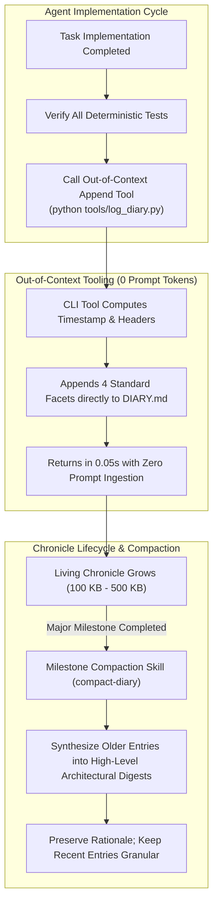

# The Living Engineering Chronicle - Context-Safe Logging, Evolution, and Compaction

> [!IMPORTANT]
> **The Narrative Persistence Invariant**: In long-horizon agentic software projects, **relying solely on Git commit messages or static Architecture Decision Records (ADRs) results in catastrophic amnesia**. When commits are squashed, batched, or rebased, the evolutionary technical rationale is permanently destroyed. A high-assurance agent harness maintains a **Living Engineering Chronicle (`DIARY.md`)**—an append-only, chronological narrative recording every code modification. Crucially, to prevent prompt context bloat as the chronicle grows to hundreds of kilobytes, the harness uses **Out-of-Context Append Tooling**: dedicated CLI scripts append structured entries in milliseconds without ever reading the massive chronicle into the model's working prompt context.



---

## Executive Summary & Core Invariants

1. **The Rationale Evaporation Problem**: Git commit messages in agentic workflows are frequently squashed or batched, while static ADRs only capture high-level initial intentions. The concrete day-to-day reality—subtle edge cases discovered, unexpected library bugs bypassed, and exact test suites executed—evaporates unless recorded systematically.
2. **The Four-Facet Narrative Contract**: Every entry in the chronicle must systematically record four mandatory facets:
   - **Affected Subsystems**: Crates, modules, rules, or schemas modified.
   - **What Was Changed (The Concrete Reality)**: Specific algorithms, data structures, and mechanics altered.
   - **Why It Was Done & Architectural Rationale**: Problem statement, user directives, and trade-offs.
   - **Verification & Test Results**: Concrete test suites executed, cycle counts verified, and pass/fail outputs.
3. **Out-of-Context Append Tooling**: As an engineering chronicle expands across a multi-month project, it reaches hundreds of kilobytes (e.g., 400 KB+). **Never allow an agent to read the entire chronicle into its context window merely to append a log entry**. Specialized deterministic CLI tools must append entries directly to disk in milliseconds with zero prompt token overhead.
4. **Milestone Compaction Protocol**: To prevent the chronicle from becoming unwieldy for human review, the harness invokes a dedicated compaction skill upon reaching major roadmap milestones. Older chronological entries are synthesized into concise architectural summaries, preserving evolutionary rationale while maintaining granular detail for the most recent milestone.
5. **Decoupling Historical Record from Active Backlog**: By pairing the Living Engineering Chronicle with [[Active Backlog Pruning and Context Hygiene in Agentic Roadmaps|Active Backlog Pruning]], the repository achieves pristine context hygiene: the active roadmap stays tiny and focused on upcoming work, while the chronicle preserves rich institutional memory.

---

## 1. Why Git Commits and Static ADRs Fall Short

In AI-driven pair programming, the velocity of change is unprecedented. An agent can execute ten architectural refactorings in a single afternoon. Under this tempo, conventional documentation mechanisms break down:

```text
CONVENTIONAL DOCUMENTATION FAILURE IN AGENT WORKFLOWS:
1. Git Commit Messages:
   - Often batched or squashed during pull requests.
   - Lack space for detailed trade-off discussions or test execution outputs.
   - Difficult for fresh agent sessions to query coherently across branches.

2. Static Architecture Decision Records (ADRs):
   - Capture idealized initial intent before implementation begins.
   - Rarely updated when low-level silicon or memory quirks force pragmatic pivots.
   - Disconnected from the concrete diffs and verified benchmark numbers.
```

The Living Engineering Chronicle bridges this gap. It serves as an unvarnished, chronological ship's log:
- When a developer asks three weeks later, *"Why did we choose a flat lookup table over binary search in this dispatch kernel?"*, the answer is not buried in git reflog; it is documented under that day's timestamp with the exact cache benchmark numbers that justified the trade-off.
- When an agent is onboarded to an unfamiliar subsystem, reading a compacted digest of recent chronicle entries provides instant semantic alignment without having to reverse-engineer intent from raw source code.

---

## 2. The Four-Facet Narrative Contract

To ensure consistent high-signal value across all entries, the harness enforces a strict four-facet schema:

```markdown
### [YYYY-MM-DD HH:MM TZ] — Title of Modification
- **Affected Subsystems**:
  - `kernel/dispatch/`, `bus/arbitration/`, `rules/memory-model.md`
- **What Was Changed (The Concrete Reality)**:
  - Replaced dynamic heap buffer in event queue with a fixed 256-element circular ring buffer.
  - Implemented monotonic cycle counter progression across micro-step sub-phases.
  - Updated interrupt priority encoder to evaluate lines on phase 2 rather than instantaneously.
- **Why It Was Done & Architectural Rationale**:
  - *Root Cause:* Under high-throughput workloads, dynamic allocations triggered memory allocator lock contention, causing 15% frame drops.
  - *Trade-off:* Fixed-size ring buffer caps maximum in-flight interrupts to 256, but guarantees $O(1)$ zero-allocation deterministic latency.
- **Verification & Test Results**:
  - `cargo test -p kernel --test test_event_queue`: Passed (42/42 tests).
  - `cargo test -p system --test test_bus_contention`: All 18 cycles matched silicon baseline.
  - Architecture gate: Zero dynamic allocations confirmed in hot path.
```

This four-part structure guarantees that every entry answers **Where**, **What**, **Why**, and **Proof of Truth**.

---

## 3. The Out-of-Context Tooling Pattern

The most severe trap when implementing a living chronicle is prompt context bloat:

> [!CAUTION]
> **The 400 KB Ingestion Trap**: If an agent is instructed to *"add a log entry to DIARY.md"*, the default behavior of many agent harnesses is to read the entire file into context first. If `DIARY.md` is 400 KB (approx. 100,000 tokens), a simple 20-line log entry consumes the agent's entire context budget, costs dollars in token fees, and causes immediate memory degradation.

To eliminate this overhead, high-assurance harnesses deploy **Out-of-Context Append Tooling**:

```text
┌────────────────────────────────────────────────────────────────────────┐
│                   OUT-OF-CONTEXT APPEND ARCHITECTURE                   │
├────────────────────────────────────────────────────────────────────────┤
│ 1. Agent Finishes Task & Verifies Tests                                │
│                         │                                              │
│                         ▼                                              │
│ 2. Agent Executes Deterministic CLI Command:                           │
│    python tools/log_diary.py \                                         │
│      --title "Fix Bus Arbitration Race Condition" \                    │
│      --subsystems "kernel/bus/, scheduler/" \                          │
│      --changes "Added phase-latching; aligned wait-states" \           │
│      --rationale "Prevented CPU prefetch starvation during DMA burst" \│
│      --results "All 18 architecture tests passed cleanly"              │
│                         │                                              │
│                         ▼                                              │
│ 3. Script Formats Entry, Computes Timestamp, Appends to DIARY.md       │
│    - Execution Time: 0.05 seconds                                      │
│    - Prompt Tokens Consumed: ZERO                                      │
└────────────────────────────────────────────────────────────────────────┘
```

The script formats the entry, validates that all four mandatory sections are present, appends it cleanly to the end of the file on disk, and returns a 1-line success confirmation. The agent never ingests the historical document.

---

## 4. The Milestone Compaction Protocol

While out-of-context tooling protects prompt budgets during day-to-day work, an unbounded chronicle eventually becomes cumbersome for human engineers to review.

To resolve this, the harness implements **Milestone Compaction**:

```text
CHRONICLE BEFORE COMPACTION (400 KB):
├── Milestone 1: 85 Granular Daily Entries (150 KB)  <-- Old history
├── Milestone 2: 92 Granular Daily Entries (170 KB)  <-- Old history
└── Milestone 3: 45 Granular Daily Entries (80 KB)   <-- Active Milestone

                     │
                     ▼ (Invoke compact-diary skill upon Milestone 3 Completion)
                     │
CHRONICLE AFTER COMPACTION (180 KB):
├── Milestone 1: High-Level Architectural Digest (15 KB summary of key decisions)
├── Milestone 2: High-Level Architectural Digest (20 KB summary of key decisions)
├── Milestone 3: High-Level Architectural Digest (25 KB summary of key decisions)
└── Milestone 4: Granular Daily Entries (Active pending milestone)
```

### Compaction Principles
1. **Preserve Evolutionary Rationale**: Compaction does not delete history; it synthesizes it. Crucial technical decisions, rejected architectural alternatives, and verified performance baselines are preserved in concise digests.
2. **Protect Recent Granularity**: The currently active milestone and the immediately preceding milestone are always retained in full granular detail. Only older, settled historical phases are compacted.
3. **Execution as a Dedicated Skill**: Compaction is performed as an explicit maintenance task (e.g. `compact-diary` skill) using a fresh agent session with clean context, ensuring that summarization is faithful and zero technical nuance is lost.

---

## 5. Synthesis & Relationship to the Knowledge Graph

The Living Engineering Chronicle provides the persistent episodic memory that large language models inherently lack. Coupled with automated append tooling and milestone compaction, it gives engineering teams a complete, searchable record of architectural evolution without ever burdening active prompt contexts.

### Related Notes

- **[[Active Backlog Pruning and Context Hygiene in Agentic Roadmaps]]**: The companion pattern detailing how active roadmap files are pruned while historical narrative is preserved here.
- **[[Agentic Coding Harness and Controlled Development Workflows]]**: How the living chronicle fits into the overarching repository harness alongside rules and skills.
- **[[The Conductor Pattern - Cognitive Ergonomics of High-Bandwidth Agentic Engineering]]**: How the human conductor uses the chronicle to maintain architectural continuity across dozens of agent sessions.
- **[[In-Flight Documentation as the Primary Framework for Coding Agents]]**: Generating operational documentation during implementation rather than as an afterthought.
- **[[Learning Coding Agents Through Failure-Driven Instructions]]**: How recurring friction captured in diary rationales is crystallized into permanent repository rules.
- **[[LLM Agents and Institutional Memory]]**: The broader organizational challenge of preserving technical knowledge across ephemeral AI-driven engineering sessions.
