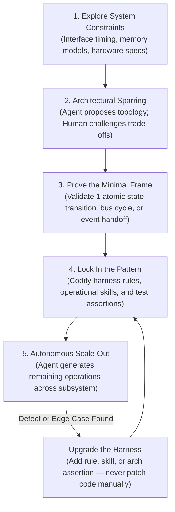

# The Minimal Frame Pattern - Proving System Topology on Atomic Slices

> [!IMPORTANT]
> **The Minimal Frame Axiom**: When engineering complex, stateful, or high-concurrency systems with AI coding agents, **unleashing a model on an entire subsystem from a large prompt guarantees architectural collapse**. The model will synthesize dozens of plausible files that compile cleanly yet fail catastrophically under continuous execution. High-assurance agentic engineering requires the **Minimal Frame**: proving system boundaries, bus arbitration, state transitions, and memory ownership on the absolute smallest working operational slice (a single execution step, a single clock phase, or a single message contention handoff) before scaling out.



---

## Executive Summary & Core Invariants

1. **The Scale-Out Fallacy**: Large language models cannot reliably synthesize interconnected multi-component subsystems from an open-ended requirements document. When asked to "implement the co-processor pipeline and memory bus arbiter," the agent invents non-standard abstractions, circular reference handles, and broken timing assumptions across twenty files at once.
2. **The Atomic Slice as Proof of Concept**: The system topology must first be proven on the smallest indivisible unit of mechanical interaction—the **Minimal Frame**. Whether simulating an execution kernel, a distributed consensus step, or an asynchronous event broker, the minimal frame establishes the shared memory layout, non-blocking state progression, and error signaling on a single operational primitive.
3. **Locking the Pattern Before Delegation**: Once the minimal frame passes deterministic tests, the human architect locks the interface contracts, data layout, and transition rules into repository guidelines (`.agents/rules/`) and reusable skills (`.agents/skills/`). The agent is never permitted to improvise high-level structural patterns during scale-out.
4. **Upgrade the Harness, Never Patch the Code**: When an agent errs or takes an unidiomatic shortcut during horizontal scale-out, the human must resist the urge to manually patch lines in the IDE. Every manual edit is a wasted learning opportunity. The architect diagnoses the missing invariant, updates the harness rules or automated architectural tests, and commands the agent to re-execute against the hardened constraint.
5. **Separation of Architectural Sparring from Mass Production**: System engineering splits cleanly into two modes: a collaborative dialogue where human and agent spar over system topology on the minimal frame, followed by high-throughput autonomous delegation where the agent implements the remaining dozens of sibling operations under frozen test oracles.

---

## 1. The Collapse of Full-Subsystem Delegation

In conventional enterprise software, developers often delegate entire features using broad vertical slices (e.g., from an HTTP route down through service interfaces to a database table; see [[Developing Features with AI Coding Agents]]).

However, when building complex, stateful backbones—such as **cycle-exact simulation engines, low-latency trading kernels, custom database storage layers, or operating system kernels**—broad vertical delegation fails completely:

```text
CONVENTIONAL PROMPT DELEGATION COLLAPSE:
[Vague Subsystem Prompt] ──► Agent synthesizes 25 files simultaneously
                                   │
                                   ▼
          ┌─────────────────────────────────────────────────┐
          │ Hidden Circular Pointer Handles (Memory Leaks)   │
          │ Uncontrolled Heap Allocations in Hot Paths       │
          │ Inconsistent Clock / Micro-Step State Machines   │
          │ Desynchronized Event Ordering & Bus Contention   │
          └─────────────────────────────────────────────────┘
                                   │
                                   ▼
Result: Code compiles cleanly, passes 3 trivial unit tests,
        yet deadlocks and thrashes under real-world workloads.
```

In these environments, architectural integrity depends entirely on subtle physical laws:
- How memory access wait-states stall the processing unit without advancing instruction micro-steps.
- How decoupled functional units communicate without circular handles or runtime locking overhead.
- How execution pipelines handle branch mispredictions or asynchronous interrupts.

If an agent hallucinates the foundation across twenty files, untangling the resulting mess takes days. The solution is to restrict the agent's generative perimeter to an atomic slice.

---

## 2. Anatomy of a Minimal Frame

A **Minimal Frame** is the smallest cohesive slice of a system that exercises the entire operational lifecycle:

```text
┌────────────────────────────────────────────────────────────────────────┐
│                        THE MINIMAL FRAME SLICE                         │
├────────────────────────────────────────────────────────────────────────┤
│ 1. ONE ATOMIC OPERATION:                                               │
│    A single arithmetic instruction, one queue transition, or one       │
│    network packet handshake.                                           │
│                                                                        │
│ 2. COMPLETE TOPOLOGICAL PATH:                                          │
│    - Clock progression: micro-step advancement across sub-phases.      │
│    - Resource arbitration: memory bus lock, contention, wait-states.   │
│    - State snapshotting: clean state serialization without heap churn. │
│    - Status flags: zero-overhead condition code register updates.      │
│                                                                        │
│ 3. ZERO EXTRA ABSTRACTIONS:                                            │
│    - No custom macros hiding control flow.                             │
│    - Flat file organization with strict ownership semantics.           │
│    - Contiguous array storage over fragmented heap allocations.        │
└────────────────────────────────────────────────────────────────────────┘
```

By proving the architecture on just **one operation**, the engineering team resolves all contentious architectural questions upfront:
- *Are functional units decoupled without circular reference pointers?*
- *Is the execution hot path completely free of dynamic heap allocations?*
- *Does the timing state machine progress cleanly across sub-clock boundaries?*
- *Can the system state be completely serialized and restored at any clock edge?*

---

## 3. The 5-Stage Minimal Frame Lifecycle

High-assurance systems progress through a strict five-stage lifecycle:

```text
┌────────────────────────────────────────────────────────────────────────┐
│                    THE 5-STAGE MINIMAL FRAME WORKFLOW                  │
├────────────────────────────────────────────────────────────────────────┤
│ Stage 1: Constraint Exploration                                        │
│ - Parse official specifications, hardware manuals, and protocol docs.  │
│ - Map physical timing, memory layout, and bus priority rules.          │
│                                                                        │
│ Stage 2: Architectural Sparring & Boundary Design                      │
│ - Human architect and agent debate ownership topology.                 │
│ - Challenge abstractions: ban shared mutable state and runtime locks.  │
│                                                                        │
│ Stage 3: Proving the Minimal Frame                                     │
│ - Implement exactly ONE operation (e.g. one ALU instruction).          │
│ - Validate against external ground truth (hardware test vectors).      │
│                                                                        │
│ Stage 4: Locking Invariants into Rules & Skills                        │
│ - Codify the discovered micro-step sequence into `.agents/rules/`.     │
│ - Package the implementation recipe into an executable agent skill.    │
│ - Add automated architectural assertions (file limits, zero panics).   │
│                                                                        │
│ Stage 5: Autonomous Scale-Out                                          │
│ - Agent scales implementation across remaining 50-100 operations.      │
│ - Zero architectural drifting: agent strictly follows frozen recipe.   │
└────────────────────────────────────────────────────────────────────────┘
```

### Stage 1: Constraint Exploration
Before writing code, the agent inspects authoritative documentation (using local vector retrieval over system reference manuals and AST dependency graphs; see [[Retrieval-Augmented Generation and Context Architecture|context retrieval mechanisms]]). The focus is uncovering hard non-negotiable boundaries: endianness conversions, bus cycle timing, and hardware exception vectors.

### Stage 2: Architectural Sparring
The human acts as the sparring partner, challenging early agent designs:
- *Why use runtime dynamic dispatch when a static match table eliminates cache misses?*
- *Why pass references across subsystems when a centralized machine loop can arbitrate bus ownership cleanly?*

### Stage 3: Proving the Minimal Frame
The agent writes the implementation for a single primitive. For example, in an execution kernel, this means implementing one single addition instruction, verifying its sub-phase micro-steps, memory operand fetching, status register mutations, and cycle count against verified external ground truth captures.

### Stage 4: Locking the Pattern
Once verified, the human extracts the structural blueprint:
- File naming conventions (e.g. strict 1:1 mapping of operations to flat source files).
- Inlining requirements (e.g. `#[inline(always)]` on leaf ALU routines, `#[inline(never)]` on cold exception traps).
- Memory invariants (zero dynamic allocations, zero panics).

### Stage 5: Autonomous Scale-Out
With the pattern locked, the agent is unleashed. Implementing the next fifty arithmetic or logical operations is no longer an open-ended design problem; it is an assembly-line execution task where the model stamps out sibling operations under strict automated test gates.

---

## 4. Minimal Frames vs. Enterprise Vertical Slices

It is critical to contrast the Minimal Frame with traditional enterprise vertical slices:

| Dimension | Enterprise Vertical Slice | Minimal Operational Frame |
| :--- | :--- | :--- |
| **System Domain** | CRUD APIs, web services, business SaaS. | Simulation engines, high-performance kernels, state machines. |
| **Slice Direction** | **Vertical through architectural layers** (HTTP $\rightarrow$ Service $\rightarrow$ ORM $\rightarrow$ DB). | **Atomic through operational time** (Clock Phase 1 $\rightarrow$ Phase 2 $\rightarrow$ Bus Arbitration $\rightarrow$ State Commit). |
| **Core Risk Addressed** | Missing business logic, misaligned API contracts. | Memory contention, pipeline stalls, circular handles, state desynchronization. |
| **Verification Basis** | Mocked unit tests and synthetic database fixtures. | External ground-truth captures and hardware execution vectors. |
| **Primary Artifact** | DTOs, controllers, database migrations. | Micro-step state machines, contiguous memory buffers, cycle-exact buses. |

While enterprise slices validate business semantics across disparate application tiers, the Minimal Frame validates **mechanical execution reality** at the lowest level of system physics.

---

## 5. "Upgrade the Harness, Never Touch the Code"

The defining operational principle of the Minimal Frame methodology is the strict refusal to manually patch code:

> [!CAUTION]
> **The Seduction of Manual Editing**: When an agent introduces an unidiomatic helper, misplaces a file, or forgets an endianness conversion, the developer's immediate instinct is to open the IDE and fix the lines manually. **This guarantees that the agent will repeat the identical mistake across the remaining forty operations.**

Instead, the human enforces an immune-system response:
1. **Identify the Missing Invariant**: Why did the agent deviate? Was there an unstated line-count limit? Was there an ambiguous naming rule?
2. **Update the Harness**:
   - Add a concrete rule to `.agents/rules/` (e.g., forbidding nested subdirectories).
   - Add an automated architecture test to the test suite (e.g., asserting that no file exceeds 800 lines, or that `.unwrap()` is banned).
   - Refine the operational recipe in `.agents/skills/`.
3. **Command Re-execution**: Direct the agent to read the updated rule and re-synthesize the solution.

When the harness is upgraded, the entire repository is permanently immunized against that class of defect.

---

## 6. Synthesis & Relationship to the Knowledge Graph

The Minimal Frame Pattern represents the bridge between high-level architectural design and autonomous agent execution. It converts open-ended, high-risk coding into a deterministic, two-phase progression: high-leverage human sparring on the atomic core, followed by machine-speed scale-out across the perimeter.

### Related Notes

- **[[Developing Features with AI Coding Agents]]**: Explains how vertical slices apply to enterprise business domains, providing the high-level contrast to minimal operational frames.
- **[[How AI Changes Prototyping and the Path from PoC to Production]]**: Explores disposable exploratory probes, demonstrating why proving the minimal frame avoids permanent prototype debt.
- **[[The Conductor Pattern - Cognitive Ergonomics of High-Bandwidth Agentic Engineering]]**: The operational psychology of the architect acting as constraint setter and sparring partner rather than a mechanical typist.
- **[[Testing in the Model, Agent, LLM Era]]**: How external ground truth oracles and frozen test harnesses anchor the minimal frame to physical reality.
- **[[Agentic Coding Harness and Controlled Development Workflows]]**: The systemic runtime infrastructure required to enforce automated guardrails and self-healing loops.
- **[[In-Flight Documentation as the Primary Framework for Coding Agents]]**: How specifications are discovered and crystallized during the minimal frame rather than drafted in a vacuum.
