# Active Backlog Pruning and Context Hygiene in Agentic Roadmaps

In human agile workflows, project boards routinely keep completed tickets around with strikethroughs, checkmarks, or `[COMPLETED]` tags so managers can track sprint velocity. When building with autonomous coding agents, bringing that same habit into active roadmap files degrades model performance. 

LLMs do not have persistent memory between sessions; they rebuild their operating context from scratch based on the prompt and repository files provided at the start of each turn. Every completed task, superseded interface specification, and obsolete technical constraint left inside an active roadmap consumes finite context window space and dilutes model attention. 

A production-grade agent harness enforces **Active Backlog Pruning (Zero Retention)**: the moment a milestone step passes verification, it is deleted from the active backlog. The project's historical evolution is offloaded to an append-only engineering chronicle and Git commit history, keeping active planning files lean, unambiguous, and focused entirely on pending execution.

```mermaid
flowchart TD
    subgraph StaleBacklog["The Retained Backlog Anti-Pattern (Context Bloat & Attention Drift)"]
        A1["Task 1 [COMPLETED: 120 lines of detail]"] --> A2["Task 2 [COMPLETED: 85 lines of detail]"]
        A2 --> A3["Task 3 [COMPLETED: 150 lines of detail]"]
        A3 --> A4["Task 4 [ACTIVE: Next pending work]"]
        A4 -.-> A5["Outcome: 80% of prompt context consumed by dead history.<br/>Model introduces stale APIs and obsolete constraints into new code."]
    end

    subgraph ActivePruning["Active Backlog Pruning (Zero-Retention Pattern)"]
        B1["1. Verify Step N<br/>(Pass all unit, integration, and architecture gates)"] --> B2["2. Log to Chronicle<br/>(Record technical rationale & touched files in DIARY.md)"]
        B2 --> B3["3. Delete Step N from ROADMAP.md<br/>(Completely remove completed task blocks)"]
        B3 --> B4["4. Update Baseline Summary<br/>(Add 1-line verified capability to Section 1)"]
        B4 --> B5["5. Renumber Remaining Steps<br/>(Contiguous sequence: next work is always Step 1)"]
    end
```



---

## Core Operating Rules for Agent Backlogs

1. **Active Roadmaps Are Execution Flight Plans, Not Archives**: Files representing upcoming work (such as `ROADMAP.md` or `PLAN.md`) serve strictly as operational flight plans for upcoming agent turns. They are not burndown charts, release notes, or sprint archives.
2. **Zero Retention of Completed Items**: Completed tasks, sub-steps, and verbose implementation specs must be deleted from the active backlog section as soon as they pass verification gates. Keeping `[COMPLETED]` tags or strikethrough text wastes token budget and directly splits model focus.
3. **Strict Separation of Concerns**: Historical narratives, modified file manifests, design trade-offs, and verification logs belong exclusively in a dedicated engineering chronicle (`DIARY.md`) and Git commit history. The active roadmap contains only **pending** and **in-progress** milestones.
4. **Contiguous Step Renumbering**: When a step is deleted, the remaining items are immediately renumbered into a clean, sequential order ($1, 2, 3\dots$). This prevents the model from getting confused by missing numbers or inferring phantom dependencies.
5. **High-Level Baseline Synchronization**: When an entire architectural milestone or subsystem finishes, that verified capability is summarized in a single concise bullet under a "Baseline Deliverables" section at the top of the roadmap. This keeps the total context overhead of established capabilities under 20 lines while ensuring the model knows what is already built.

---

## 1. How Completed Tasks Poison Context Windows

Transformer models compute self-attention across every token in their context window. When an agent repository maintains a monolithic roadmap that accumulates completed tasks across multiple iterations, it triggers three distinct failure modes:

```text
COMPLETED BACKLOG POISONING:
Turn 1:  ROADMAP.md has 10 pending steps (2,000 tokens) ──► Sharp attention allocation
Turn 10: ROADMAP.md has 5 completed steps (6,000 tokens) ──► Early attention dispersion
Turn 30: ROADMAP.md has 25 completed steps (25,000 tokens)──► Severe prompt bloat & drift
                                                              │
                                                              ▼
               ┌─────────────────────────────────────────────────────────┐
               │ - Model confuses old refactoring tasks with new goals.  │
               │ - Model revives superseded APIs or temporary shims.     │
               │ - Model wastes output tokens summarizing past work.     │
               │ - Critical negative boundaries get pushed out of focus. │
               └─────────────────────────────────────────────────────────┘
```

### Attention Dispersion and Retrieval Degradation
As a prompt swells with hundreds of lines of dead tasks, the attention mechanism distributes weights across obsolete implementation details rather than focusing sharply on the active task's acceptance criteria. In long-horizon sessions, soft-max attention distributions flatten, making it harder for the model to isolate critical constraints buried under layers of historical text.

### Stale Pattern Mimicry (Ghost Code)
LLMs are pattern-matching engines. If an agent reads completed task descriptions explaining how temporary shims, mocks, or throwaway adapters were wired five steps ago, it will often pull those superseded patterns back into current code. This causes silent regressions where recently refactored or deleted interfaces are reintroduced because the model saw them documented as "valid work" earlier in the same prompt.

### Latency and Token Overhead
Streaming 20,000 to 40,000 tokens of dead backlog history on every single turn adds unnecessary API cost and introduces multi-second delays into time-to-first-token (TTFT). Across a multi-step coding workflow involving dozens of tool calls, this overhead adds up quickly.

---

## 2. Implementing the Zero-Retention Pattern

To keep context clean, the development harness must mandate **Zero Retention**:

> Strikethrough text (`~~Step 2: Completed on Sept 14~~`) and `[COMPLETED]` headers are anti-patterns. Markdown formatting does not prevent a transformer from parsing those tokens. The model still attends to every character inside the strikethrough. If an instruction says `~~Use SQLite for local caching~~`, the tokens for `SQLite` and `caching` are still primed in the KV cache. If a task is verified and merged, **delete it completely from the active execution file**.

### The Five-Step Completion Protocol
When an agent finishes implementing a milestone step:

1. **Pass All Gates**: Run the full test suite—unit tests, integration suites, and automated architecture linters. Never modify the backlog until the code passes all automated checks.
2. **Commit Narrative to Chronicle**: Append the full technical story (what changed, design trade-offs, files touched, and test outputs) to the engineering chronicle (`DIARY.md`) using an out-of-context tool call or script.
3. **Prune the Active Section**: Open `ROADMAP.md` and excise the completed step's header, acceptance criteria, and implementation notes from Section 2 ("Remaining Milestones").
4. **Update Baseline Capabilities**: If the step completed a major architectural capability, add a one-sentence summary to Section 1 ("Verified Baseline Deliverables").
5. **Renumber the Sequence**: Re-index the remaining steps so the list is contiguous, ensuring the next active task is always Step 1.

---

## 3. Separation of Concerns: Roadmap vs. Chronicle vs. Git

A structured agent harness divides planning, narrative memory, and source control across three distinct tiers:

```text
┌────────────────────────────────────────────────────────────────────────┐
│               THE THREE-TIER HARNESS INFORMATION TOPOLOGY              │
├────────────────────────────────────────────────────────────────────────┤
│ 1. ACTIVE BACKLOG (ROADMAP.md)                                         │
│    - Purpose: Real-time execution plan for upcoming turns.             │
│    - Content: ONLY pending and in-progress steps.                      │
│    - Retention: Zero completed items. Sized strictly under 500 lines.  │
│                                                                        │
│ 2. LIVING ENGINEERING CHRONICLE (DIARY.md)                             │
│    - Purpose: Permanent narrative memory and evolutionary record.      │
│    - Content: Append-only chronological log of all technical changes.  │
│    - Access: Handled via CLI tools, NEVER read directly into context.  │
│                                                                        │
│ 3. VERSION CONTROL (Git Commit History)                                │
│    - Purpose: Ground-truth atomic code snapshots.                      │
│    - Content: Granular conventional commits linking code and tests.    │
└────────────────────────────────────────────────────────────────────────┘
```

| Dimension | Active Roadmap (`ROADMAP.md`) | Engineering Chronicle (`DIARY.md`) | Git Log |
| :--- | :--- | :--- | :--- |
| **Audience** | Agent active working context and human lead. | Human retrospectives, audits, and newly initialized agent sessions. | CI/CD runners, automated rollbacks, and diff review. |
| **Lifecycle** | Ephemeral, constantly pruned. | Permanent, append-only, periodically compacted. | Immutable cryptographic commit chain. |
| **Context Cost** | Kept minimal (typically under 3,000 tokens). | Zero prompt overhead during normal turns (updated via tooling). | Zero prompt overhead. |
| **Contents** | What must be built next and active boundaries. | Why architectural decisions were made and how they were tested. | Exact byte diffs, file trees, and commit metadata. |

---

## 4. Contiguous Renumbering and Prompt Alignment

When tasks are pruned dynamically, keeping numbers contiguous prevents synchronization issues between human instructions and model execution:

```markdown
<!-- INCORRECT: Retaining dead markers and leaving numbered gaps -->
### Section 2: Remaining Milestones
- Step 2.1: [COMPLETED] Set up bus router
- Step 2.2: [COMPLETED] Add arbitration logic
- Step 2.3: Active Bus Routing
- Step 2.5: Machine Reset (Step 2.4 was skipped during triage)
```

```markdown
<!-- CORRECT: Pruned cleanly with contiguous sequence -->
### Section 1: Verified Baseline Deliverables
- Subsystem Bus Routing & Hierarchical Chipset Integration (Verified across 114 tests).

### Section 2: Remaining Milestones
- Step 1: Host Audio Playback & Presentation Buffers
- Step 2: Host Input Subsystem & Game Controller Mapping
- Step 3: Silicon Test Suite Direct-Injection Harness
```

Under the contiguous model:
- The human operator can issue simple, deterministic instructions: *"Review ROADMAP.md and implement Step 1."*
- There is zero ambiguity about whether "Step 1" refers to historical work, a completed ticket, or active work.
- The model does not burn tokens reasoning about why Step 2.4 is missing or whether Step 2.1 needs to be re-run. Its attention remains entirely on the acceptance criteria of the pending milestone.

---

## 5. Automated Backlog Hygiene Enforcement

Backlog hygiene should not rely on the agent's discipline or manual human code review. It should be enforced directly through automated pre-flight checks and repository linters.

Below is an executable Python linter script that can run in CI or as a pre-commit hook to catch roadmap violations before an agent begins its coding cycle:

```python
#!/usr/bin/env python3
"""
validate_roadmap.py - Enforces Active Backlog Pruning and Context Hygiene.
Fails if ROADMAP.md contains completed task markers, invalid numbering, or exceeds size limits.
"""

import re
import sys
from pathlib import Path

ROADMAP_PATH = Path("ROADMAP.md")
MAX_LINES = 500
MAX_BYTES = 40 * 1024  # 40 KB ceiling

FORBIDDEN_PATTERNS = [
    (re.compile(r"\[x\]", re.IGNORECASE), "Completed checkbox '[x]' detected."),
    (re.compile(r"\[completed\]", re.IGNORECASE), "Completed tag '[COMPLETED]' detected."),
    (re.compile(r"\[done\]", re.IGNORECASE), "Completed tag '[DONE]' detected."),
    (re.compile(r"~~.+~~"), "Strikethrough text detected."),
]

STEP_PATTERN = re.compile(r"^-\s+Step\s+(\d+):", re.MULTILINE)

def validate_roadmap() -> None:
    if not ROADMAP_PATH.exists():
        print(f"Error: {ROADMAP_PATH} does not exist.", file=sys.stderr)
        sys.exit(1)

    content = ROADMAP_PATH.read_text(encoding="utf-8")
    lines = content.splitlines()

    # 1. Check size ceilings
    if len(lines) > MAX_LINES:
        print(
            f"Hygiene Violation: {ROADMAP_PATH} has {len(lines)} lines (max allowed: {MAX_LINES}). "
            "Prune completed milestones or decompose upcoming work.",
            file=sys.stderr,
        )
        sys.exit(1)

    byte_size = ROADMAP_PATH.stat().st_size
    if byte_size > MAX_BYTES:
        print(
            f"Hygiene Violation: {ROADMAP_PATH} size is {byte_size} bytes (max allowed: {MAX_BYTES}).",
            file=sys.stderr,
        )
        sys.exit(1)

    # 2. Check for completed marker anti-patterns in Section 2
    in_remaining_section = False
    for line_num, line in enumerate(lines, start=1):
        if "### Section 2" in line or "Remaining Milestones" in line:
            in_remaining_section = True
            continue

        if in_remaining_section:
            for pattern, message in FORBIDDEN_PATTERNS:
                if pattern.search(line):
                    print(
                        f"Hygiene Violation at {ROADMAP_PATH}:{line_num}: {message}\n"
                        f"  Line: '{line.strip()}'\n"
                        "  Action: Prune completed items and move narrative to DIARY.md.",
                        file=sys.stderr,
                    )
                    sys.exit(1)

    # 3. Check for contiguous step numbering
    step_numbers = [int(m.group(1)) for m in STEP_PATTERN.finditer(content)]
    if step_numbers:
        expected = list(range(1, len(step_numbers) + 1))
        if step_numbers != expected:
            print(
                f"Numbering Violation: Steps in {ROADMAP_PATH} are not contiguous.\n"
                f"  Found sequence:    {step_numbers}\n"
                f"  Expected sequence: {expected}\n"
                "  Action: Renumber remaining steps starting sequentially from Step 1.",
                file=sys.stderr,
            )
            sys.exit(1)

    print("ROADMAP.md context hygiene check passed.")

if __name__ == "__main__":
    validate_roadmap()
```

If an agent attempts to resolve a milestone by simply checking off a box (`- [x] Step 1: Initialize Bus`), this linter aborts the workflow immediately. The agent is forced to prune the text, log its findings to `DIARY.md`, renumber the pending steps, and present a clean roadmap for subsequent runs.

---

## 6. Synthesis & Relationship to the Knowledge Graph

Active Backlog Pruning is a core discipline of context engineering. In agentic development, **prompt context is a shared, finite working medium that degrades when cluttered with obsolete state**. By pruning completed items from active plans and routing historical records to dedicated chronicles, the harness keeps model attention sharp across long-running, multi-day engineering projects.

### Related Notes

- **[[Agentic Coding Harness and Controlled Development Workflows]]**: The broader harness framework detailing file responsibilities, state transitions, and execution loops.
- **[[The Living Engineering Chronicle - Context-Safe Logging, Evolution, and Compaction]]**: The companion pattern detailing where pruned historical narratives are preserved and how they are accessed without prompt bloat.
- **[[The Minimal Frame Pattern - Proving System Topology on Atomic Slices]]**: How decomposed roadmap steps are validated on atomic operational slices before scale-out.
- **[[Context Attractors and Recency Bias in Long-Horizon Agent Sessions]]**: Explains how stale text in prompts pollutes attention and degrades model decisions.
- **[[Executable Architecture Tests for Coding Agent Guardrails]]**: Automated test suites that enforce repository hygiene, line ceilings, and file rules.
- **[[How Context Narrows an AI's Solution Space]]**: Analysis of attention dilution and context bloat in large prompts.
