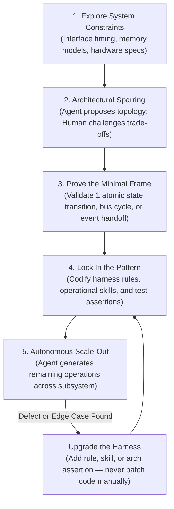

# The Minimal Frame Pattern: Proving System Topology on Atomic Slices

> **The Minimal Frame Principle**: If you prompt an AI coding agent to implement an entire stateful subsystem from a broad specification, the result looks deceptively complete. The model will generate dozens of files that compile cleanly, satisfy trivial mock tests, and then fail completely the moment you run them under sustained execution. Concurrency breaks, clock-step state machines drift, circular references leak memory, and bus arbitration deadlocks.
>
> High-assurance agentic engineering requires starting with a **Minimal Frame**: isolating the absolute smallest operational slice of the architecture—a single instruction cycle, one clock phase, or a single message contention handoff—and proving your memory ownership, interface boundaries, and state transitions there first before scaling horizontally.



---

## Architectural Ground Rules

1. **The Scale-Out Fallacy**: LLMs cannot reliably design and connect multi-component subsystems in a single generation pass. When prompted to "build the coprocessor pipeline and bus arbiter," an agent will invent non-standard abstractions, introduce hidden circular references, and botch timing assumptions across twenty files simultaneously.
2. **The Atomic Slice as Proof of Concept**: You have to prove system topology on the smallest indivisible unit of mechanical execution: the **Minimal Frame**. Whether you are building an instruction set emulator, a Raft consensus node, or an off-heap event broker, the minimal frame nails down memory layout, non-blocking state progression, and error signaling on a single operational primitive.
3. **Locking the Pattern Before Delegation**: Once the minimal frame passes deterministic tests, you lock its contracts, memory layout, and transition rules into your repository guidelines (`.agents/rules/`) and reusable agent skills (`.agents/skills/`). The agent must never improvise high-level structural patterns during scale-out.
4. **Upgrade the Harness, Never Patch the Code**: When an agent writes messy code or takes shortcuts during scale-out, do not open the file and clean it up yourself. Every manual fix is an uncaptured lesson. Diagnose the missing rule, update your linter or harness tests, and make the agent regenerate the code against that stricter constraint.
5. **Separation of Architectural Sparring from Mass Production**: System engineering splits cleanly into two phases: a high-context dialogue where human and agent spar over system topology on the minimal frame, followed by high-throughput autonomous delegation where the agent implements dozens of sibling operations under frozen test oracles.

---

## 1. The Collapse of Full-Subsystem Delegation

In line-of-business software, you can often delegate broad vertical slices to an agent—plumbing an HTTP endpoint down through a service layer into an ORM and out to a database table (see [[Developing Features with AI Coding Agents]]). The blast radius of an agent misunderstanding a boundary is small, and the runtime semantics are forgiving.

When you build complex, stateful backbones—like cycle-exact simulation engines, low-latency trading kernels, storage engines, or embedded OS kernels—broad vertical delegation breaks down completely:

```text
CONVENTIONAL PROMPT DELEGATION BREAKDOWN:
[Vague Subsystem Prompt] ──► Agent synthesizes 25 files simultaneously
                                   │
                                   ▼
          ┌─────────────────────────────────────────────────┐
          │ Hidden Circular Pointer Handles (Memory Leaks)   │
          │ Uncontrolled Heap Allocations in Hot Paths       │
          │ Inconsistent Clock / Micro-Step State Machines   │
          │ Desynchronized Event Ordering & Bus Contention   │
          └─────────────────────────────────────────────────┘
                                   │
                                   ▼
Result: Code compiles cleanly, passes 3 trivial unit tests,
        yet deadlocks and thrashes under real-world workloads.
```

In these environments, system integrity depends entirely on the low-level mechanics of execution:
- How memory wait-states stall the processing unit without advancing instruction micro-steps.
- How decoupled functional units communicate without circular handles or runtime locking overhead.
- How execution pipelines handle branch mispredictions or asynchronous interrupts.

If an agent hallucinates the architectural foundation across twenty interdependent files, untangling the resulting mess takes days. The fix is simple: restrict the agent's generative perimeter to an atomic slice.

---

## 2. Anatomy of a Minimal Frame

A **Minimal Frame** is the smallest cohesive slice of a system that exercises the entire operational lifecycle:

```text
┌────────────────────────────────────────────────────────────────────────┐
│                        THE MINIMAL FRAME SLICE                         │
├────────────────────────────────────────────────────────────────────────┤
│ 1. ONE ATOMIC OPERATION:                                               │
│    A single arithmetic instruction, one queue transition, or one       │
│    network packet handshake.                                           │
│                                                                        │
│ 2. COMPLETE TOPOLOGICAL PATH:                                          │
│    - Clock progression: micro-step advancement across sub-phases.      │
│    - Resource arbitration: memory bus lock, contention, wait-states.   │
│    - State snapshotting: clean state serialization without heap churn. │
│    - Status flags: zero-overhead condition code register updates.      │
│                                                                        │
│ 3. ZERO EXTRA ABSTRACTIONS:                                            │
│    - No custom macros hiding control flow.                             │
│    - Flat file organization with strict ownership semantics.           │
│    - Contiguous array storage over fragmented heap allocations.        │
└────────────────────────────────────────────────────────────────────────┘
```

By proving the architecture on just **one operation**, you force every hard design question to the surface before writing hundreds of lines of code:
- *Are functional units decoupled without circular reference pointers?*
- *Is the execution hot path completely free of dynamic heap allocations?*
- *Does the timing state machine progress cleanly across sub-clock boundaries?*
- *Can the system state be completely serialized and restored at any clock edge?*

---

## 3. The 5-Stage Minimal Frame Lifecycle

High-assurance systems require a five-stage progression:

```text
┌────────────────────────────────────────────────────────────────────────┐
│                    THE 5-STAGE MINIMAL FRAME WORKFLOW                  │
├────────────────────────────────────────────────────────────────────────┤
│ Stage 1: Constraint Exploration                                        │
│ - Parse official specifications, hardware manuals, and protocol docs.  │
│ - Map physical timing, memory layout, and bus priority rules.          │
│                                                                        │
│ Stage 2: Architectural Sparring & Boundary Design                      │
│ - Human architect and agent debate ownership topology.                 │
│ - Challenge abstractions: ban shared mutable state and runtime locks.  │
│                                                                        │
│ Stage 3: Proving the Minimal Frame                                     │
│ - Implement exactly ONE operation (e.g. one ALU instruction).          │
│ - Validate against external ground truth (hardware test vectors).      │
│                                                                        │
│ Stage 4: Locking Invariants into Rules & Skills                        │
│ - Codify the discovered micro-step sequence into `.agents/rules/`.     │
│ - Package the implementation recipe into an executable agent skill.    │
│ - Add automated architectural assertions (file limits, zero panics).   │
│                                                                        │
│ Stage 5: Autonomous Scale-Out                                          │
│ - Agent scales implementation across remaining 50-100 operations.      │
│ - Zero architectural drifting: agent strictly follows frozen recipe.   │
└────────────────────────────────────────────────────────────────────────┘
```

### Stage 1: Constraint Exploration
Before writing code, the agent inspects authoritative documentation (using local vector retrieval over system reference manuals and AST dependency graphs; see [[Retrieval-Augmented Generation and Context Architecture]]). The goal is to uncover non-negotiable system realities: endianness conversions, bus cycle timing, and hardware exception vectors.

### Stage 2: Architectural Sparring
Here, you act as the sparring partner, pushing back against the agent’s default tendencies:
- *Why use runtime dynamic dispatch when a static match table eliminates cache misses?*
- *Why pass references across subsystems when a centralized machine loop can arbitrate bus ownership cleanly?*

For example, when designing an execution unit, an agent might propose an object-oriented layout:

```rust
// The agent's first instinct: Trait objects and heap allocation
pub trait Instruction {
    fn execute(&self, state: &mut SystemState) -> Result<Cycles, CpuError>;
}

pub struct Cpu {
    pipeline: Vec<Box<dyn Instruction>>, // Heap fragmentation, pointer indirection
    bus: Arc<Mutex<MemoryBus>>,          // Locking overhead on the hot path
}
```

You step in and force a zero-allocation, cache-aligned design:

```rust
// The corrected topology: Contiguous memory, static dispatch, explicit phase progression
#[repr(C)]
pub struct Cpu {
    pub registers: [u32; 16],
    pub pc: u32,
    pub cycle_accumulator: u64,
}

#[derive(Copy, Clone, Debug, PartialEq, Eq)]
pub enum MicroStep {
    Fetch,
    Decode,
    Execute,
    BusWait(u8),
    Writeback,
}

pub struct ExecutionFrame {
    pub step: MicroStep,
    pub opcode: u16,
    pub operand_a: u32,
    pub operand_b: u32,
}
```

### Stage 3: Proving the Minimal Frame
The agent writes the implementation for a single primitive. In an execution kernel, this means implementing one single addition instruction, verifying its sub-phase micro-steps, memory operand fetching, status register mutations, and cycle count against verified external ground truth captures:

```rust
impl Cpu {
    /// Step a single clock phase of the minimal frame (e.g., ADD register-to-register).
    /// Returns true when the instruction retires.
    #[inline(always)]
    pub fn step_add_primitive(&mut self, frame: &mut ExecutionFrame, bus: &mut [u8]) -> bool {
        match frame.step {
            MicroStep::Fetch => {
                // Read 16-bit opcode from memory using PC
                let addr = self.pc as usize;
                frame.opcode = u16::from_le_bytes([bus[addr], bus[addr + 1]]);
                self.pc += 2;
                frame.step = MicroStep::Decode;
                false
            }
            MicroStep::Decode => {
                let reg_a = (frame.opcode & 0x00F0) >> 4;
                let reg_b = frame.opcode & 0x000F;
                frame.operand_a = self.registers[reg_a as usize];
                frame.operand_b = self.registers[reg_b as usize];
                frame.step = MicroStep::Execute;
                false
            }
            MicroStep::Execute => {
                let (result, overflow) = frame.operand_a.overflowing_add(frame.operand_b);
                let dest = ((frame.opcode & 0x0F00) >> 8) as usize;
                self.registers[dest] = result;
                
                // Update condition flags: Zero, Negative, Carry/Overflow
                self.update_flags(result, overflow);
                
                frame.step = MicroStep::Writeback;
                false
            }
            MicroStep::Writeback => {
                // Instruction complete. Reset frame for next fetch.
                frame.step = MicroStep::Fetch;
                self.cycle_accumulator += 1;
                true
            }
            MicroStep::BusWait(_) => unreachable!("ALU add does not stall on memory bus"),
        }
    }

    #[inline(always)]
    fn update_flags(&mut self, result: u32, overflow: bool) {
        // Condition flag packing without heap overhead
    }
}
```

This single method answers your core performance and design questions: memory accesses stay within predictable bounds, state machines step cleanly across sub-clock boundaries, and execution never touches the heap.

### Stage 4: Locking the Pattern
Once verified against ground-truth tests, you extract the structural blueprint into `.agents/rules/` and `.agents/skills/`:
- **File structure**: Enforce a flat source layout, mapping each category of operation to its own file (e.g., `src/ops/alu.rs`, `src/ops/branch.rs`).
- **Inlining rules**: Require `#[inline(always)]` on leaf ALU routines and `#[inline(never)]` on cold exception traps to preserve the instruction cache.
- **Memory invariants**: Zero dynamic heap allocations in execution methods, and zero unchecked panics or `.unwrap()` calls.

### Stage 5: Autonomous Scale-Out
With the pattern locked down, you unleash the agent. Implementing the next fifty arithmetic or logical operations is no longer an open-ended design problem. It is an assembly-line task: the agent stamps out sibling operations that follow the exact same micro-step layout under strict automated test gates.

---

## 4. Minimal Frames vs. Enterprise Vertical Slices

It helps to contrast the Minimal Frame with traditional enterprise vertical slices:

| Dimension | Enterprise Vertical Slice | Minimal Operational Frame |
| :--- | :--- | :--- |
| **System Domain** | CRUD APIs, web services, business SaaS. | Simulation engines, high-performance kernels, state machines. |
| **Slice Direction** | **Vertical through architectural layers** (HTTP $\rightarrow$ Service $\rightarrow$ ORM $\rightarrow$ DB). | **Atomic through operational time** (Clock Phase 1 $\rightarrow$ Phase 2 $\rightarrow$ Bus Arbitration $\rightarrow$ State Commit). |
| **Core Risk Addressed** | Missing business logic, misaligned API contracts. | Memory contention, pipeline stalls, circular handles, state desynchronization. |
| **Verification Basis** | Mocked unit tests and synthetic database fixtures. | External ground-truth captures and hardware execution vectors. |
| **Primary Artifact** | DTOs, controllers, database migrations. | Micro-step state machines, contiguous memory buffers, cycle-exact buses. |

Enterprise slices validate business semantics across different application tiers. The Minimal Frame validates mechanical execution at the lowest level of system physics.

---

## 5. Upgrade the Harness, Never Touch the Code

The core operating discipline of this pattern is simple: never patch the code by hand during autonomous scale-out.

> If an agent writes an unidiomatic helper, misplaces a file, or forgets an endianness conversion, your immediate instinct is to open the IDE and fix those three lines yourself. **Resist it.** If you fix it by hand, the agent will make the exact same mistake across the remaining forty operations it still has to write.

Run an automated immune-system loop instead:

```text
               ┌──────────────────────────────────────────────┐
               │ Agent introduces bad pattern or breaks rule  │
               └──────────────────────┬───────────────────────┘
                                      │
                                      ▼
               ┌──────────────────────────────────────────────┐
               │ 1. DIAGNOSE MISSING INVARIANT                │
               │    Why did it fail? Undefined naming rule,   │
               │    missing linter check, unstated boundary?  │
               └──────────────────────┬───────────────────────┘
                                      │
                                      ▼
               ┌──────────────────────────────────────────────┐
               │ 2. UPGRADE THE HARNESS                       │
               │    - Add file-limit or panic checks to tests │
               │    - Update .agents/rules/ with code pattern │
               │    - Embed validation step in .agents/skills/│
               └──────────────────────┬───────────────────────┘
                                      │
                                      ▼
               ┌──────────────────────────────────────────────┐
               │ 3. COMMAND RE-EXECUTION                      │
               │    Agent re-runs against the new constraint. │
               │    Entire repository is permanently guarded. │
               └──────────────────────────────────────────────┘
```

### Example: Architectural Guardrails in the Test Suite

Instead of manually reviewing every pull request for allocation regressions or unwrap calls, write an architectural test directly into your test suite:

```rust
// tests/architecture_invariants.rs
use std::fs;
use std::path::Path;

#[test]
fn test_no_unwrap_or_panic_in_execution_path() {
    let ops_dir = Path::new("src/ops");
    for entry in fs::read_dir(ops_dir).unwrap() {
        let entry = entry.unwrap();
        let path = entry.path();
        if path.extension().and_then(|s| s.to_str()) == Some("rs") {
            let content = fs::read_to_string(&path).unwrap();
            
            // Forbid unchecked unwrap operations in hot execution code
            assert!(
                !content.contains(".unwrap()"),
                "File {:?} contains .unwrap()! Use explicit pattern matching or bubble errors.",
                path.file_name().unwrap()
            );
            
            // Forbid direct panic triggers
            assert!(
                !content.contains("panic!("),
                "File {:?} contains panic!()! Execution operations must return deterministic error states.",
                path.file_name().unwrap()
            );
        }
    }
}

#[test]
fn test_single_file_line_limits() {
    let ops_dir = Path::new("src/ops");
    for entry in fs::read_dir(ops_dir).unwrap() {
        let entry = entry.unwrap();
        let path = entry.path();
        if path.extension().and_then(|s| s.to_str()) == Some("rs") {
            let line_count = fs::read_to_string(&path).unwrap().lines().count();
            assert!(
                line_count <= 800,
                "File {:?} has {} lines. Operations must be split into flat, focused files (< 800 lines).",
                path.file_name().unwrap(),
                line_count
            );
        }
    }
}
```

When you update the harness this way, you fix the bug across your current task and permanently protect the codebase against regressions.

---

## 6. How This Fits Together

The Minimal Frame Pattern bridges the gap between high-level architectural design and autonomous agent execution. It converts open-ended, high-risk code generation into a two-phase process: high-leverage sparring between the human architect and the agent on the atomic core, followed by machine-speed scale-out against frozen test suites.

### Related Notes

- **[[Developing Features with AI Coding Agents]]**: How vertical slices apply to enterprise business domains, and how they contrast with minimal operational frames.
- **[[How AI Changes Prototyping and the Path from PoC to Production]]**: Using disposable exploratory probes to prove the minimal frame without taking on permanent prototype debt.
- **[[The Conductor Pattern - Cognitive Ergonomics of High-Bandwidth Agentic Engineering]]**: The working habits of the architect as constraint setter and sparring partner rather than a mechanical typist.
- **[[Testing in the Model, Agent, LLM Era]]**: Using external ground-truth test oracles to anchor minimal frames to real-world system behavior.
- **[[Agentic Coding Harness and Controlled Development Workflows]]**: The runtime infrastructure needed to enforce guardrails and self-healing agent loops.
- **[[In-Flight Documentation as the Primary Framework for Coding Agents]]**: Capturing specifications during the minimal frame proof rather than trying to draft perfect docs upfront.
