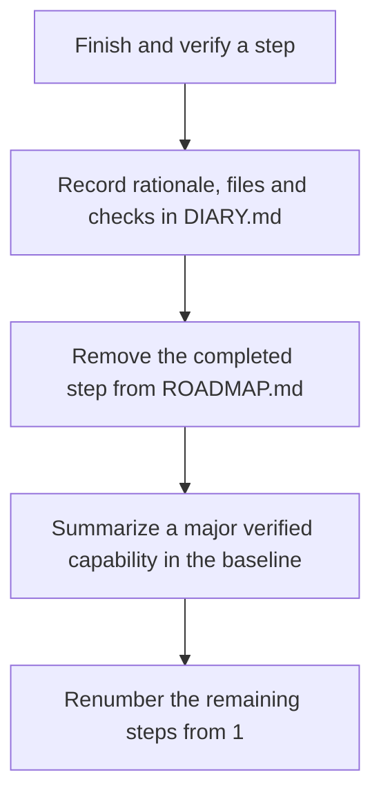

# Keep completed work out of the agent's active roadmap

On a typical project board, completed tickets stay visible. Their checkmarks and dates help people follow sprint progress. An agent's `ROADMAP.md` has a different job: it tells the agent what to do next. If it carries every completed task along with the remaining work, the agent reads old implementation details on every turn.

The team's choice of which work enters that active roadmap is a separate project-planning decision (see [[Managing Software Projects with Coding Agents]]).

An LLM does not retain a reliable working memory between sessions. It rebuilds its working context from the prompt and the files it reads. A completed task, a replaced interface specification, or an obsolete constraint therefore takes up room in the context window alongside the current acceptance criteria. Old text can also influence how the agent interprets the next task.

The rule I use here is **Active Backlog Pruning**, or **Zero Retention**: once a step has passed verification, remove its detailed entry from the active roadmap. Record what happened in `DIARY.md` and the Git history (see [[The Living Engineering Chronicle and Context Compaction]]). Keep the roadmap focused on work still pending or in progress, with only a short summary of established capabilities.



If a retained roadmap contains 120 lines for one completed task, 85 for another, and 150 for a third before it gets to the next active step, most of what the agent reads is already history. That is the situation this rule is meant to prevent.

## What belongs in each file

Five rules keep the plan usable:

1. **Use the active roadmap as an execution plan.** `ROADMAP.md` or `PLAN.md` describes upcoming agent work. It does not serve as a burndown chart, release note, or sprint archive.
2. **Remove verified work completely.** Delete completed tasks, subtasks, acceptance criteria, and detailed implementation notes from the active backlog. A checkmark, `[COMPLETED]` label, or strikethrough leaves the text in the context.
3. **Put the history elsewhere.** Keep the account of changes, affected files, design trade-offs, and verification results in `DIARY.md` and Git. The active roadmap contains pending and in-progress milestones.
4. **Renumber after pruning.** Make the remaining steps consecutive: 1, 2, 3, and so on. The next item is always Step 1; gaps do not invite questions about skipped or missing work.
5. **Keep a short verified baseline.** When a whole subsystem or architectural milestone is complete, add one concise bullet to the baseline at the top of the roadmap. Keep established capabilities within roughly 20 lines, so the agent knows what exists without rereading the old plan.

## How old tasks get in the way

The problem builds up across turns. Imagine a roadmap that starts with 10 pending steps and about 2,000 tokens. By turn 10 it carries five completed steps and about 6,000 tokens. By turn 30 it carries 25 completed steps and about 25,000 tokens. The agent now spends much of its input budget on work it cannot use as its current plan.

That creates several practical failure modes (see [[Context Attractors and Recency Bias in Long-Horizon Agent Sessions]] and [[How Context Narrows an AI's Solution Space]]):

- **The current task becomes harder to find.** Acceptance criteria and important constraints are surrounded by old implementation notes. Negative boundaries, such as an instruction to avoid a particular interface, may be less prominent.
- **Old solutions look current.** Suppose a completed step described a temporary shim, mock, or disposable adapter. If that description stays in the roadmap after the shim is removed, the agent may copy the old pattern and bring a retired interface back into the code.
- **The agent spends time on history.** It may revisit old refactoring tasks, wonder whether they still apply, or spend output tokens recounting work that is already done.
- **Every turn costs more.** Passing 20,000–40,000 tokens of completed backlog to the model adds input cost and can delay the first response by seconds. Repeated across a workflow with many turns and tool calls, the overhead accumulates.

The underlying issue is straightforward: the model processes the text that is present, including obsolete text. In a long prompt, old details compete with the instructions for the active step. We do not need a theory of the attention mechanism to decide that an active plan should contain active work.

## Remove completed steps after verification

A Markdown strikethrough changes what a person sees; it does not remove those words from the model's input. In `~~Use SQLite for local caching~~`, the model still receives “SQLite” and “caching”. The same applies to a `[COMPLETED]` heading. Once the task has been verified and merged, delete its block from the active execution file.

Use this sequence when an agent finishes a milestone:

1. **Run the checks.** Run the unit tests, integration suites, and automated architecture checks that apply to the milestone (see [[Executable Architecture Tests for Coding Agent Guardrails]]). Do not prune the step before it passes the verification gates.
2. **Write the engineering record.** Append what changed, the design trade-offs, touched files, and test results to `DIARY.md`. A script or tool call can update the diary without loading the entire history into the agent's prompt.
3. **Remove the finished step.** Delete its heading, acceptance criteria, and implementation notes from Section 2, “Remaining Milestones”, in `ROADMAP.md`.
4. **Update the baseline when appropriate.** If the step establishes a major architectural capability, add a single-sentence summary to Section 1, “Verified Baseline Deliverables”.
5. **Renumber what remains.** Give the pending steps consecutive numbers starting at Step 1.

## Give the roadmap, diary, and Git separate jobs

| File | What it contains | Who uses it and when | Effect on the usual agent prompt |
| :--- | :--- | :--- | :--- |
| `ROADMAP.md` | Pending and in-progress steps, acceptance criteria, and current boundaries. No completed task blocks. | The agent and the human lead during current work. | Keep it small: typically under 3,000 tokens and strictly under 500 lines. |
| `DIARY.md` | An append-only account of changes, decisions, affected files, and verification, with periodic compaction. | People reviewing the project's evolution or a newly initialized agent session that needs specific history. Update it through tools during ordinary turns rather than reading the whole file into the prompt. | No routine prompt overhead. |
| Git history | Granular commits with the exact code and test changes, file trees, and commit metadata. | Diff review, CI/CD, rollback, and inspection of an earlier state. | No routine prompt overhead. |

The roadmap answers *what is next*. The diary explains *why the project arrived here* and how changes were checked. Git shows *exactly what changed*. Moving a completed step out of the roadmap does not erase its history.

## Keep the next step unambiguous

Here is a roadmap that still mixes finished and active work, including a gap left by a skipped step:

```markdown
### Section 2: Remaining Milestones
- Step 2.1: [COMPLETED] Set up bus router
- Step 2.2: [COMPLETED] Add arbitration logic
- Step 2.3: Active Bus Routing
- Step 2.5: Machine Reset (Step 2.4 was skipped during triage)
```

After pruning and renumbering, the file can show the verified capability briefly and list only the work ahead:

```markdown
### Section 1: Verified Baseline Deliverables
- Subsystem Bus Routing & Hierarchical Chipset Integration (Verified across 114 tests).

### Section 2: Remaining Milestones
- Step 1: Host Audio Playback & Presentation Buffers
- Step 2: Host Input Subsystem & Game Controller Mapping
- Step 3: Silicon Test Suite Direct-Injection Harness
```

Now a human can say, “Review `ROADMAP.md` and implement Step 1.” There is no completed Step 1 competing for that reference, and the agent has no missing Step 2.4 to interpret or old Step 2.1 to reconsider. It can work from the acceptance criteria of the next pending milestone.

## Check the roadmap automatically

This convention should not depend on somebody spotting a stale checkbox in review. A repository check can reject completed markers, numbering gaps, and a roadmap that grows past its size limits. The following Python script can run in CI or as a pre-commit hook:

```python
#!/usr/bin/env python3
"""
validate_roadmap.py - Enforces Active Backlog Pruning and Context Hygiene.
Fails if ROADMAP.md contains completed task markers, invalid numbering, or exceeds size limits.
"""

import re
import sys
from pathlib import Path

ROADMAP_PATH = Path("ROADMAP.md")
MAX_LINES = 500
MAX_BYTES = 40 * 1024  # 40 KB ceiling

FORBIDDEN_PATTERNS = [
    (re.compile(r"\[x\]", re.IGNORECASE), "Completed checkbox '[x]' detected."),
    (re.compile(r"\[completed\]", re.IGNORECASE), "Completed tag '[COMPLETED]' detected."),
    (re.compile(r"\[done\]", re.IGNORECASE), "Completed tag '[DONE]' detected."),
    (re.compile(r"~~.+~~"), "Strikethrough text detected."),
]

STEP_PATTERN = re.compile(r"^-\s+Step\s+(\d+):", re.MULTILINE)

def validate_roadmap() -> None:
    if not ROADMAP_PATH.exists():
        print(f"Error: {ROADMAP_PATH} does not exist.", file=sys.stderr)
        sys.exit(1)

    content = ROADMAP_PATH.read_text(encoding="utf-8")
    lines = content.splitlines()

    # 1. Check size ceilings
    if len(lines) > MAX_LINES:
        print(
            f"Hygiene Violation: {ROADMAP_PATH} has {len(lines)} lines (max allowed: {MAX_LINES}). "
            "Prune completed milestones or decompose upcoming work.",
            file=sys.stderr,
        )
        sys.exit(1)

    byte_size = ROADMAP_PATH.stat().st_size
    if byte_size > MAX_BYTES:
        print(
            f"Hygiene Violation: {ROADMAP_PATH} size is {byte_size} bytes (max allowed: {MAX_BYTES}).",
            file=sys.stderr,
        )
        sys.exit(1)

    # 2. Check for completed marker anti-patterns in Section 2
    in_remaining_section = False
    for line_num, line in enumerate(lines, start=1):
        if "### Section 2" in line or "Remaining Milestones" in line:
            in_remaining_section = True
            continue

        if in_remaining_section:
            for pattern, message in FORBIDDEN_PATTERNS:
                if pattern.search(line):
                    print(
                        f"Hygiene Violation at {ROADMAP_PATH}:{line_num}: {message}\n"
                        f"  Line: '{line.strip()}'\n"
                        "  Action: Prune completed items and move narrative to DIARY.md.",
                        file=sys.stderr,
                    )
                    sys.exit(1)

    # 3. Check for contiguous step numbering
    step_numbers = [int(m.group(1)) for m in STEP_PATTERN.finditer(content)]
    if step_numbers:
        expected = list(range(1, len(step_numbers) + 1))
        if step_numbers != expected:
            print(
                f"Numbering Violation: Steps in {ROADMAP_PATH} are not contiguous.\n"
                f"  Found sequence:    {step_numbers}\n"
                f"  Expected sequence: {expected}\n"
                "  Action: Renumber remaining steps starting sequentially from Step 1.",
                file=sys.stderr,
            )
            sys.exit(1)

    print("ROADMAP.md context hygiene check passed.")

if __name__ == "__main__":
    validate_roadmap()
```

If the agent tries to finish a milestone by changing it to `- [x] Step 1: Initialize Bus`, this check fails. The agent must remove the completed text, record the result in `DIARY.md`, and renumber the pending steps before the next run.

The script checks for `[x]`, `[COMPLETED]`, `[DONE]`, and strikethrough text in the remaining-milestones section. It also checks that steps numbered in the form `- Step N:` run from 1 without gaps, and sets ceilings of 500 lines and 40 KB for `ROADMAP.md`. Those checks turn the file convention into a repeatable repository rule (see [[Agentic Coding Harness and Controlled Development Workflows]]).

## Keep history available without carrying it into every turn

The agent needs the verified state of the system and a clear next task. It does not need the full story of each completed step in every prompt. Pruning the active roadmap leaves room for current constraints and acceptance criteria; `DIARY.md` and Git preserve the technical history when someone needs to inspect it.

## Related notes

- **[[Agentic Coding Harness and Controlled Development Workflows]]** — File responsibilities, state transitions, and the broader execution loop.
- **[[The Living Engineering Chronicle and Context Compaction]]** — Where the removed history goes and how to consult it without loading the entire diary into the prompt.
- **[[The Minimal Frame Pattern - Proving System Topology on Atomic Slices]]** — Verifying small roadmap steps before expanding them.
- **[[Context Attractors and Recency Bias in Long-Horizon Agent Sessions]]** — How old prompt text can affect later decisions.
- **[[Executable Architecture Tests for Coding Agent Guardrails]]** — Checks for repository rules, file limits, and hygiene.
- **[[How Context Narrows an AI's Solution Space]]** — How large prompts affect what the agent considers.
