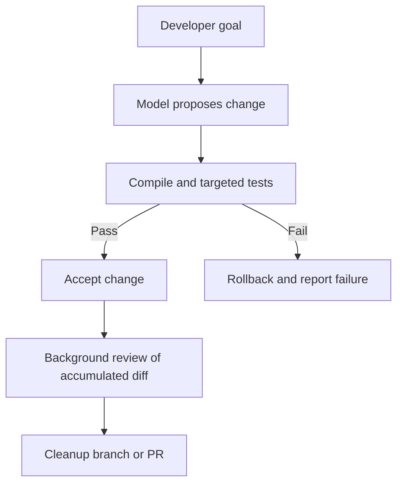

# Building Determinism from Unpredictable Models

> [!IMPORTANT]
> **Who actually controls the session?** It can look as though the coding agent is issuing commands to your workstation. The model proposes actions, but the host runtime decides which actions it can execute. The remote model has no access to your files, processes, or network unless the harness gives it that access. A reliable harness treats tool calls as proposals, checks them, and runs fast, repeatable verification before changes reach the active branch. A detailed system prompt cannot provide the same guarantee.

The two sides have different jobs:

| Remote model | Local harness |
| :--- | :--- |
| Generates possible plans and tool calls from the context it receives. It does not hold filesystem descriptors or network sockets on the host. | Owns processes, filesystem and Git access. It controls permissions, available tools, context compaction, and compilation and test gates. |

## 1. Why a model drifts during a session

Setting `temperature = 0.0` does not make a model behave like a compiler. The output can still change with differences in distributed GPU calculations, including the order of bfloat16 operations, small changes in terminal output, or changes to the system prompt. Any of these can send generation down a different path.

System prompts, custom instructions, and role descriptions also become less reliable as a session grows. More turns and more tool output compete for the model's attention. Three patterns are especially visible:

### Context rot: the agent keeps working around old failures

Each failed command, long stack trace, and abandoned patch remains in the conversation unless the harness removes it. After five failed attempts to fix a dependency issue, recent context may consist mostly of errors. The agent can then keep producing small variations of the same broken fix instead of stepping back to reconsider the original goal.

### Overconfidence: successful steps lead to unchecked actions

A run of successful tool calls can carry the agent into the next familiar command sequence. Repositories and shell transcripts often pair `git add .` with `git commit -m "..."` and `git push`. After passing a few checks, an agent may follow that pattern, commit an unreviewed diff, edit files outside the task, or overlook a constraint from the beginning of the session.

### Defensive drift: a correction stops ordinary work

A sharp correction from the developer can produce the opposite failure. After a message such as *"Stop, you just broke the primary authentication interface!"*, the agent may spend turns apologizing, discard viable code, and ask permission even for read-only commands such as `ls` or `cat`. Safety training can contribute to this overcorrection.

These failures are a poor fit for prompt-only safeguards. Put the rules that must always hold in the harness, where the model cannot bypass them by generating a different answer.

## 2. Match the check to the cost of failure

Running the entire test suite or an aggressive linter after every tool call slows exploration and can reject intermediate edits that would become valid a few steps later. Verification should match the risk of the change and the cost of recovering from a mistake.

| Level | What it covers | How to check it | When it belongs |
| :--- | :--- | :--- | :--- |
| **1. Critical** | Compilation, regression and unit tests, directory safety, Git index integrity. | Process exit codes, test runners, and Git guards such as `pytest`, `cargo check`, and `git status`. | Fast, repeatable gates before accepting work. |
| **2. Structural** | Forbidden dependencies, architecture boundaries, import paths, API contracts, cyclomatic complexity. | Static analyzers, AST parsers such as tree-sitter, ESLint, and custom CLI rules. | Deterministic checks that can run on the accumulated change. |
| **3. Semantic** | Prose clarity, documentation quality, names, and style. | Background review agents or asynchronous model-based review. | Advisory work that can tolerate variation and need not block each edit. |

There is a useful asymmetry here. Producing a correct change across several files can take exploration and multiple attempts. Checking a proposed change is often much cheaper: the compiler returns an exit code, and a targeted test passes or fails. Have the harness run those tools against the proposed patch and report their results. Asking the same model to read its diff and declare it correct spends tokens and time without giving you a comparable gate.

## 3. Keep the active loop fast and review accumulated changes separately

A harness can run checks at two different times. The **inner loop** handles the immediate change: the developer gives a goal, the model proposes a patch, and the harness runs the necessary compilation and targeted tests before accepting it. A failed check can trigger a rollback. The **outer loop** examines the accumulated verified changes later and prepares a cleanup branch or PR.

### Inner loop: make the patch work

Keep the active context focused on the task, the interfaces being changed, and the immediate errors. Large style manuals and formatting rules need not accompany each implementation step.

Block acceptance on the operational checks that matter now: does the project compile, do the targeted unit tests pass, and is the Git index in the expected state? Do not interrupt the agent because a comment lacks punctuation or a local variable name could be shorter. Those corrections can wait until the working change has passed its checks.

### Outer loop: inspect the whole diff

A background worker, scheduled job, or pre-PR workflow can examine changes from several inner-loop cycles at once. Static analysis checks dependency and architecture rules. A faster, cheaper model can review docstrings, dead code, naming, and other matters of style. Package related fixes into one cleanup branch or PR instead of interrupting implementation with a series of small corrections.

## 4. How harness control changes across three designs

Agent harnesses can give the model different amounts of control over the workflow. The progression from an open conversation loop to a workflow encoded in host code makes that difference clear.

| Design | How it works | Where it fails |
| :--- | :--- | :--- |
| **Generation 1: ReAct** | The model repeats `Thought → Action → Observation`, chooses from a general tool list, and decides when to stop. | It can handle a short task of three to five steps. Longer tasks accumulate logs and errors; the agent can lose its place, loop on a failing tool, or claim completion too early. |
| **Generation 2: Plan and execute** | The model writes a checklist, follows it, and updates progress as it goes. | The same model does the work and judges its progress. With a stubborn bug, it may lower the acceptance criteria, mark a failing step complete, or call an item out of scope. |
| **Generation 3: State graph** | Host code defines the states, allowed tools, and conditions for moving between states. | More of the workflow must be encoded explicitly, but the model cannot move past a required gate by rewriting its own plan. |

In the third design, the host can enforce `Analyze → Reproduce → Synthesize → Verify → Commit`. During **Reproduce**, the model may read files and run tests, while writes to production code are unavailable. During **Implement**, it may edit files, but `git commit` is not offered. The host advances only when the required condition, such as a reproduced failing test or successful compilation, is met.

If verification fails at the final gate, the harness can run `git reset --hard` to the last known good commit, remove the failed intermediate turns from the model's context, and return to implementation with a short diagnostic summary. That transition is host code, not a request for the model to decide whether its own work passed.

Most everyday IDE agents and terminal CLIs sit between the second and third designs: they track a plan while also using permission prompts and human approvals. The note calls this **Generation 2.5**. More tightly controlled autonomous workflows, including competitive SWE-bench pipelines, use explicit state graphs and call the model within individual workflow states.

## 5. Rules for building the harness

### Make tools available only in the right state

Do not expose finalizing or destructive operations before their prerequisites pass. Commands such as `git commit` and `git push`, and writes to production configuration, should stay outside the model's available tools until local compilation and targeted tests exit with code `0`.

### Replace failed attempts with a useful summary

When an approach has failed through several iterations, remove the abandoned turns and long stack traces from the working context. Preserve the result and the reason for changing direction in a short note:

> [!NOTE]
> **Attempt #1 failed:** Reflection-based binding caused a null pointer in the transaction handler. The working directory was rolled back to commit `a1b2c3d`. Avoid reflection-based binding for this handler.

The agent still gets the operational lesson, while the old errors no longer occupy the context needed for the next attempt.

### Enforce autonomy rules in the host

Instructions such as *"Please be careful when modifying files"* or *"Ask before running destructive commands"* are weak boundaries. Put the boundary in the execution layer:

- Mount critical configuration files and directories read-only.
- Allow automatic approval only after local verification passes, for example with a `--auto-approve=tests-pass-only` mode.
- Withhold destructive filesystem operations such as `rm -rf` from the tool dispatcher until an explicit human intervention flag enables them.

### Move secondary polish to the outer loop

Let the local agent write the patch, pass the unit tests, and get the feature working. Run formatting, documentation review, and architecture checks in background jobs or the pre-PR pipeline. This keeps active development moving while still reviewing the accumulated change.

## Relationship to the Knowledge Graph

### Upward architectural anchor

- [[The 5-Layer System Stack for Agentic Software Engineering|The 5-Layer System Stack]]: Places the harness, governance, and verification in Layer 2, at the boundary between model proposals and runtime execution.

### Downward and peer links

- [[Agentic Coding Harness and Controlled Development Workflows|Controlled Development Workflows]]: Practical orchestration, vertical slices, and constraints enforced by the harness.
- [[Exploring Agent Harnesses|Exploring Agent Harnesses]]: Host processes, sandboxes, and execution wrappers.
- [[Active Backlog Pruning and Context Hygiene in Agentic Roadmaps|Active Backlog Pruning and Context Hygiene]]: Context compaction and management of long-running work.
- [[Executable Architecture Tests for Coding Agent Guardrails|Executable Architecture Tests]]: Structural checks that enforce architecture boundaries.
- [[Tests Are for Verification, Not Architectural Navigation|Tests Are for Verification, Not Architectural Navigation]]: Fast, repeatable tests for checking model-generated changes.
