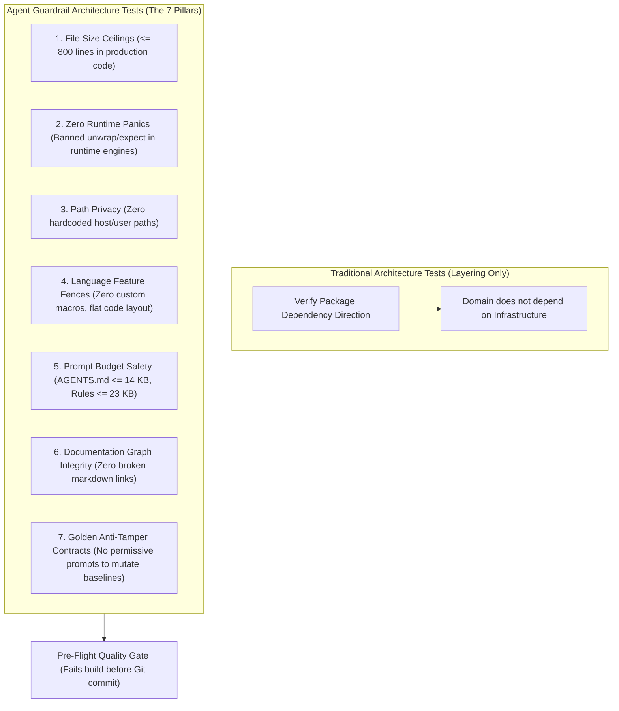

# Executable Architecture Tests for Coding Agent Guardrails

Architecture tests usually check dependencies between modules. They can catch a domain model importing a database driver or a UI component calling a network client directly. When coding agents work in a repository, you also need checks for the shortcuts they may leave in the code and tests.

Give an agent a feature to implement, and it may choose the quickest way to get a passing build. Tricky error handling becomes `.unwrap()` or `.expect()`. New logic lands as another 400 lines in an already large file. An integration test gets a hardcoded `C:\Users\username\...` path. A failing regression benchmark gets a new expected hash instead of a fix for the regression.

Instructions in `AGENTS.md` or `.agents/rules/` help, but they can fall out of the agent's working context during a long refactor. Put rules that you can check mechanically into tests as well. Run them through the project's normal test tools (`cargo test`, `pytest`, `go test`) so a violation fails the build.



---

## 1. What dependency tests miss when agents write code

Tools such as ArchUnit for Java and NetArchTest for .NET inspect code to enforce rules like “module A must not depend on module B.” That protects a useful part of the architecture, but it does not catch a hardcoded workstation path, a growing source file, or an altered golden baseline.

A human developer is expected to consider maintenance costs and investigate why a test failed. An agent working toward “make this test pass” may instead take a shortcut that satisfies the immediate request. The examples below show the kind of result to watch for:

```text
THE PATH-OF-LEAST-RESISTANCE FAILURE CHAIN:
1. Complex error variant handling ──► Slaps .unwrap() on the Result to satisfy compiler types.
2. Adding a complementary feature ──► Expands a 600-line module into a 1,400-line monolith.
3. Path resolution in tests       ──► Hardcodes local developer workstation paths.
4. Repetitive boilerplate         ──► Generates an unreadable 150-line macro_rules! block.
5. Golden snapshot fails in CI    ──► Rewrites the expected test hash to match the broken output.
```

If reviewers have to catch all of these by hand, senior engineers spend their time checking file lengths and stray `.unwrap()` calls instead of reviewing business logic and system behavior. A test such as `tests/architecture_rules.rs` can check those structural rules on every run. A failed check gives the agent a concrete problem to fix before its work is accepted.

---

## 2. Seven checks to add to the repository

These checks cover the shortcuts described above:

| Check | What it enforces | Problem it catches |
| :--- | :--- | :--- |
| **1. File length** | Production files have at most 800 lines, unless listed as exceptions | Large files that consume context and keep growing |
| **2. Runtime panics** | No `.unwrap()` or `.expect()` in core runtime code | Crashes on unhandled `None` or `Err` values |
| **3. Host paths** | No hardcoded paths such as `/home/` or `C:\Users\` | Tests that fail elsewhere and paths leaked into the repo |
| **4. Language features** | No custom `macro_rules!` definitions in application code | Macro expansions that are hard to read and debug |
| **5. Instruction size** | `AGENTS.md` at most 14,000 bytes; individual rule files at most 23,000 bytes | Instructions lost when a harness truncates a file |
| **6. Documentation links** | No broken Markdown paths or `[[wikilinks]]` | Missing context when agents navigate or retrieve documentation |
| **7. Golden baselines** | Required anti-tamper header and no self-update prompt | An agent changing expected results to make a regression test pass |

---

### 1. Keep production source files within 800 lines

Reading a large file uses a substantial part of an agent's working context, including functions unrelated to the current change. That makes it easier to miss relevant logic or misunderstand where a variable belongs. An 800-line limit gives the agent a clear point at which to split a file.

The test walks the production source tree, counts lines, and reports files over the limit. Legitimate exceptions live in a checked-in map:

```rust
// tests/architecture_rules.rs
use std::collections::HashMap;
use std::fs;
use std::path::Path;

const MAX_PRODUCTION_LINES: usize = 800;

// Whitelist legacy files or genuine lookup tables with an explicit reason.
fn line_count_exceptions() -> HashMap<&'static str, usize> {
    let mut exceptions = HashMap::new();
    // exceptions.insert("src/codegen/opcodes.rs", 1200); // Reason: static lookup table
    exceptions
}

#[test]
fn test_production_files_do_not_exceed_line_ceiling() {
    let exceptions = line_count_exceptions();
    let mut violations = Vec::new();

    for entry in walkdir::WalkDir::new("src")
        .into_iter()
        .filter_map(Result::ok)
        .filter(|e| e.path().extension().is_some_and(|ext| ext == "rs"))
    {
        let path = entry.path();
        let path_str = path.to_str().unwrap().replace('\\', "/");
        let content = fs::read_to_string(path).expect("Failed to read source file");
        let line_count = content.lines().count();

        let allowed_limit = exceptions
            .get(path_str.as_str())
            .copied()
            .unwrap_or(MAX_PRODUCTION_LINES);

        if line_count > allowed_limit {
            violations.push(format!(
                "{} has {} lines (limit: {})",
                path_str, line_count, allowed_limit
            ));
        }
    }

    assert!(
        violations.is_empty(),
        "Production files exceed line budget. Split these modules:\n{}",
        violations.join("\n")
    );
}
```

When the check fails, the intended response is to extract focused modules. Raising the limit or adding an exception needs an explicit reason and review.

---

### 2. Keep `.unwrap()` and `.expect()` out of core runtime code

In a core engine, an unexpected `None` or `Err` should reach the caller as a structured error, such as `Result<T, EngineError>`. A quick `.unwrap()` can make the compiler happy while leaving a crash for an edge case.

A plain search would also match comments and documentation. The example strips line and block comments before it checks the code:

```rust
// tests/architecture_rules.rs
use std::fs;
use std::path::Path;

fn strip_comments(source: &str) -> String {
    let mut result = String::with_capacity(source.len());
    let mut chars = source.chars().peekable();
    let mut in_string = false;

    while let Some(c) = chars.next() {
        if c == '"' && !in_string {
            in_string = true;
            result.push(c);
        } else if c == '"' && in_string {
            in_string = false;
            result.push(c);
        } else if !in_string && c == '/' && chars.peek() == Some(&'/') {
            // Line comment: skip until newline
            chars.next();
            for next_c in chars.by_ref() {
                if next_c == '\n' {
                    result.push('\n');
                    break;
                }
            }
        } else if !in_string && c == '/' && chars.peek() == Some(&'*') {
            // Block comment: skip until closing tag
            chars.next();
            while let Some(next_c) = chars.next() {
                if next_c == '*' && chars.peek() == Some(&'/') {
                    chars.next();
                    break;
                }
            }
        } else {
            result.push(c);
        }
    }
    result
}

#[test]
fn test_core_engine_has_zero_runtime_panics() {
    let core_engine_dir = Path::new("src/engine");
    let mut violations = Vec::new();

    for entry in walkdir::WalkDir::new(core_engine_dir)
        .into_iter()
        .filter_map(Result::ok)
        .filter(|e| e.path().extension().is_some_and(|ext| ext == "rs"))
    {
        let path = entry.path();
        let raw_content = fs::read_to_string(path).expect("Failed to read engine source");
        let clean_code = strip_comments(&raw_content);

        for (line_idx, line) in clean_code.lines().enumerate() {
            if line.contains(".unwrap()") || line.contains(".expect(") {
                violations.push(format!(
                    "{}:{}: Contains raw unwrap/expect call: '{}'",
                    path.display(),
                    line_idx + 1,
                    line.trim()
                ));
            }
        }
    }

    assert!(
        violations.is_empty(),
        "Runtime engine paths must handle errors explicitly. Found panics:\n{}",
        violations.join("\n")
    );
}
```

---

### 3. Reject paths tied to one machine

An agent debugging a filesystem test may copy a path from its own environment into the source or an assertion. A path such as `C:\Users\runner\...` or `/home/developer/...` then fails in CI or on a teammate's computer.

This check looks for known host path prefixes in source and configuration files:

```rust
// tests/architecture_rules.rs
#[test]
fn test_zero_hardcoded_host_paths() {
    let forbidden_prefixes = [
        "C:\\Users\\",
        "C:/Users/",
        "/home/",
        "/Users/",
        "/var/folders/",
    ];

    let mut violations = Vec::new();

    for entry in walkdir::WalkDir::new(".")
        .into_iter()
        .filter_map(Result::ok)
        .filter(|e| {
            let p = e.path();
            let s = p.to_str().unwrap_or_default();
            !s.contains("/target/") && !s.contains("/.git/") && (s.ends_with(".rs") || s.ends_with(".toml"))
        })
    {
        let path = entry.path();
        let content = fs::read_to_string(path).unwrap_or_default();

        for (idx, line) in content.lines().enumerate() {
            for forbidden in &forbidden_prefixes {
                if line.contains(forbidden) {
                    violations.push(format!(
                        "{}:{}: Contains host-specific absolute path fragment '{}'",
                        path.display(),
                        idx + 1,
                        forbidden
                    ));
                }
            }
        }
    }

    assert!(
        violations.is_empty(),
        "Detected machine-specific host paths in source. Use relative paths or tempdir primitives:\n{}",
        violations.join("\n")
    );
}
```

---

### 4. Limit custom macros and other hard-to-follow code

Flat, explicit code is easier for people and agents to read. A large `macro_rules!` definition in Rust, or a heavily specialized C++ template, can hide the behavior behind its call site. Errors in the expansion become harder to debug, and a later agent may misunderstand what the macro generates.

The test bans custom declarative macros in application source. For repeated logic, use explicit functions or documented derive macros from approved dependencies:

```rust
// tests/architecture_rules.rs
#[test]
fn test_no_custom_macro_rules_definitions() {
    let mut violations = Vec::new();

    for entry in walkdir::WalkDir::new("src")
        .into_iter()
        .filter_map(Result::ok)
        .filter(|e| e.path().extension().is_some_and(|ext| ext == "rs"))
    {
        let path = entry.path();
        let content = fs::read_to_string(path).unwrap_or_default();
        let clean = strip_comments(&content);

        for (idx, line) in clean.lines().enumerate() {
            if line.contains("macro_rules!") {
                violations.push(format!(
                    "{}:{}: Defines macro_rules! metaprogramming. Prefer explicit functions.",
                    path.display(),
                    idx + 1
                ));
            }
        }
    }

    assert!(
        violations.is_empty(),
        "Custom declarative macros are banned to keep code legible to both LLMs and humans:\n{}",
        violations.join("\n")
    );
}
```

---

### 5. Check the size of agent instruction files

Agent tools load files such as `AGENTS.md` and `.agents/rules/*.md` into their working context. Some harnesses truncate a rule file after a byte limit and may show only a marker such as `<truncated 8420 bytes>`. Instructions near the end of the file can disappear, including restrictions the agent needs for the task.

The proposed limits are 14,000 bytes for `AGENTS.md` and 23,000 bytes for each rule file, below the roughly 24,000-byte cutoff described here. Check their actual byte sizes as part of the build:

```python
# tools/test_prompt_budgets.py
import sys
from pathlib import Path

MAX_AGENTS_MD_BYTES = 14_000      # 14 KB limit keeps foundational instructions compact
MAX_RULE_FILE_BYTES = 23_000      # 23 KB hard ceiling prevents silent harness truncation

def check_budgets() -> bool:
    failed = False
    
    agents_md = Path("AGENTS.md")
    if agents_md.exists():
        size = agents_md.stat().st_size
        if size > MAX_AGENTS_MD_BYTES:
            print(f"[FAIL] AGENTS.md is {size:,} bytes (Max: {MAX_AGENTS_MD_BYTES:,} bytes)")
            failed = True
        else:
            print(f"[PASS] AGENTS.md size: {size:,} bytes")
            
    rules_dir = Path(".agents/rules")
    if rules_dir.exists():
        for rule_file in rules_dir.glob("*.md"):
            size = rule_file.stat().st_size
            if size > MAX_RULE_FILE_BYTES:
                print(f"[FAIL] {rule_file} is {size:,} bytes (Max: {MAX_RULE_FILE_BYTES:,} bytes)")
                failed = True
            else:
                print(f"[PASS] {rule_file.name} size: {size:,} bytes")
                
    return not failed

if __name__ == "__main__":
    if not check_budgets():
        sys.exit(1)
```

This keeps the rule files within the chosen budgets in local development and CI.

---

### 6. Check links between documentation files

Agents use links in Markdown documentation, ADRs, and Obsidian notes to find related decisions. When a component or document moves, old links can remain. A retrieval tool following those links then fails to load the context it needs.

The example scans Markdown files, checks `[[wikilinks]]` and relative Markdown links, decodes URL-encoded characters, and reports targets that do not exist:

```python
# tools/test_doc_graph.py
import re
import sys
from pathlib import Path
from urllib.parse import unquote

WIKILINK_RE = re.compile(r'\[\[([^\]\|]+)(?:\|[^\]]+)?\]\]')
MDLINK_RE = re.compile(r'\[[^\]]+\]\(([^)]+)\)')

def verify_knowledge_graph(docs_dir: Path) -> bool:
    broken_links = []
    total_links = 0
    all_md_files = {p.stem.lower(): p for p in docs_dir.rglob("*.md")}

    for doc in docs_dir.rglob("*.md"):
        content = doc.read_text(encoding="utf-8")
        
        # 1. Check Wikilinks: [[Target File]]
        for match in WIKILINK_RE.finditer(content):
            total_links += 1
            raw_target = match.group(1).split('#')[0].strip()
            if not raw_target:
                continue
            clean_target = unquote(raw_target).lower()
            if clean_target not in all_md_files:
                broken_links.append((doc, raw_target))
                
        # 2. Check Standard Relative Markdown Links: [Text](path/to/file.md)
        for match in MDLINK_RE.finditer(content):
            raw_target = match.group(1).split('#')[0].strip()
            if raw_target.startswith(("http://", "https://", "mailto:")) or not raw_target:
                continue
            total_links += 1
            clean_path = unquote(raw_target)
            resolved = (doc.parent / clean_path).resolve()
            if not resolved.exists():
                broken_links.append((doc, raw_target))

    if broken_links:
        print(f"[FAIL] Found {len(broken_links)} broken documentation links:")
        for source, target in broken_links:
            print(f"  {source} -> '{target}' does not exist on disk.")
        return False
        
    print(f"[PASS] Documentation graph clean. Verified {total_links} links.")
    return True

if __name__ == "__main__":
    if not verify_knowledge_graph(Path("docs")):
        sys.exit(1)
```

---

### 7. Protect golden test baselines

A golden test compares the current result with a saved expected value. Suppose a regression produces this failure:

```text
assertion `left == right` failed
  left: 0x8A4B22F1
 right: 0x770E11C0
```

An agent focused on getting a green test run might replace `right` with `0x8A4B22F1`. The test would pass while accepting the changed output. The proposed check requires an anti-tamper policy header in each named golden test file and rejects a self-update instruction such as `UPDATE_GOLDEN`:

```rust
// tests/architecture_rules.rs
#[test]
fn test_golden_benchmarks_have_anti_tamper_headers() {
    let benchmark_tests = ["tests/golden_execution.rs", "tests/bytecode_hashes.rs"];
    let required_marker = "ANTI-TAMPER POLICY: Golden hashes are absolute invariant baselines.";

    for test_path in &benchmark_tests {
        let path = Path::new(test_path);
        assert!(
            path.exists(),
            "Mandatory benchmark test file '{}' was deleted!",
            test_path
        );

        let content = fs::read_to_string(path).expect("Failed to read benchmark test file");
        
        assert!(
            content.contains(required_marker),
            "Test file '{}' is missing the anti-tamper contract header. Agents are forbidden from mutating these baselines.",
            test_path
        );

        assert!(
            !content.contains("UPDATE_GOLDEN"),
            "Test file '{}' contains permissive self-updating logic. Golden hashes must be manually verified by humans.",
            test_path
        );
    }
}
```

The policy calls for a human to verify changes to golden hashes.

---

## 3. Run the checks before committing

If an agent learns from remote CI six minutes later that a file has 850 lines or a `.unwrap()` remains on line 42, the feedback arrives after extra work, tool calls, and context use. Run the checks locally through a script such as `python tools/pre_flight.py` before committing. The example run takes under two seconds:

```text
$ python tools/pre_flight.py
>> Running Pre-Flight Quality Gates...
  [PASS] Formatting: 100% compliant (0.34s)
  [PASS] File Line Limits: 142 files checked, 0 violations (0.11s)
  [PASS] Prompt Budgets: AGENTS.md at 13,624 bytes (<= 14,000) (0.01s)
  [PASS] Documentation Graph: 421 links verified (0.18s)
  [PASS] Architecture Rules: all 18 test assertions passed (0.82s)

[OK] All Pre-Flight Quality Gates PASSED cleanly! (1.46s)
```

The script reports the file, line, and rule that failed. The agent can use that feedback to fix the problem while the change is still in its working context.

---

## 4. Where strict rules need exceptions or judgment

### A line limit can split code in the wrong place

An 800-line ceiling discourages bloated files, but an agent may respond by cutting one cohesive state machine into `state_part1.rs` and `state_part2.rs`. File size alone does not tell it where a module boundary belongs.

Pair the limit with the language rule and clear module names. In `AGENTS.md`, tell the agent to extract meaningful parts, such as parsing, validation, and serialization, instead of dividing one algorithm arbitrarily.

### Generated code and lookup tables can be longer

Protocol lookup tables, instruction sets, and generated parser state tables may have valid reasons to exceed 800 lines. List these files in a checked-in exception map and record why each exception exists. Do not guess from the file's shape whether it was generated. Adding an exception requires human approval in the PR.

### Test code can use panic-based assertions

A blanket ban on `.unwrap()` makes unit and integration tests awkward. Tests should fail when an assertion fails or their setup is invalid. Apply the runtime rule to production directories such as `src/`, or specifically to `src/engine/` and `src/kernel/`. Let `tests/` and test harnesses use `unwrap()` and assertions.

---

## 5. Putting the rules to work

Instructions tell an agent how to work; executable checks verify what it leaves in the repository. Put the structural rules into fast tests and run them before a commit. Reviewers can then focus on whether the code behaves correctly and whether the chosen design makes sense, even when several agents contribute changes.

### Related notes

- **[[Agentic Coding Harness and Controlled Development Workflows]]**: Tool permissions, sandboxing, and verification loops in the wider harness.
- **[[The Minimal Frame Pattern - Proving System Topology on Atomic Slices]]**: Testing the system's shape on small vertical slices before generating more code.
- **[[Testing in the Model, Agent, LLM Era]]**: Keeping test baselines out of reach of changes made only to satisfy failing tests.
- **[[Active Backlog Pruning and Context Hygiene in Agentic Roadmaps]]**: Limiting stale context and instruction drift.
- **[[AI May Replace Some Source Generators with Explicit Generated Code]]**: Choosing code that people and agents can read and debug over complex metaprogramming.
- **[[Constraint Saturation and Rule Oscillation in Coding Agents]]**: Splitting rule files and checking their byte limits to reduce instruction conflicts.
