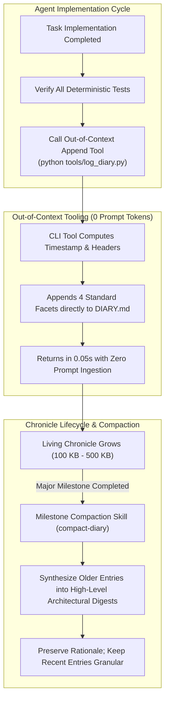

# The Living Engineering Chronicle and Context Compaction

When you run long-horizon software projects with coding agents, standard documentation patterns fall apart quickly. If you rely entirely on Git commit history or static Architecture Decision Records (ADRs), your project will eventually suffer from catastrophic amnesia. 

The mechanism is straightforward: when feature branches are squashed, batched, or rebased into `main`, the nuanced, step-by-step technical rationale behind intermediate decisions gets discarded. The repo retains the final diff, but the context—the compiler quirks discovered midway through, the subtle concurrency bug bypassed during step three, or the failed architectural attempt—disappears. Static ADRs have the inverse problem: they capture high-level intentions before implementation starts, but rarely get updated when real-world constraints force a pivot during development.

To solve this, a production-grade agent harness needs a **Living Engineering Chronicle** (`DIARY.md`). This is an append-only, chronological narrative recording every single architectural change, bug fix, and structural modification. 

However, maintaining a continuous log presents a major operational trap: as the file grows to hundreds of kilobytes over weeks of development, having an agent read the entire file just to append an entry will blow out its context window, waste thousands of tokens, and degrade model performance. We resolve this by enforcing **Out-of-Context Append Tooling**—a dedicated, deterministic CLI script that handles appends in milliseconds directly on disk without ever loading the chronicle into the model's active prompt.



---

## Architectural Principles and Operating Rules

### 1. The Rationale Evaporation Problem
Git commit messages in high-bandwidth agent workflows are routinely squashed into single PR summaries, while static ADRs capture only idealized initial designs. The concrete daily reality—obscure runtime errors, vendor library bugs bypassed with targeted workarounds, and exact test suite outputs—evaporates unless captured immediately at the moment of execution.

### 2. The Four-Facet Narrative Contract
Every log entry must follow a rigid four-part schema:
* **Affected Subsystems**: Specific crates, modules, configuration files, or database schemas modified.
* **What Was Changed (The Concrete Reality)**: The explicit algorithmic changes, data structure modifications, and plumbing updates applied.
* **Why It Was Done & Architectural Rationale**: The problem statement, user directive, root cause analysis, and rejected alternatives.
* **Verification & Test Results**: Concrete test suites executed, benchmark measurements, clock-cycle counts, and pass/fail outputs.

### 3. Out-of-Context Append Tooling
As a multi-month chronicle expands past 100 KB and approaches 500 KB, **an agent must never read the chronicle into its context window merely to write a new entry**. Doing so wastes context capacity on historical data irrelevant to the active task. Dedicated CLI tools must append entries directly to disk via standard file I/O in milliseconds, consuming zero prompt tokens.

### 4. Milestone Compaction Protocol
While out-of-context append tools protect prompt budgets during active runs, an unbounded 500 KB Markdown file eventually becomes difficult for human engineers to review. When an engineering milestone is reached, a dedicated compaction routine runs in an isolated session. Older chronological entries are synthesized into dense architectural summaries that preserve the core decision-making logic, while recent entries remain granular.

### 5. Decoupling History from the Active Backlog
Pairing the Living Engineering Chronicle with [[Active Backlog Pruning and Context Hygiene in Agentic Roadmaps]] keeps the codebase clean. The active task backlog remains small, lightweight, and focused purely on upcoming work, while the chronicle acts as the system's durable long-term memory.

---

## 1. Why Git Commits and Static ADRs Fall Short

When pairing with coding agents, the iteration cycle moves fast. An agent can run through ten substantial architectural refactorings in an afternoon. Under this kind of throughput, standard documentation workflows fail:

```text
CONVENTIONAL DOCUMENTATION FAILURE MODES:
1. Git Commit Messages:
   - Squash-merging pull requests destroys intermediate reasoning.
   - Commit bodies are rarely structured enough to log benchmark deltas or runtime telemetry.
   - Querying Git logs across divergent branches requires complex commands that agents parse poorly.

2. Static Architecture Decision Records (ADRs):
   - Written upfront when technical knowledge of the problem is at its lowest point.
   - Rarely updated when low-level runtime quirks, hardware limits, or API limits force changes.
   - Completely disconnected from actual diffs and verified benchmark suites.
```

The Living Engineering Chronicle bridges the gap between raw Git diffs and abstract design docs. It functions as an unedited engineering log:

* When an engineer reviews the codebase weeks later and wonders, *"Why did we choose a flat lookup table over a binary search in this dispatch kernel?"*, the answer isn't lost in a deleted branch. It is logged under that day's timestamp alongside the exact L1/L2 cache hit rates that justified the trade-off.
* When an agent starts work on an unfamiliar subsystem, reading a compacted digest of recent chronicle entries provides immediate context on recent architectural decisions without requiring the model to deduce intent by reading thousands of lines of code.

---

## 2. The Four-Facet Narrative Contract

To prevent entries from devolving into lazy, low-signal summaries like "fixed bug in engine," the harness enforces a strict four-facet schema for every entry:

```markdown
### [YYYY-MM-DD HH:MM TZ] — Title of Modification
- **Affected Subsystems**:
  - `kernel/dispatch/`, `bus/arbitration/`, `rules/memory-model.md`
- **What Was Changed (The Concrete Reality)**:
  - Replaced dynamic heap buffer in event queue with a fixed 256-element circular ring buffer.
  - Implemented monotonic cycle counter progression across micro-step sub-phases.
  - Updated interrupt priority encoder to evaluate lines on phase 2 rather than instantaneously.
- **Why It Was Done & Architectural Rationale**:
  - *Root Cause:* Under high-throughput workloads, dynamic allocations triggered memory allocator lock contention, causing 15% frame drops.
  - *Trade-off:* Fixed-size ring buffer caps maximum in-flight interrupts to 256, but guarantees $O(1)$ zero-allocation deterministic latency.
- **Verification & Test Results**:
  - `cargo test -p kernel --test test_event_queue`: Passed (42/42 tests).
  - `cargo test -p system --test test_bus_contention`: All 18 cycles matched silicon baseline.
  - Architecture gate: Zero dynamic allocations confirmed in hot path.
```

This structure guarantees that every entry answers four critical questions:
1. **Where**: Exactly what boundary or module was touched?
2. **What**: What are the raw mechanical changes, down to the data structures?
3. **Why**: What problem forced this change, and what trade-offs were accepted?
4. **Proof of Truth**: What deterministic command proved that the change works as intended?

---

## 3. The Out-of-Context Tooling Pattern

The failure mode with an append-only chronicle is prompt context bloat. 

If an agent's instructions simply say *"add an entry to DIARY.md"*, standard agent toolchains will run a `read_file` call first, loading the entire file into memory before writing back the update. If `DIARY.md` has grown to 400 KB (roughly 100,000 tokens), appending a 20-line log entry consumes the agent's context budget, drives up API costs, degrades reasoning performance, and risks context truncation.

To avoid this entirely, use an **Out-of-Context Append Tool**:

```text
┌────────────────────────────────────────────────────────────────────────┐
│                   OUT-OF-CONTEXT APPEND ARCHITECTURE                   │
├────────────────────────────────────────────────────────────────────────┤
│ 1. Agent Finishes Task & Verifies Tests                                │
│                         │                                              │
│                         ▼                                              │
│ 2. Agent Executes Deterministic CLI Command:                           │
│    python tools/log_diary.py \                                         │
│      --title "Fix Bus Arbitration Race Condition" \                    │
│      --subsystems "kernel/bus/, scheduler/" \                          │
│      --changes "Added phase-latching; aligned wait-states" \           │
│      --rationale "Prevented CPU prefetch starvation during DMA burst" \│
│      --results "All 18 architecture tests passed cleanly"              │
│                         │                                              │
│                         ▼                                              │
│ 3. Script Formats Entry, Computes Timestamp, Appends to DIARY.md       │
│    - Execution Time: ~0.05 seconds                                     │
│    - Prompt Tokens Consumed: 0                                         │
└────────────────────────────────────────────────────────────────────────┘
```

The script validates that all required parameters are present, formats the markdown block, generates the ISO-8601 timestamp, and writes directly to disk via standard append mode (`open(path, 'a')`). The agent sees only a one-line terminal output confirming success. The historical contents of the chronicle never touch the agent's context window.

Below is a production-ready implementation of `tools/log_diary.py`:

```python
#!/usr/bin/env python3
"""
tools/log_diary.py
Appends a verified engineering diary entry directly to DIARY.md.
Executes completely out-of-context (zero prompt token consumption).
"""

import argparse
import datetime
import sys
from pathlib import Path

DIARY_PATH = Path("DIARY.md")

ENTRY_TEMPLATE = """
### [{timestamp}] — {title}
- **Affected Subsystems**:
{subsystems}
- **What Was Changed (The Concrete Reality)**:
{changes}
- **Why It Was Done & Architectural Rationale**:
{rationale}
- **Verification & Test Results**:
{results}
"""

def format_bullet_points(raw_text: str) -> str:
    """Ensures input items are consistently formatted as clean markdown bullets."""
    lines = [line.strip() for line in raw_text.splitlines() if line.strip()]
    if not lines:
        return "  - None documented."
    formatted = []
    for line in lines:
        if line.startswith("- ") or line.startswith("* "):
            formatted.append(f"  {line}")
        else:
            formatted.append(f"  - {line}")
    return "\n".join(formatted)

def main():
    parser = argparse.ArgumentParser(description="Append an out-of-context entry to DIARY.md.")
    parser.add_argument("--title", required=True, help="Concise summary title of the change.")
    parser.add_argument("--subsystems", required=True, help="Modified modules, paths, or schemas.")
    parser.add_argument("--changes", required=True, help="Specific algorithmic or structural modifications.")
    parser.add_argument("--rationale", required=True, help="Root cause, architectural problem, and trade-offs.")
    parser.add_argument("--results", required=True, help="Explicit test suites executed and verified output.")

    args = parser.parse_args()

    # Generate timestamp with current local timezone offset
    now = datetime.datetime.now(datetime.timezone.utc).astimezone()
    timestamp_str = now.strftime("%Y-%m-%d %H:%M %Z")

    entry = ENTRY_TEMPLATE.format(
        timestamp=timestamp_str,
        title=args.title.strip(),
        subsystems=format_bullet_points(args.subsystems),
        changes=format_bullet_points(args.changes),
        rationale=format_bullet_points(args.rationale),
        results=format_bullet_points(args.results),
    )

    try:
        # Append directly to file without reading existing contents into memory
        with open(DIARY_PATH, "a", encoding="utf-8") as f:
            f.write(entry.rstrip() + "\n\n")
        print(f"Successfully appended entry to {DIARY_PATH} at {timestamp_str}")
        sys.exit(0)
    except OSError as err:
        print(f"Error appending to {DIARY_PATH}: {err}", file=sys.stderr)
        sys.exit(1)

if __name__ == "__main__":
    main()
```

---

## 4. The Milestone Compaction Protocol

Out-of-context tooling keeps prompt costs at zero during routine task runs, but the file on disk will still expand steadily. Eventually, an unbounded file becomes unwieldy for humans to audit and too large for an agent to ingest even when intentional historical research is needed.

To manage this, we run **Milestone Compaction**:

```text
CHRONICLE BEFORE COMPACTION (400 KB):
├── Milestone 1: 85 Granular Daily Entries (150 KB)  <-- Older phase
├── Milestone 2: 92 Granular Daily Entries (170 KB)  <-- Older phase
└── Milestone 3: 45 Granular Daily Entries (80 KB)   <-- Active Milestone

                     │
                     ▼ (Invoke compact-diary skill upon Milestone 3 Completion)
                     │
CHRONICLE AFTER COMPACTION (180 KB):
├── Milestone 1: High-Level Architectural Digest (15 KB summary of key decisions)
├── Milestone 2: High-Level Architectural Digest (20 KB summary of key decisions)
├── Milestone 3: High-Level Architectural Digest (25 KB summary of key decisions)
└── Milestone 4: Granular Daily Entries (Active pending milestone)
```

### Compaction Rules
1. **Preserve Rationale, Drop Routine Churn**: Compaction is not simple log pruning; it is architectural synthesis. Routine entries (typo fixes, straightforward test additions) are compressed, while critical decisions, rejected alternatives, performance baselines, and tricky hardware/runtime edge cases are preserved in concise digests.
2. **Protect Recent Granularity**: The active milestone and the milestone immediately preceding it must always remain fully uncompacted. Engineers and agents frequently need to review recent step-by-step diffs and test logs to diagnose regressions. Only older, settled milestones are eligible for compaction.
3. **Execution via Isolated Tooling**: Compaction should never run as an afterthought during feature work. It runs as an explicit maintenance task (for example, via an isolated `compact-diary` skill) in a fresh agent session. This keeps the agent's context focused entirely on synthesis, avoiding hallucinated summaries or dropped details.

---

## 5. Harness Integration and the Knowledge Graph

The Living Engineering Chronicle gives an agentic workflow the durable institutional memory that LLMs lack natively. When combined with automated append tooling and milestone compaction, the engineering team gets a complete, searchable record of technical decisions without running into context bloat or high token bills.

### Related Patterns and Systems

* **[[Active Backlog Pruning and Context Hygiene in Agentic Roadmaps]]**: The operational counterpart to this document. Explains how to prune active tasks while archiving completed work in the chronicle.
* **[[Agentic Coding Harness and Controlled Development Workflows]]**: The broader harness infrastructure, including automated checks, environment isolation, and skill execution.
* **[[The Conductor Pattern for High-Bandwidth Engineering]]**: How a human lead uses the chronicle to maintain architectural continuity across multiple autonomous agent sessions.
* **[[In-Flight Documentation as the Primary Framework for Coding Agents]]**: The practice of documenting architectural changes during implementation rather than writing docs after the fact.
* **[[Learning Coding Agents Through Failure-Driven Instructions]]**: How debugging insights captured in diary entries are graduated into permanent system rules.
* **[[LLM Agents and Institutional Memory]]**: The broader systems design problem of retaining knowledge across ephemeral agent contexts.
