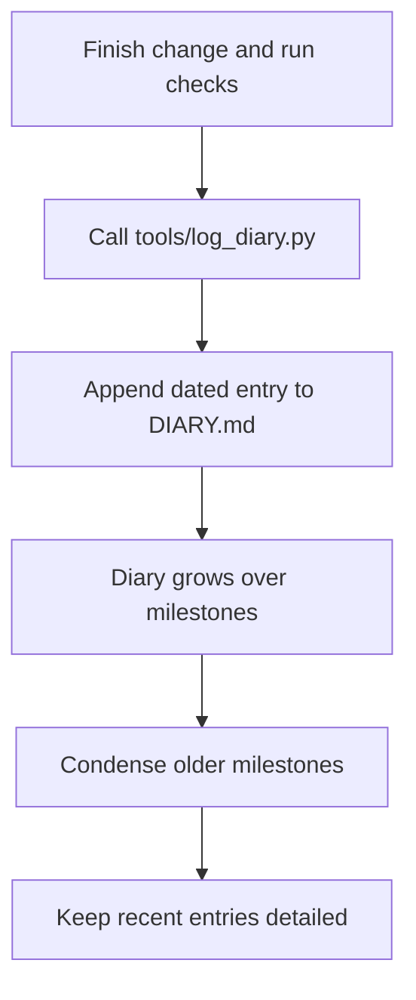

# The Living Engineering Chronicle and Context Compaction

Coding agents can make ten substantial changes to a system in an afternoon. A few weeks later, the repository shows what survived, but it may tell you very little about why those changes took this shape. A squashed or rebased branch can hide the intermediate attempts: a compiler quirk found halfway through, a concurrency bug worked around in the third iteration, or an approach that failed before the final diff. An architecture decision record (ADR) often has the opposite timing problem. It records the intended design before implementation reveals the limits of a library, API, or machine, and nobody updates it after the design changes.

Keep that reasoning in a chronological `DIARY.md`. The file records architectural changes, bug fixes, and structural changes as they happen. Each entry says which parts of the system changed, what changed, why, and how the result was checked. That gives a later reader more than a final diff or an initial design statement.

There is a practical catch. After weeks of work, the diary may be hundreds of kilobytes long. If the agent reads the entire file to append a short entry, old history fills its context window, costs tokens, and leaves less room for the task at hand. A small CLI script can write the entry straight to disk and return a short confirmation. At completed milestones, a separate session condenses older entries while leaving recent ones in full.



## How to use the diary

### Record reasoning while it is fresh

Git messages are often reduced to one PR summary when work is squashed. They also seldom carry benchmark deltas, runtime measurements, or exact test results. ADRs describe an intended direction, but runtime errors, library bugs, hardware limits, and API constraints can force changes during implementation. Write down those discoveries when they happen, alongside the change they explain.

### Give every entry four parts

An entry identifies the affected crates, modules, configuration files, or schemas; describes the actual algorithm, data structure, or wiring changes; explains the problem, instruction, root cause, trade-off, and rejected options; and lists the tests, benchmarks, cycle counts, or pass/fail results used to check the work. A line such as “fixed bug in engine” does not give the next engineer enough to work with.

### Append without reading the history

For routine writes, the agent passes those four parts to a CLI tool. The tool checks the inputs, adds a timestamp, formats the entry, and appends it to `DIARY.md`. The existing entries do not enter the model's prompt. This matters as a multi-month diary grows from roughly 100 KB toward 500 KB.

### Condense completed milestones

Direct appends solve the prompt problem during daily work, but they do not stop the file from growing. After a milestone, run a separate compaction task. It condenses older entries into architectural summaries that retain decisions, rejected approaches, measurements, and difficult edge cases. Keep the current and immediately preceding milestones in full so a recent regression can still be traced step by step.

### Keep the backlog focused on future work

The diary holds completed work and its reasoning. The active task list stays small and contains upcoming work. [[Active Backlog Pruning and Context Hygiene in Agentic Roadmaps]] describes how to maintain that division.

## 1. Where Git and ADRs lose the details

In a fast agent workflow, several substantial refactors can happen before the end of a day. A squash merge removes the intermediate commits from the main history. Commit bodies rarely capture benchmark changes or runtime telemetry in a consistent form, and finding the relevant reasoning across diverging branches takes Git queries that an agent may handle poorly.

An ADR has a different weakness: it is usually written when the team knows the least about implementation details. If a hardware limit, API restriction, or runtime behavior forces a different design, the ADR may remain as it was. It is also separate from the actual diff and the test suite that verified the eventual choice.

The diary fills the space between those sources. Suppose an engineer asks weeks later why a dispatch kernel uses a flat lookup table instead of binary search. The dated entry can show the measured workload and benchmark behind that choice, even if the intermediate branch is gone. When an agent begins work in an unfamiliar subsystem, a compact summary of recent entries gives it the relevant decisions without making it infer intent from thousands of lines of code.

## 2. What an entry must contain

Use the same four fields each time. Here is an example:

```markdown
### [YYYY-MM-DD HH:MM TZ] — Title of Modification
- **Affected subsystems**:
  - `kernel/dispatch/`, `bus/arbitration/`, `rules/memory-model.md`
- **What changed**:
  - Replaced the event queue's heap buffer with a fixed 256-element ring buffer.
  - Made the cycle counter advance monotonically across micro-step phases.
  - Changed the interrupt priority encoder to check lines in phase 2 rather than immediately.
- **Why and what it costs**:
  - Root cause: Allocations under high throughput caused allocator lock contention and 15% frame drops.
  - Trade-off: The ring buffer limits in-flight interrupts to 256 but gives O(1) latency without allocations.
- **Verification and results**:
  - `cargo test -p kernel --test test_event_queue`: 42/42 passed.
  - `cargo test -p system --test test_bus_contention`: All 18 cycles matched the silicon baseline.
  - Architecture gate: No dynamic allocations in the hot path.
```

The fields answer four questions a later reader will actually ask: where was the change made; what happened down to the data structures; why was it necessary and what trade-off was accepted; and which command or measurement checked the result? Keep the actual outputs rather than replacing them with “tests passed.”

## 3. Append the entry without loading the diary

Imagine telling an agent only to “add an entry to `DIARY.md`.” A typical file-editing workflow reads the file before writing it back. At 400 KB, the diary might represent roughly 100,000 tokens. Reading that history to add 20 lines uses up context, raises API costs, can impair reasoning on the current task, and may lead to truncation.

Instead, finish the change, run its checks, and call a deterministic script with the entry fields:

```bash
python tools/log_diary.py \
  --title "Fix Bus Arbitration Race Condition" \
  --subsystems "kernel/bus/, scheduler/" \
  --changes "Added phase-latching; aligned wait-states" \
  --rationale "Reduced stalls during sustained input bursts" \
  --results "All 18 architecture tests passed cleanly"
```

The script checks that each argument is present, produces the timestamp and Markdown, and appends with `open(path, 'a')`. It can finish in around 0.05 seconds. The agent receives one short confirmation; none of the old diary contents are loaded into its prompt. That is the sense in which the append consumes zero prompt tokens for the existing file.

Here is the `tools/log_diary.py` implementation:

```python
#!/usr/bin/env python3
"""Append a verified engineering entry to DIARY.md without reading it."""

import argparse
import datetime
import sys
from pathlib import Path

DIARY_PATH = Path("DIARY.md")

ENTRY_TEMPLATE = """
### [{timestamp}] — {title}
- **Affected subsystems**:
{subsystems}
- **What changed**:
{changes}
- **Why and what it costs**:
{rationale}
- **Verification and results**:
{results}
"""


def format_bullet_points(raw_text: str) -> str:
    """Format each nonempty input line as a Markdown bullet."""
    lines = [line.strip() for line in raw_text.splitlines() if line.strip()]
    if not lines:
        return "  - None documented."
    formatted = []
    for line in lines:
        if line.startswith("- ") or line.startswith("* "):
            formatted.append(f"  {line}")
        else:
            formatted.append(f"  - {line}")
    return "\n".join(formatted)


def main():
    parser = argparse.ArgumentParser(description="Append an entry to DIARY.md.")
    parser.add_argument("--title", required=True, help="Title of the change.")
    parser.add_argument("--subsystems", required=True, help="Modules, paths, or schemas changed.")
    parser.add_argument("--changes", required=True, help="Algorithm or structure changes.")
    parser.add_argument("--rationale", required=True, help="Cause and trade-offs.")
    parser.add_argument("--results", required=True, help="Checks run and their results.")

    args = parser.parse_args()
    now = datetime.datetime.now(datetime.timezone.utc).astimezone()
    timestamp_str = now.strftime("%Y-%m-%d %H:%M %Z")

    entry = ENTRY_TEMPLATE.format(
        timestamp=timestamp_str,
        title=args.title.strip(),
        subsystems=format_bullet_points(args.subsystems),
        changes=format_bullet_points(args.changes),
        rationale=format_bullet_points(args.rationale),
        results=format_bullet_points(args.results),
    )

    try:
        # Append without reading existing diary entries.
        with open(DIARY_PATH, "a", encoding="utf-8") as f:
            f.write(entry.rstrip() + "\n\n")
        print(f"Successfully appended entry to {DIARY_PATH} at {timestamp_str}")
        sys.exit(0)
    except OSError as err:
        print(f"Error appending to {DIARY_PATH}: {err}", file=sys.stderr)
        sys.exit(1)


if __name__ == "__main__":
    main()
```

## 4. Condense older milestones

Appending directly keeps routine work from loading the history into the model, but `DIARY.md` still grows. Eventually the full file becomes awkward for an engineer to review and too large for an agent to read even when historical research calls for it.

The example below shows the intended shape of compaction. Older milestones become shorter summaries; the active work remains detailed.

```text
BEFORE (400 KB)
Milestone 1: 85 daily entries (150 KB) — older work
Milestone 2: 92 daily entries (170 KB) — older work
Milestone 3: 45 daily entries (80 KB)  — active work

AFTER compact-diary runs as Milestone 4 begins
Milestone 1: architectural summary (15 KB)
Milestone 2: architectural summary (20 KB)
Milestone 3: 45 detailed daily entries (80 KB) — previous milestone
Milestone 4: detailed daily entries — new active work

After another milestone, Milestone 3 can also become a shorter summary
(25 KB in this example). Milestone 4 then remains detailed.
```

Three rules govern this maintenance task:

1. **Keep the reasons, compress routine work.** Shorten typo fixes and straightforward test additions. Retain major decisions, rejected alternatives, performance baselines, and awkward hardware or runtime cases. The aim is to preserve how the design evolved, not merely remove old lines.
2. **Keep recent work detailed.** Leave the active milestone and the one immediately before it untouched. Engineers and agents may need the individual changes and test logs to diagnose a regression. Only older, settled milestones are candidates for compaction.
3. **Run compaction in its own session.** Make it an explicit maintenance task, such as a `compact-diary` skill, after finishing a milestone. A fresh session can focus on synthesizing the history instead of squeezing that work into a feature task and risking missing or invented details.

## 5. Use the diary with the rest of the workflow

The diary gives successive agent sessions and the engineering team a searchable record of decisions. The append script keeps daily entries out of the active prompt; milestone compaction keeps older history usable. The task backlog remains for upcoming work, while the diary records what was done and why.

### Related notes

- **[[Active Backlog Pruning and Context Hygiene in Agentic Roadmaps]]** explains how to keep active tasks short while archiving completed work.
- **[[Token Optimization and Context Economics in Agentic Workflows]]** covers token costs, tools that run outside model context, and different reasoning tiers in the agent loop.
- **[[Agentic Coding Harness and Controlled Development Workflows]]** covers the surrounding checks, isolated environments, and skill execution.
- **[[The Conductor Pattern for High-Bandwidth Engineering]]** shows how a human lead maintains architectural continuity across agent sessions.
- **[[In-Flight Documentation as the Primary Framework for Coding Agents]]** covers recording architectural changes during implementation.
- **[[Learning Coding Agents Through Failure-Driven Instructions]]** covers turning debugging lessons from diary entries into lasting rules.
- **[[LLM Agents and Institutional Memory in Software Teams]]** discusses retaining knowledge across short-lived agent contexts.
