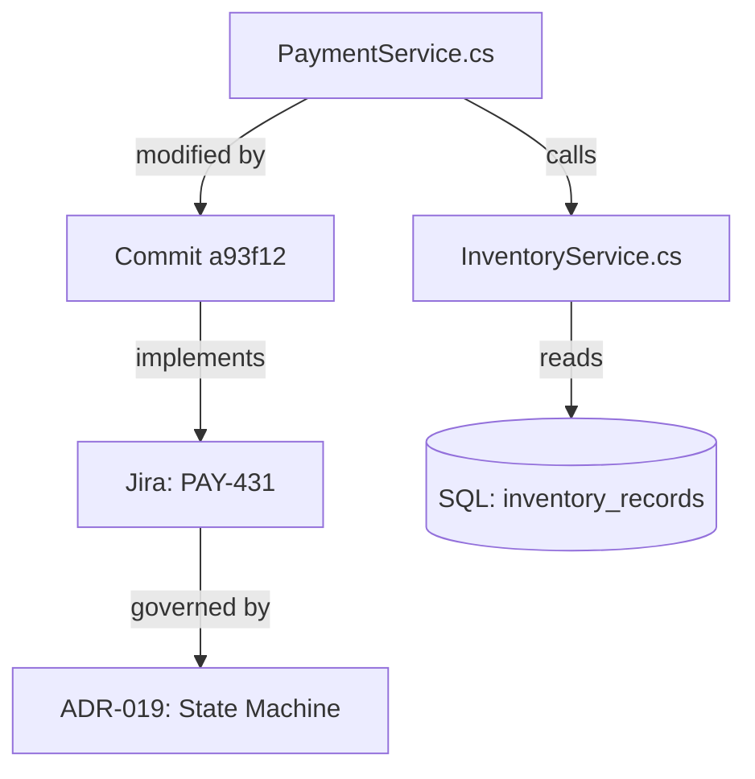

# Retrieval-Augmented Generation and Context Architecture

> [!IMPORTANT]
> **Core Architectural Takeaway**: Retrieval-Augmented Generation (RAG) is fundamentally a **Context Minimization Architecture**, not merely a workaround for finite context windows. Blindly dumping monolithic codebases into million-token windows degrades transformer attention density ("Lost in the Middle"), explodes inference costs, and inflates agent loop latency. Production-grade software engineering demands multi-stage retrieval: AST-aware structural chunking, hybrid fusion (dense embeddings + sparse BM25 lexical search), cross-encoder reranking, and graph-relational traversal to inject dense, high-signal invariants at the precise point of decision.

```text
           HYBRID CONTEXT RETRIEVAL & MINIMIZATION PIPELINE
+-------------------------------------------------------------------------+
| [ Codebase, ADRs, Git History, Issue Trackers ]                         |
+------------------------------------|------------------------------------+
                                     | (AST-Aware Structural Chunking)
                                     v
         +---------------------------+---------------------------+
         |                                                       |
         v                                                       v
+---------------------------------+     +---------------------------------+
| DENSE VECTOR EMBEDDINGS         |     | SPARSE LEXICAL INDEX (BM25)     |
| Semantic intent & conceptual    |     | Exact symbol names, error codes,|
| similarity search               |     | function signatures & constants |
+---------------------------------+     +---------------------------------+
         |                                                       |
         +---------------------------+---------------------------+
                                     |
                                     v
+-------------------------------------------------------------------------+
| [ RECIPROCAL RANK FUSION (RRF) & CROSS-ENCODER RERANKER ]               |
| Filters false positives, re-scores joint attention across top-K         |
+------------------------------------|------------------------------------+
                                     |
                                     v (Compact Context < 1.5k Tokens)
+-------------------------------------------------------------------------+
| [ High-Density Transformer Context Window ] ---> [ Fast Agent Decision ]|
| Preserves attention density, minimizes TTFT, eliminates middle-decay   |
+-------------------------------------------------------------------------+
```

## Executive Summary & Core Architectural Invariants

1. **Context Minimization Over Window Bloat**: RAG's primary objective is to maximize attention density and minimize loop latency. Stuffing 100k+ tokens into every agent step dilutes transformer attention, increases time-to-first-token, and causes severe "Lost in the Middle" cognitive degradation.
2. **AST-Aware Structural Chunking**: Source code must never be split by arbitrary character or token counts. Ingestion pipelines must parse AST boundaries (functions, classes, interfaces, ADR blocks) to preserve complete logical invariants within individual chunks.
3. **Mandatory Hybrid Fusion (Dense + Sparse)**: Pure vector similarity fails in software engineering because it cannot guarantee exact matches for specific symbols, variable names, or error codes. Production retrieval requires pairing dense embeddings with sparse BM25 lexical search via Reciprocal Rank Fusion ($RRF$).
4. **Cross-Encoder Attention Reranking**: Re-scoring top candidates with a cross-encoder before prompt injection eliminates semantic near-misses that share superficial vector proximity but belong to unrelated modules.
5. **Multi-Hop Relational Traversal (Graph RAG)**: Complex refactoring across enterprise systems requires navigating typed relationships (call graphs, dependency trees, commit histories, ticket linkages), which can only be resolved by traversing explicit graph structures rather than flat vector indices.

---

## Architectural Summary
Language models operate within bounded, expensive, and attention-diluting context windows. While modern frontier models offer theoretical context capacities of millions of tokens, blindly dumping entire source files, repositories, or documentation sets into a prompt creates catastrophic operational failure: latency spikes, exorbitant token costs, attention dilution ("Lost in the Middle"), and hallucinations.

**Retrieval-Augmented Generation (RAG)** is the fundamental architectural pattern that decouples a model's operational knowledge from its static weights or raw context limits. Rather than forcing the model to remember everything or ingest monolithic files, RAG dynamically retrieves precise, high-signal semantic fragments and injects them into the model’s reasoning path at the exact moment of decision, forming the operational context foundation for [[Agentic Coding Harness and Controlled Development Workflows|agentic development harnesses]].

```text
Traditional Monolithic Ingestion:
Whole Repositories (50k+ lines) ──► Bloated Prompt (100k+ tokens) ──► High Latency, Attention Loss, Noise

Precision Context Architecture (RAG):
Project Knowledge Base ──► Targeted Query ──► Dense/Sparse Retrieval ──► Compact Context (<1.5k tokens) ──► LLM
```

---

## 1. Context Minimization: Why Not Just Dump Whole Files?

Even with massive context windows, loading entire code files or entire directories into an agent prompt violates fundamental engineering efficiency:

1. **Precision Context over Whole Files**: When an agent needs to fix a bug in a payment settlement routine, it does not need 3,000 lines of boilerplate UI controllers or test fixtures. It needs the specific 35-line state transition function, the database schema contract, and the relevant Architectural Decision Record (ADR).
2. **Eliminating the "Lost in the Middle" Degradation**: Deep learning research consistently demonstrates that transformer attention degrades when critical reasoning clues are buried in the middle of massive token streams. Dense, curated context consistently outperforms sprawling context in reasoning benchmarks.
3. **Latency and Token Economics**: Multi-turn agentic coding loops invoke models dozens of times. Passing 100,000 tokens on every loop turn explodes API costs and inflates time-to-first-token (TTFT) from 500ms to 15 seconds. Compact, retrieved contexts (<1,500 tokens) keep agent execution responsive and budget-conscious.
4. **Headroom for Agentic State Machines**: In long-running agent workflows, keeping retrieved fragments small preserves context headroom for intermediate scratchpads, Git diffs, compiler error outputs, and multi-step tool calls, avoiding [[Constraint Saturation and Rule Oscillation in Coding Agents|rule oscillation and prompt saturation]].

---

## 2. The Four Evolutionary Generations of RAG

RAG has progressed far beyond naive vector databases:

```text
Generation 1: Naive Vector RAG
Documents ──► Fixed Chunks ──► Embeddings ──► Vector Similarity Search ──► Prompt Context ──► LLM

Generation 2: Hybrid RAG
Query ──► [Dense Vector Embedding + Sparse BM25 Lexical + Metadata Filters] ──► RRF Fusion ──► Cross-Encoder Reranker ──► LLM

Generation 3: Agentic RAG
Agent Loop ──(Dynamic Query Formulation)──► Multiple Search Tools ──(Evaluate Relevance)──► Backtrack/Drilldown ──► Synthesis

Generation 4: Graph RAG
Structured Knowledge Graph (Nodes, Typed Edges) + Vector Embeddings ──► Subgraph Path Reasoning ──► Global & Local Synthesis
```

### Generation 1: Naive RAG (The Vector-Only Trap)
The early standard: slice text into fixed-size character windows (e.g., 500 tokens), compute vector embeddings, store them in a vector database (Chroma, Pinecone), and retrieve the top-K cosine similarity matches.  
*Fatal Flaws*: Completely blind to exact keywords (e.g., function names like `ProcessTx_v2`), cuts sentences in half, loses hierarchical parent context, and retrieves irrelevant semantic neighbors.

### Generation 2: Hybrid RAG (Dense + Sparse + Reranking)
Combines dense semantic vector search with sparse lexical search (BM25) via **Reciprocal Rank Fusion (RRF)**, followed by a secondary **Cross-Encoder Reranker**:
- BM25 guarantees that exact symbol names, error codes (`ERR_404_NULL_REF`), and specific identifiers are matched with 100% precision.
- Dense embeddings capture conceptual equivalence (e.g., matching "rate limiting" with "token bucket throttling").
- The Cross-Encoder computes deep, cross-attention relevance scores between the query and candidate passages, filtering out semantic false positives.

### Generation 3: Agentic RAG
Retrieval is no longer a single-shot database query. An autonomous agent actively formulates queries, evaluates whether the retrieved information answers the core inquiry, drills down into referenced files, and backtracks if the context is insufficient:
1. Search codebase for `PaymentProcessor.cs`.
2. Inspect Git blame to find commit `a93f12`.
3. Retrieve linked Jira ticket `PAY-431` via API.
4. Read linked Architectural Decision Record `ADR-019`.
5. Synthesize root cause with complete context.

*(Note: While agentic RAG executes this multi-hop chain during deep forensic debugging, routine code modifications cannot afford speculative VCS tool queries for every line; routine operations depend on zero-latency co-located context anchors, as explored in [[Comments May Become More Valuable in AI-Generated Code]].)*

### Generation 4: Graph RAG (Relational and Topological Knowledge)
Software systems are directed graphs, not flat paragraphs. Graph RAG constructs a knowledge graph where code symbols, database tables, team ownerships, and architectural decisions are linked by typed edges:



By traversing typed paths (`calls`, `implements`, `authored_by`, `breaks`), the model can answer multi-hop architectural queries that vector similarity alone cannot resolve.

---

## 3. Ingestion, Parsing, and Chunking Strategies

A RAG system's retrieval quality is permanently bounded by the quality of its ingestion pipeline: **garbage in, garbage out**.

```text
Raw Source ──► Format Parsing ──► AST / Structure Normalization ──► Semantic Chunking ──► Metadata Enrichment ──► Dual Indexing
```

### Format Parsing and Content Normalization
Different technical formats require specialized extraction:
- **Markdown / Architecture Notes**: Parse headers (`#`, `##`, `###`) to preserve conceptual hierarchy; keep tables and code snippets intact.
- **Source Code**: Must be parsed via **Abstract Syntax Tree (AST)** parsers (such as Tree-sitter) rather than naive line splitting. Chunks must respect function, class, and method boundaries.
- **API Specs (OpenAPI / GraphQL)**: Chunk by complete endpoint or schema type definition; never split a request payload from its response contract.

### Chunking Strategies for Technical Knowledge

| Strategy | Mechanism | Best Used For | Trade-Offs |
| :--- | :--- | :--- | :--- |
| **Fixed-Size Chunking** | Splits every $N$ characters/tokens with overlap | Generic narrative text | Destroys code semantics; cuts blocks mid-expression |
| **AST / Syntax-Aware Chunking** | Slices along function, struct, and module boundaries | Source code across compiled and dynamic languages | Variable chunk sizes; requires specialized parsers |
| **Document Hierarchy Chunking** | Chunks by Markdown header levels (`H2`/`H3`) | Architecture vaults, Obsidian notes | Chunks can become too long if sections are verbose |
| **Parent-Document / Small-to-Big** | Indexes small 100-token chunks for search; returns parent 1000-token section to LLM | Technical documentation | Requires two-tier storage and retrieval mapping |

### Metadata Enrichment
Every chunk stored in the retrieval index must carry structured metadata:
- `file_path`, `repository`, `branch`, `commit_sha`
- `content_type` (`code`, `markdown_spec`, `adr`, `test`, `telemetry_log`)
- `parent_symbol` (e.g., `Class: OrderSettlementEngine`)
- `dependencies` (imported namespaces or external packages)
- `version` / `last_updated_timestamp`

---

## 4. Retrieval, Fusion, and Ranking Dynamics

Retrieval is a multi-stage pipeline designed to narrow a database of 500,000 chunks down to the 5 most critical fragments:

```text
Query Formulation ──► Parallel Dense & Sparse Search ──► Reciprocal Rank Fusion ──► Cross-Encoder Reranker ──► Top-K to Context
```

### 1. Query Transformation and Expansion
Users often type underspecified queries: *"Why is checkout failing?"*  
The retrieval harness performs:
- **HyDE (Hypothetical Document Embeddings)**: The model generates a hypothetical technical answer or log snippet, and the system searches for chunks matching that hypothetical output.
- **Sub-Query Decomposition**: Deconstructs a complex question into orthogonal sub-queries (e.g., Query 1: *"Checkout database deadlocks"*, Query 2: *"Payment gateway timeout exceptions"*).

### 2. Reciprocal Rank Fusion (RRF)
To combine dense vector scores (which measure semantic affinity) with BM25 scores (which measure keyword precision), the system uses rank-based normalization:

$$RRF\_Score(d) = \sum_{m \in \{dense, sparse\}} \frac{1}{k + rank_m(d)}$$

Where $k \approx 60$ is a smoothing constant. This ensures that a chunk appearing at the top of either search receives a strong priority without requiring score scale calibration.

### 3. Cross-Encoder Reranking
Bi-encoder embedding models process queries and documents independently to generate vectors. This enables sub-millisecond similarity search, but sacrifices deep semantic interaction.  
The **Cross-Encoder Reranker** passes the query and candidate chunk together through full attention layers, computing an exact relevance score. Slicing the candidate pool from Top-50 down to Top-5 via a cross-encoder typically yields a 20–35% increase in answer accuracy.

---

## 5. The Project Knowledge Layer & Enterprise On-Premises Architecture

In professional software development, RAG is not an external chatbot feature; it forms the **Project Knowledge Layer**:

```text
                                  Autonomous Agent Loop
                                            │
                                    Context Planner
                                            │
                    ┌───────────────────────┼───────────────────────┐
                    │                       │                       │
              Hybrid RAG               Graph RAG               MCP Tool API
          (Code, Specs, ADRs)     (Git Dependencies, Jira) (Live Host Telemetry)
                    │                       │                       │
                    └───────────────────────┼───────────────────────┘
                                            ↓
                           Enterprise Knowledge Layer    
```

### Local On-Premises Deployment (Confidentiality Sovereign)
For organizations with strict intellectual property and regulatory boundaries, RAG pipelines can run 100% locally:
- **Local Embedding Models**: BAAI/bge-large-en, nomic-embed-text running on local CPU/GPU via ONNX runtime or Ollama.
- **Local Search Engines**: Qdrant / Milvus (vector) + Meilisearch / SQLite FTS5 (lexical BM25).
- **Local Rerankers**: BAAI/bge-reranker-large running on-device.
- **Execution Privacy**: No source code, architectural specs, or employee queries ever leave the private organizational boundary.

---

## 6. Failure Modes, Semantic Drift, and Invariant Defense

Deploying RAG in software systems reveals distinct architectural hazards:

1. **The Chunk Fragmentation Blindness**: If a business invariant spans 40 lines and is sliced across two chunks, neither chunk alone contains the full logical rule. *Countermeasure: Small-to-Big retrieval (index small sentences, return parent blocks).*
2. **Stale Index Drift (The Ghost Architecture Trap)**: Source code is refactored, but the vector index still contains chunks from deprecated interfaces. When prompted, the agent hallucinates implementations based on obsolete designs. *Countermeasure: Continuous CI-driven index invalidation synchronized with Git commits.*
3. **Semantic Dilution and Hallucinated Relevance**: A chunk shares keywords with the query but discusses a completely different subsystem. *Countermeasure: Strict metadata filtering (scoping retrieval to the target service or module).*

---

## 7. Summary

1. **RAG is Context Minimization**: Modern RAG is not about overcoming token limits; it is about providing dense, high-signal, attention-preserving context while slashing latency and token burn.
2. **Hybrid is Mandatory**: Dense vector search alone fails in software engineering. Precise symbol matching (BM25) fused with semantic embeddings (RRF) and verified by cross-encoders is the bare minimum for reliable code retrieval.
3. **AST Over Character Slicing**: Code must be chunked along logical language boundaries (functions, classes, contracts) using AST parsers, never naive character windows.
4. **Agentic & Graph Integration**: Real engineering context requires multi-hop path traversal across Git history, Jira tickets, and architectural decision records.
5. **The Foundation of Autonomous Engineering**: High-density living specifications in Obsidian paired with hybrid RAG pipelines provide the executable foundation that enables coding agents to operate with precision and mechanical discipline.

---

## Relationship to the Knowledge Graph

- **[[Agentic Coding Harness and Controlled Development Workflows]]**: How execution harnesses query the RAG index to seed context into autonomous coding loops.
- **[[In-Flight Documentation as the Primary Framework for Coding Agents]]**: Generating in-flight documentation templates specifically formatted for high-efficiency RAG indexing.
- **[[How Personal AI Models Will Diff, Reconcile, and Challenge External Knowledge]]**: Using personal second-brain RAG indexes as the baseline for computing cognitive diffs against external knowledge.
- **[[How LLM Systems Build Context]]**: The complementary mechanics of context window management, compaction, and retrieval scheduling.
- **[[Designing Software for AI Agents]]**: Designing codebases with clear structural boundaries that enable clean, unambiguous AST chunking and retrieval.
- **[[Comments May Become More Valuable in AI-Generated Code]]**: Contrasts multi-hop agentic retrieval (Git blame, ticket lookup) with zero-cost co-located context injection directly in source files.
- **[[LLM Agents and Institutional Memory]]**: Preserving long-term organizational knowledge across teams via persistent, version-controlled RAG repositories.
- **[[WebMCP - Turning Web Applications into Agent-Native Toolkits]]**: Exposing browser-side tool state and DOM context directly to client-side RAG agents.
