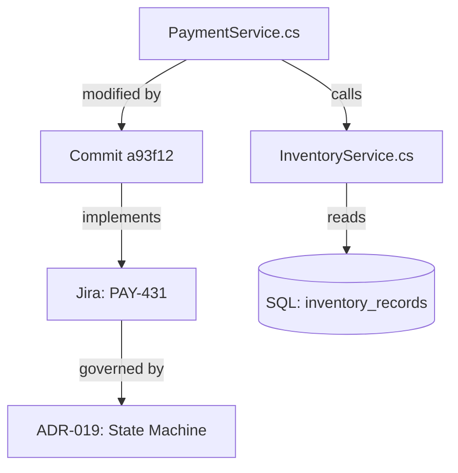

# Retrieval-Augmented Generation and Context Architecture

> [!IMPORTANT]
> **Core Architectural Takeaway**: Retrieval-Augmented Generation (RAG) is fundamentally a **Context Minimization Architecture**, not a workaround for small context windows. Dumping monolithic codebases into million-token windows degrades transformer attention density ("Lost in the Middle"), drives inference costs through the roof, and inflates agent loop latency to unusable levels. In production software engineering, retrieval must be multi-stage: AST-aware structural chunking, hybrid fusion (dense embeddings combined with sparse BM25 lexical search), cross-encoder reranking, and graph-relational traversal to inject high-signal technical context directly at the point of decision.

```text
           HYBRID CONTEXT RETRIEVAL & MINIMIZATION PIPELINE
+-------------------------------------------------------------------------+
| [ Codebase, ADRs, Git History, Issue Trackers ]                         |
+------------------------------------|------------------------------------+
                                     | (AST-Aware Structural Chunking)
                                     v
         +---------------------------+---------------------------+
         |                                                       |
         v                                                       v
+---------------------------------+     +---------------------------------+
| DENSE VECTOR EMBEDDINGS         |     | SPARSE LEXICAL INDEX (BM25)     |
| Semantic intent & conceptual    |     | Exact symbol names, error codes,|
| similarity search               |     | function signatures & constants |
+---------------------------------+     +---------------------------------+
         |                                                       |
         +---------------------------+---------------------------+
                                     |
                                     v
+-------------------------------------------------------------------------+
| [ RECIPROCAL RANK FUSION (RRF) & CROSS-ENCODER RERANKER ]               |
| Filters false positives, re-scores joint attention across top-K         |
+------------------------------------|------------------------------------+
                                     |
                                     v (Compact Context < 1.5k Tokens)
+-------------------------------------------------------------------------+
| [ High-Density Transformer Context Window ] ---> [ Fast Agent Decision ]|
| Preserves attention density, minimizes TTFT, eliminates middle-decay   |
+------------------------------------|------------------------------------+
```

---

## Engineering Principles for Production Context Systems

1. **Context Minimization Over Window Bloat**: RAG's primary operational job is maximizing attention density and slashing agent loop latency. Shoving 100k+ tokens into every execution step dilutes transformer attention, inflates time-to-first-token (TTFT), and triggers severe "Lost in the Middle" degradation.
2. **AST-Aware Structural Chunking**: Source code must never be split by arbitrary character counts or naive token lengths. Ingestion pipelines must parse language-specific Abstract Syntax Tree (AST) boundaries (functions, classes, interfaces, ADR blocks) to guarantee that logical units remain intact within individual chunks.
3. **Mandatory Hybrid Fusion (Dense + Sparse)**: Pure vector similarity search fails when applied to software engineering. It cannot reliably locate exact symbols, variable names, or hardware error codes. Production retrieval requires pairing dense semantic embeddings with sparse BM25 lexical search, combined via Reciprocal Rank Fusion ($RRF$).
4. **Cross-Encoder Attention Reranking**: Rescoring top candidate chunks with a cross-encoder before prompt assembly filters out semantic near-misses—documents that sit near the query in embedding space but belong to completely unrelated modules.
5. **Multi-Hop Relational Traversal (Graph RAG)**: Complex refactoring across enterprise codebases requires navigating typed relationships (call graphs, dependency trees, commit histories, ticket linkages). These connections cannot be resolved using flat vector similarity; they require explicit graph traversal.

---

## Architectural Overview

Language models operate within bounded, expensive, and attention-diluting context windows. Frontier models now advertise theoretical context limits in the millions of tokens. However, treating these windows as dumping grounds for entire repositories, documentation sets, or raw logs creates immediate operational issues: massive latency spikes, runaway token costs, attention dilution ("Lost in the Middle"), and hallucinations.

**Retrieval-Augmented Generation (RAG)** decouples the model's operational knowledge from its static weights and context limits. Instead of expecting the model to retain everything in weights or parsing whole files on every call, RAG queries external indices, extracts precise, high-signal fragments, and injects them directly into the model's reasoning path at the exact point of execution. This is the foundation of [[Agentic Coding Harness and Controlled Development Workflows|agentic development harnesses]].

```text
Traditional Monolithic Ingestion:
Whole Repositories (50k+ lines) ──► Bloated Prompt (100k+ tokens) ──► High Latency, Attention Loss, Noise

Precision Context Architecture (RAG):
Project Knowledge Base ──► Targeted Query ──► Dense/Sparse Retrieval ──► Compact Context (<1.5k tokens) ──► LLM
```

---

## 1. Context Minimization: Why Whole-File Dumps Break Production Systems

When engineers see modern, massive context windows, their first instinct is often to stop indexing and dump entire source files into the prompt. In production agents, that approach runs into four hard technical constraints:

1. **Precision Context Over Whole Files**: If an agent needs to fix a state bug in a payment settlement loop, it does not need the surrounding 3,000 lines of UI routing, mock setups, and logging helpers. It needs the specific 35-line state transition function, the database schema contract, and the relevant Architectural Decision Record (ADR).
2. **Eliminating "Lost in the Middle" Degradation**: Transformer self-attention is not uniformly distributed across long sequences. Attention density degrades when key reasoning constraints are buried in the middle of massive token streams. Dense, curated context windows consistently beat raw, bloated prompts on multi-step reasoning benchmarks.
3. **Inference Latency and Token Economics**: Multi-turn agent loops execute dozens of iterative steps. Running 100,000 tokens on every turn drives API costs up linearly and pushes TTFT from 500 milliseconds out to 15 seconds. Keeping retrieved context under 1,500 tokens ensures the agent loop remains fast and cost-effective.
4. **Headroom for Agentic State Machines**: Long-running workflows require prompt space for scratchpads, Git diffs, compiler error logs, and multi-step tool call returns. Keeping retrieved context small preserves context headroom, preventing [[Constraint Saturation and Rule Oscillation in Coding Agents|rule oscillation and prompt saturation]].

---

## 2. The Four Evolutionary Generations of RAG

Retrieval architectures have evolved through four distinct operational phases:

```text
Generation 1: Naive Vector RAG
Documents ──► Fixed Chunks ──► Embeddings ──► Vector Similarity Search ──► Prompt Context ──► LLM

Generation 2: Hybrid RAG
Query ──► [Dense Vector Embedding + Sparse BM25 Lexical + Metadata Filters] ──► RRF Fusion ──► Cross-Encoder Reranker ──► LLM

Generation 3: Agentic RAG
Agent Loop ──(Dynamic Query Formulation)──► Multiple Search Tools ──(Evaluate Relevance)──► Backtrack/Drilldown ──► Synthesis

Generation 4: Graph RAG
Structured Knowledge Graph (Nodes, Typed Edges) + Vector Embeddings ──► Subgraph Path Reasoning ──► Global & Local Synthesis
```

### Generation 1: Naive RAG (The Vector-Only Trap)
The early baseline: split raw text into fixed-size character chunks (e.g., 500 tokens), generate vector embeddings, push them to a vector database (Chroma, Pinecone), and retrieve the top-K matches using cosine similarity.  
*The problem in codebases*: It is completely blind to exact keywords. It cannot reliably surface function names like `ProcessTx_v2`, splits code blocks mid-statement, drops parent class scopes, and frequently pulls in irrelevant code that merely sounds similar.

### Generation 2: Hybrid RAG (Dense + Sparse + Reranking)
Combines dense semantic vector search with sparse lexical search (BM25) through **Reciprocal Rank Fusion (RRF)**, then passes the candidates through a **Cross-Encoder Reranker**:
- **BM25** guarantees deterministic matching for exact symbol names, error codes (`ERR_404_NULL_REF`), and system constants.
- **Dense embeddings** catch conceptual synonyms (for example, matching "rate limiting" with "token bucket throttling").
- **Cross-Encoder** layers run joint cross-attention over the query and candidate passages together, stripping out superficial semantic matches before they reach the model's context.

### Generation 3: Agentic RAG
Retrieval shifts from a static single-shot database lookup to an interactive investigation. The agent formulates queries dynamically, evaluates candidate passages, dives into references, and backtracks if the retrieved information is incomplete:
1. Search codebase for `PaymentProcessor.cs`.
2. Inspect Git blame to find commit `a93f12`.
3. Query the Jira API to pull linked issue `PAY-431`.
4. Load Architectural Decision Record `ADR-019`.
5. Synthesize the root cause using the complete trail.

*(Note: While agentic RAG works well for deep forensic debugging, routine refactoring cannot afford multi-hop network queries for every change. Day-to-day code edits depend heavily on zero-latency, co-located context anchors, as detailed in [[Comments May Become More Valuable in AI-Generated Code]].)*

### Generation 4: Graph RAG (Relational and Topological Knowledge)
Codebases are directed graphs, not flat prose. Graph RAG builds an explicit knowledge graph where symbols, database tables, team boundaries, and design records are joined by typed edges:



Traversing these typed paths (`calls`, `implements`, `authored_by`, `breaks`) lets the model answer architectural questions across structural boundaries that flat vector similarity searches miss entirely.

---

## 3. Ingestion, Parsing, and Chunking Strategies

A retrieval system's output quality is strictly bounded by its ingestion pipeline: **garbage in, garbage out**.

```text
Raw Source ──► Format Parsing ──► AST / Structure Normalization ──► Semantic Chunking ──► Metadata Enrichment ──► Dual Indexing
```

### Format Parsing and Content Normalization
Different technical assets require dedicated parsers:
- **Markdown / Technical Specs**: Split along header markers (`#`, `##`, `###`) to preserve logical hierarchy. Tables and code blocks must stay whole; splitting a markdown table mid-row invalidates its layout for the LLM.
- **Source Code**: Source code must be parsed with **Abstract Syntax Tree (AST)** tools (like Tree-sitter) rather than raw line or token delimiters. Chunks must align with function, class, and interface boundaries.
- **API Specs (OpenAPI / GraphQL)**: Chunk by complete endpoint or schema type definition. Never split an endpoint's request payload from its response model.

### Chunking Strategies for Technical Knowledge

| Strategy | Mechanism | Best Used For | Trade-Offs |
| :--- | :--- | :--- | :--- |
| **Fixed-Size Chunking** | Slices text every $N$ characters or tokens with a sliding overlap window. | Unstructured narrative text, runbooks. | Destroys code semantics; breaks functions and blocks mid-expression. |
| **AST / Syntax-Aware Chunking** | Traverses language ASTs, splitting along functions, methods, and types. | Source code across compiled and dynamic languages. | Results in uneven chunk sizes; requires language-specific parser grammars. |
| **Document Hierarchy Chunking** | Parses Markdown header trees (`H2`/`H3`), preserving section nesting. | System architecture vaults, engineering runbooks. | Chunks can easily exceed optimal token limits if sections are long-winded. |
| **Parent-Document / Small-to-Big** | Indexes small 100-token chunks for dense search, but returns the parent 1,000-token section to the prompt. | Dense technical manuals, API guides. | Requires maintaining two-tier storage and bidirectional parent-child index pointers. |

### Metadata Enrichment
Every indexed chunk must include rich metadata properties to allow precise pre-retrieval filtering:
- `file_path`, `repository`, `branch`, `commit_sha`
- `content_type` (`code`, `markdown_spec`, `adr`, `test`, `telemetry_log`)
- `parent_symbol` (e.g., `Class: OrderSettlementEngine`)
- `dependencies` (imported namespaces, packages, or module includes)
- `version` / `last_updated_timestamp`

---

## 4. Retrieval, Fusion, and Ranking Dynamics

Retrieval should be treated as a multi-stage funnel designed to narrow a half-million chunk repository down to the 5 highest-signal context fragments:

```text
Query Formulation ──► Parallel Dense & Sparse Search ──► Reciprocal Rank Fusion ──► Cross-Encoder Reranker ──► Top-K to Context
```

### 1. Query Transformation and Expansion
Raw developer queries are often brief or incomplete: *"Why is checkout failing?"*  
The retrieval harness expands these queries before searching:
- **HyDE (Hypothetical Document Embeddings)**: The model writes a short, hypothetical log snippet or exception handler answering the query, and the pipeline searches for chunks that match that synthetic output in vector space.
- **Sub-Query Decomposition**: Splits complex questions into distinct sub-queries (e.g., Query 1: *"Checkout database deadlocks"*, Query 2: *"Payment gateway timeout exceptions"*).

### 2. Reciprocal Rank Fusion (RRF)
To merge dense vector scores (measuring semantic distance) with BM25 scores (measuring keyword frequency), normalize them using rank positions rather than raw scores:

$$RRF\_Score(d) = \sum_{m \in \{dense, sparse\}} \frac{1}{k + rank_m(d)}$$

Where $k \approx 60$ is a smoothing constant. Rank fusion guarantees that documents scoring near the top of either index receive significant weight, without needing to balance radically different score distributions.

### 3. Cross-Encoder Reranking
Bi-encoder embedding models vectorize the query and documents independently. This allows for fast vector searches using cosine similarity, but misses token-level interactions between the question and the candidate text.  
A **Cross-Encoder Reranker** takes the query and candidate chunk together, passing both through full attention layers to calculate an exact relevance score. Trimming the candidate pool from top-50 down to top-5 with a cross-encoder typically delivers a 20–35% jump in answer accuracy.

---

## 5. The Project Knowledge Layer & Enterprise On-Premises Architecture

In production development workflows, RAG is not an external chat add-on; it serves as the core **Project Knowledge Layer**:

```text
                                  Autonomous Agent Loop
                                            │
                                    Context Planner
                                            │
                    ┌───────────────────────┼───────────────────────┐
                    │                       │                       │
              Hybrid RAG               Graph RAG               MCP Tool API
          (Code, Specs, ADRs)     (Git Dependencies, Jira) (Live Host Telemetry)
                    │                       │                       │
                    └───────────────────────┼───────────────────────┘
                                            ↓
                           Enterprise Knowledge Layer    
```

### Local On-Premises Deployments (Confidentiality Sovereign)
For teams with strict IP boundaries, regulatory controls, or compliance limits, the entire RAG pipeline can run fully on-premises:
- **Local Embedding Models**: Run `BAAI/bge-large-en` or `nomic-embed-text` locally via ONNX Runtime or Ollama.
- **Local Search Engines**: Combine Qdrant or Milvus for dense vector indexing with Meilisearch or SQLite FTS5 for sparse BM25 indexing.
- **Local Rerankers**: Host `BAAI/bge-reranker-large` on an on-prem GPU or high-memory inference host.
- **Data Privacy**: No private code, architectural plans, or queries leave the secure corporate network perimeter.

---

## 6. Failure Modes, Semantic Drift, and Invariant Defense

Running RAG in real-world development workflows reveals three recurring failure modes:

1. **Chunk Fragmentation Blindness**: If a crucial business rule covers 40 lines of code and the chunker splits it at line 20, neither chunk retains the complete logic.  
   *Mitigation: Use Small-to-Big retrieval (index small leaf chunks, but return the broader parent block to the prompt).*
2. **Stale Index Drift (Ghost Architectures)**: When code is refactored, the vector database often retains chunks from deleted or modified functions. The model then writes code against deprecated interfaces.  
   *Mitigation: Integrate index updates into the CI pipeline, running invalidations automatically on every Git push.*
3. **Semantic Dilution and Hallucinated Relevance**: A chunk contains matching keywords, but belongs to an entirely unrelated module or namespace.  
   *Mitigation: Enforce strict metadata filtering to constrain searches to the target service, module, or package before running the query.*

---

## Summary

1. **RAG Is Context Minimization**: Modern RAG is built to deliver lean, high-signal context that prevents attention dilution, keeps inference latency low, and cuts token burn.
2. **Hybrid Search Is Mandatory**: Vector search alone fails in software development. Precise BM25 symbol matching combined with semantic embeddings (via RRF) and cross-encoder reranking is the baseline for reliable code retrieval.
3. **Chunk on ASTs, Not Character Counts**: Code must be sliced along syntax boundaries (functions, classes, contracts) using AST parsers like Tree-sitter, not arbitrary token windows.
4. **Graph Integration**: Complete engineering context requires traversing relationships across call graphs, Git histories, and architectural decision records.
5. **The Foundation for Autonomous Agents**: Maintaining dense living documentation alongside hybrid RAG pipelines gives coding agents the precise context they need to write production-grade code.

---

## Relationship to the Knowledge Graph

- **[[Agentic Coding Harness and Controlled Development Workflows]]**: How autonomous execution harnesses query the RAG index to seed context into agent loops.
- **[[In-Flight Documentation as the Primary Framework for Coding Agents]]**: Generating in-flight documentation structured for high-precision RAG indexing.
- **[[How Personal AI Models Will Diff, Reconcile, and Challenge External Knowledge]]**: Using local RAG indices to run semantic diffs against external documentation and updates.
- **[[How LLM Systems Build Context]]**: The mechanics of context window management, attention budgets, and retrieval scheduling.
- **[[Designing Software for AI Agents]]**: Structuring software systems to provide clean, modular AST boundaries for chunking and retrieval.
- **[[Comments May Become More Valuable in AI-Generated Code]]**: Comparing multi-hop agentic retrieval (Git blame, ticket lookups) with zero-latency co-located context embedded directly in source code.
- **[[LLM Agents and Institutional Memory]]**: Capturing and retaining institutional systems knowledge using versioned, shared RAG indices.
- **[[WebMCP - Turning Web Applications into Agent-Native Toolkits]]**: Exposing browser state, DOM layouts, and network telemetry directly to client-side RAG agents.
