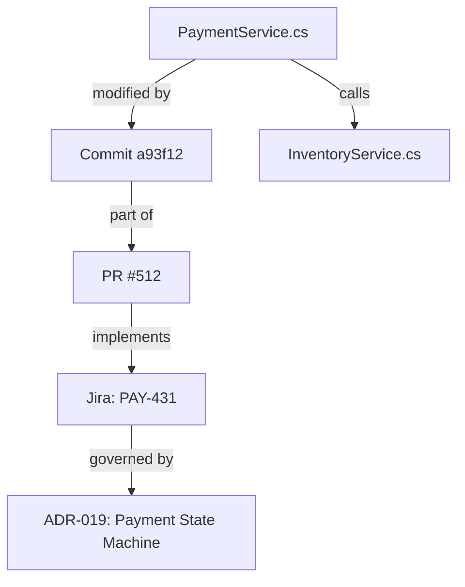

# Retrieval-Augmented Generation and Context Architecture

## What RAG Is

**RAG — Retrieval-Augmented Generation** — is a pattern in which a language model does not answer only from its trained knowledge and current conversation context.

Instead, before generating an answer, the system retrieves additional information from an external knowledge source and adds it to the model context.

The basic flow is:

```text
question
   ↓
retrieval
   ↓
relevant context
   ↓
LLM
   ↓
answer
```

In practice, RAG can be thought of as a way to give a model access to a large body of knowledge without putting all of that knowledge into the prompt at once.

For example, an agent working on a software project may retrieve information from:
- source code,
- Git history,
- commits and pull requests,
- Jira,
- Confluence,
- SharePoint / Office 365,
- ADRs,
- API specifications,
- incident reports,
- logs and telemetry,
- meeting notes.

This makes RAG one of the main mechanisms of **context engineering** for agents.

---

## Context Minimization: Why Not Just Dump Whole Files?

Even with modern models offering context windows of 1M+ tokens, loading entire files or whole repositories into the prompt is often inefficient and detrimental:

- **Targeted context over whole files**: Instead of pulling 10 entire 2,000-line source files or a 50-page architecture PDF, RAG selects only the specific 20 lines of logic, single class method, or relevant paragraph.
- **Reducing "Lost in the Middle" and noise**: Language models reason significantly better when the prompt contains dense, high-signal information. Flooding context with thousands of lines of boilerplate, imports, and unrelated helper functions degrades reasoning and invites hallucinations.
- **Latency and cost reduction**: Passing a 1,500-token prompt is substantially faster (time-to-first-token) and drastically cheaper than repeatedly transferring 100,000+ tokens across agent iterations.
- **Headroom for agent loops**: In multi-step agent workflows, keeping retrieved fragments minimal leaves context budget open for reasoning chains, conversation history, and subsequent tool execution outputs.

```text
Naive Whole-File Ingestion:
[ File A (1,500 lines) ] + [ File B (2,500 lines) ] + [ Architecture PDF (40 pages) ]
→ Bloated context (50k+ tokens), high latency, attention dilution, noise

RAG Precision Context:
[ Function A (25 lines) ] + [ Relevant Type Interface (15 lines) ] + [ Spec Section 3.2 ]
→ Compact context (<1k tokens), focused attention, fast response, low cost
```

In production agent loops, every token in the prompt carries a recurring latency and cost tax. Pushing time-to-first-token (TTFT) from 500 milliseconds out to 15 seconds across a 20-turn agent execution destroys developer ergonomics. Furthermore, keeping retrieved context compact preserves prompt headroom for intermediate reasoning chains, Git diffs, compiler error logs, and multi-step tool call returns, preventing context window saturation and rule oscillation.

---

## RAG Is More Than a Vector Database

A common simplification is:

> RAG = embeddings + vector database.

This is only the simplest form. A practical RAG system contains several specialized stages across the ingestion, search, and generation pipelines:

```text
data sources
    ↓
ingestion  ──────────────────────────┐
    ↓                                │
parsing / normalization              ├──> Detailed in [[RAG Ingestion and Chunking Strategies]]
    ↓                                │
chunking                             │
    ↓                                │
metadata enrichment                  │
    ↓                                │
indexing (embeddings + lexical) ─────┘
    ↓
retrieval  ──────────────────────────┐
    ↓                                ├──> Detailed in [[RAG Retrieval and Search]]
reranking                            │
    ↓                                │
source authority & versioning ───────┘
    ↓
architectural paradigms  ────────────┐
    ↓                                ├──> Detailed in [[Advanced RAG Architectures]]
context construction & agents ───────┘
    ↓
LLM / agent
```

---

## Modular Knowledge Map

This guide is modularized into specialized references covering each phase of the architecture:

1. **[[RAG Ingestion and Chunking Strategies]]**
   - Ingestion models: Indexed batch synchronization vs. live API retrieval.
   - Layout-aware parsing and normalization (Docling, PDF tables, multi-column code blocks).
   - AST and boundary-aware chunking strategies (code, markdown, tickets).
   - Metadata enrichment schemas and embeddings generation.

2. **[[RAG Retrieval and Search]]**
   - Limitations of pure vector similarity search for exact identifiers and symbols.
   - Hybrid search architecture (Dense vectors + BM25 sparse keyword search + metadata filtering).
   - Candidate fusion via Reciprocal Rank Fusion (RRF) and cross-encoder reranking.
   - Resolving source authority conflicts (Production Code > ADRs > Tickets > Comments).
   - Temporal awareness and versioning metadata (`valid_from`, `commit_sha`, branch tracking).

3. **[[Advanced RAG Architectures]]**
   - Architectural evolution: Naive, Hybrid, Agentic, and Graph RAG.
   - Multi-hop agentic investigations and dependency-graph reasoning.
   - Constructing a unified Project Knowledge Layer for software engineering.
   - Complete on-premises / local RAG technology stacks (Docling, Qdrant, Haystack, vLLM).
   - Enterprise security: Permission-aware retrieval and chunk-level ACLs.

---

## RAG and Tools / MCP

RAG and MCP solve related but distinct problems in agent workflows:

```text
RAG
= searchable prepared memory (broad discovery across historical documents and code)

MCP / tools
= active live access to source systems (real-time verification and action)
```

For example:
- **RAG:** *"This Jira issue PAY-431 and this PR #512 introduced the retry policy."*
- **Agent via MCP:** *"I will now call the GitHub MCP server to inspect the exact current code on the main branch."*

```text
indexed knowledge (RAG)
          +
   live tools (MCP)
          ↓
   autonomous agent
```

RAG provides broad historical discovery, while live tools provide authoritative current verification.

---

## A Sensible Adoption Path

A reliable path to adopt RAG in engineering teams is to progress incrementally rather than adopting an opaque, monolithic black-box platform:

```text
v1: Basic Document Search
    Docling + Qdrant + local embeddings (SentenceTransformers)
    ↓
v2: Structured Metadata
    Add repository, branch, author, and timestamp filtering
    ↓
v3: Hybrid Search & Reranking
    Combine vector embeddings with BM25 lexical search and a cross-encoder reranker
    ↓
v4: Multi-Source Ingestion
    Index Jira tickets, Confluence ADRs, and API specifications
    ↓
v5: Codebase & Git History Integration
    Link AST-parsed code chunks with commits and pull requests
    ↓
v6: Agentic Tools & MCP Interconnect
    Expose the knowledge layer as a tool to autonomous developer agents
    ↓
v7: Knowledge Graph (Graph RAG)
    Model relationships explicitly between services, tickets, authors, and specs
```

---

## Key Takeaway

RAG should not be understood merely as:

> Search some vectors and give the results to an LLM.

A more useful definition is:

> **RAG is a mechanism for selecting the most relevant external knowledge and constructing the context needed by a model or agent to solve the current task.**

For software engineering, the ultimate objective is:

> **Build a reliable, permission-aware, temporally aware project knowledge layer that agents can explore, navigate, and verify.**

---

<!-- Source: RAG/Advanced RAG Architectures.md -->

---
title: Advanced RAG Architectures
tags:
  - rag
  - ai-agents
  - system-architecture
  - graph-rag
  - retrieval
  - hybrid-search
  - knowledge-graphs
aliases:
  - Advanced RAG Patterns
  - Agentic and Graph RAG Architectures
---

# Advanced RAG Architectures

This note explores modern architectural paradigms for Retrieval-Augmented Generation, ranging from Agentic RAG and Graph RAG to local deployment stacks and permission-aware enterprise security.

It builds upon [[RAG Ingestion and Chunking Strategies]] and [[RAG Retrieval and Search]], serving as an advanced architectural reference for [[Introduction to RAG]].

---

## 1. Main Classes of RAG Systems

RAG architectures have evolved across four distinct generations:

```text
1. Naive RAG:
   Documents ──> Chunks ──> Embeddings ──> Vector DB ──> Prompt Context ──> LLM

2. Hybrid RAG:
   Query ──> [Dense Vector + Sparse BM25 + Filters] ──> RRF Fusion ──> Reranker ──> LLM

3. Agentic RAG:
   Agent Loop ──(Query Formulation)──> Tool / Retriever ──(Analyze Results)──> Next Step ──> Synthesis

4. Graph RAG:
   Knowledge Graph (Nodes & Typed Edges) + Vector Index ──> Subgraph Extraction & Path Reasoning ──> LLM
```

### Naive RAG
The early baseline splits raw text into fixed-size character or token windows, generates embeddings, stores them in a vector database, and queries via cosine similarity. In software engineering codebases, this vector-only approach fails constantly: it cannot reliably match exact symbols or function names like `ProcessTx_v2`, splits syntax mid-statement, drops enclosing class scopes, and pulls in syntactically similar code from entirely unrelated modules.

### Hybrid RAG
Hybrid retrieval addresses lexical blindness by pairing dense semantic vector search with sparse lexical indices (BM25) fused via Reciprocal Rank Fusion (RRF), then passing the candidates through a cross-encoder reranker. BM25 guarantees deterministic matching for exact identifiers, error codes, and configuration keys, while dense vectors capture conceptual synonyms. A cross-encoder reranking stage evaluates joint attention over the query and candidate chunk together, pruning false positives before prompt assembly.

### Agentic RAG
In Agentic RAG, retrieval is not a single shot, but an iterative investigation guided by an autonomous agent loop:
```text
1. Analyze user request
2. Search codebase for target service ("PaymentProcessor")
3. Find suspicious commit SHA in git blame
4. Retrieve corresponding Jira ticket via ID
5. Read linked Architectural Decision Record (ADR)
6. Cross-reference unit tests
7. Synthesize complete root-cause answer
```
The agent controls query formulation, evaluates whether retrieved context is sufficient, and backtracks or issues follow-up queries dynamically.

While agentic RAG excels at deep forensic investigations across distributed repositories and ticketing systems, routine refactoring cannot afford multi-hop network roundtrips for every local edit. Day-to-day code maintenance relies heavily on zero-latency, co-located context anchors, as detailed in [[Comments May Become More Valuable in AI-Generated Code]].

### Graph RAG
Software engineering knowledge forms an interconnected natural graph rather than isolated text snippets:



Graph RAG combines structured knowledge graphs (e.g. Neo4j) with vector embeddings, allowing models to traverse explicit dependencies (`calls`, `implements`, `authored_by`, `breaks`) before generating answers.

---

## 2. RAG as a Project Knowledge Layer

For software engineering teams, RAG is moving beyond simple document question-answering into a unified **Project Knowledge Layer**:

```text
                          Autonomous Agent
                                 │
                          Context Planner
                                 │
         ┌───────────────────────┼───────────────────────┐
         │                       │                       │
   Hybrid Search           Graph Traversal         MCP / Live Tools
  (Code & Docs)         (Dependencies & Git)     (Current State & CLI)
         │                       │                       │
         └───────────────────────┼───────────────────────┘
                                 ↓
                    Project Knowledge Substrate
```

This substrate allows agents to answer high-level architectural queries:
- *Why was this abstraction introduced rather than a direct database call?*
- *Which Jira tickets and pull requests influenced this service contract?*
- *Are current runtime configurations consistent with the architectural specs?*

---

## 3. Example Local RAG Stack

For enterprise environments with strict confidentiality, the entire RAG pipeline can be deployed on-premises:

```text
Document / Code Sources
          ↓
  Docling (Layout Parser)
          ↓
  Chunking & Metadata Pipeline
          ↓
  SentenceTransformers (Local Embeddings)
          ↓
  Qdrant / pgvector (Vector & Hybrid Store)
          ↓
  Haystack / LlamaIndex (Pipeline Orchestrator)
          ↓
  Ollama / vLLM (Local LLM Inference)
```

### Component Landscape
- **Parsing:** Docling, Unstructured, Apache Tika
- **Vector & Hybrid Stores:** Qdrant, OpenSearch, Weaviate, Milvus, pgvector
- **Orchestration:** Haystack, LlamaIndex, LangChain
- **Graph Backends:** Neo4j, GraphRAG, Memgraph
- **Local Model Serving:** Ollama, vLLM, LocalAI

For strictly air-gapped or confidentiality-sovereign environments, production local deployments typically run local embedding models (`BAAI/bge-large-en` or `nomic-embed-text` via Ollama or ONNX Runtime) paired with local hybrid storage (Qdrant or pgvector for dense vectors, and Meilisearch or SQLite FTS5 for BM25 sparse search). Cross-encoder rerankers such as `BAAI/bge-reranker-large` can run locally on dedicated GPU or high-memory inference hosts without sending proprietary code outside the network perimeter.

---

## 4. Security: Permission-Aware Retrieval

A production RAG system cannot simply expose all indexed enterprise chunks to every user or agent prompt.

Knowledge bases frequently index sensitive data across boundaries:
- Source code repositories (internal vs. public)
- Executive strategy documents
- Human Resources & compensation records
- Customer financial data

```text
User / Agent Query
        ↓
    Retriever
        ↓
[ Permission Filter ] ──(Validates ACLs against user identity)
        ↓
Filtered Safe Context Chunks
        ↓
       LLM
```

### Critical Security Requirements
1. **Document- and Chunk-Level ACLs:** Chunks must inherit access lists from original source systems (e.g. GitHub teams, Jira project permissions, SharePoint groups).
2. **Post-Retrieval Truncation vs. Pre-Filtering:** Filter candidates by tenant and permission group *prior* to vector ranking to prevent leakage through side-channel search results.
3. **Audit Logging:** Every retrieved chunk passed to an agent must be logged with user and tenant correlation IDs.

---

## 5. Operational Failure Modes and Defenses

Running RAG pipelines across large software repositories exposes three primary operational failure modes:

1. **Chunk Fragmentation Blindness**: If critical business logic spans 40 lines across multiple conditional branches and the chunker splits at line 20, neither chunk contains the full invariant. Using Small-to-Big retrieval or AST-aware chunking ensures the model receives the full parent function.
2. **Stale Index Drift (Ghost Architectures)**: When files are refactored or deleted, vector indices often retain obsolete chunks. An agent will retrieve and write code against interfaces that no longer exist. Ingestion pipelines must bind index updates to CI/CD triggers, automatically invalidating stale chunk IDs on every branch merge.
3. **Semantic Dilution and Hallucinated Near-Misses**: Chunks sharing technical vocabulary (e.g., generic payment utilities) score high in vector similarity but belong to an entirely different subsystem. Hard metadata pre-filtering (by repository, module namespace, or runtime environment) must constrain the search boundary before vector scoring.

Related foundational overview: [[Introduction to RAG]].

---

<!-- Source: RAG/RAG Ingestion and Chunking Strategies.md -->

---
title: RAG Ingestion and Chunking Strategies
tags:
  - rag
  - chunking
  - data-ingestion
  - embeddings
  - document-processing
  - metadata-enrichment
aliases:
  - Chunking Strategies for RAG
  - Data Ingestion Pipeline for RAG
---

# RAG Ingestion and Chunking Strategies

This note details the data ingestion, document parsing, chunking, metadata enrichment, and embedding stages of a Retrieval-Augmented Generation (RAG) system. 

It is an atomic component of the broader [[Introduction to RAG]] architecture, feeding into [[RAG Retrieval and Search]] and [[Advanced RAG Architectures]].

---

## 1. Ingestion Approaches: Indexed vs. Live

Before data can be transformed into context, it must be ingested or accessed. Two primary patterns exist:

```text
Indexed Ingestion:
Jira / Git / Confluence ──(Batch / Changefeed)──> Ingestion Pipeline ──> RAG Vector / Hybrid Index

Live Retrieval:
Agent ──(Tool / MCP Call)──> Jira API / GitHub API / Confluence API ──> Real-time Context
```

### Indexed Ingestion
Data is periodically or continuously synced into an intermediate knowledge store.
- **Advantages:**
  - Fast, predictable retrieval latency during agent runs.
  - Enables pre-computed vector embeddings, BM25 indexing, and semantic graph construction.
  - Normalizes heterogeneous data into a unified schema.
- **Disadvantages:**
  - Synchronization overhead; potential for stale data between sync intervals.
  - Complex permission replication (access control lists must be mirrored or verified).

### Live Retrieval
The agent directly queries source systems via APIs or MCP servers at execution time.
- **Advantages:**
  - Always up-to-date information.
  - Native permission models and access controls are respected automatically.
  - No storage overhead for indexing massive repositories.
- **Disadvantages:**
  - High latency during multi-turn agent execution.
  - Multi-hop searches require multiple tool calls and consume agent context.

> [!TIP]
> **Hybrid Pattern:** Use indexed ingestion for broad discovery across large repositories, and live MCP tools for precise, immediate verification of current state.

---

## 2. Parsing and Normalization

Raw organizational documents (PDF, DOCX, PPTX, HTML, Markdown) contain complex layouts that naive text extraction destroys:
- Multi-column text
- Header and section hierarchies
- Tables and spreadsheets
- Footnotes and annotations
- Embedded code snippets, diagrams, and figures

### Structural Parsing (e.g. Docling)
Modern parsers like **Docling**, **Unstructured**, or **Apache Tika** convert unstructured binary documents into structured document graphs (e.g. Markdown or JSON-LD):

```text
PDF / Office Document
        ↓
     Docling
        ↓
Document Object Model
  ├── Title & Metadata
  ├── Headings (H1, H2, H3)
  ├── Paragraphs
  ├── Tables (preserved as Markdown/HTML tables)
  └── Code Blocks (preserved with language annotations)
```

Preserving semantic structure is essential because tables and code lose their meaning when converted to flat, unformatted strings.

### Format-Specific Parsing Rules
Different technical formats require specialized parsing rules before chunking:
- **Markdown and Technical Specs**: Preserve header hierarchies (`#`, `##`, `###`) to maintain contextual parentage. Markdown tables and code blocks must stay intact; splitting a table mid-row destroys its structural semantics for the model.
- **API Specifications (OpenAPI, GraphQL)**: Chunk strictly by complete endpoint or schema type definition. Never decouple an endpoint's request payload from its response schema.

---

## 3. Chunking Strategies

Large documents cannot and should not be passed into language model prompts in their entirety. They must be divided into granular units called **chunks**.

Chunking directly governs **context minimization**: by isolating exact units of logic or documentation, the retriever avoids diluting the LLM's attention with thousands of lines of irrelevant boilerplate.

### Naive Chunking vs. Semantic Chunking

| Approach | Mechanism | Failure Mode |
| :--- | :--- | :--- |
| **Fixed-Size (Naive)** | Splits every $N$ characters/tokens (e.g. 1000 tokens) with fixed overlap (e.g. 100 tokens). | Cuts sentences, methods, or table rows in half; breaks semantic meaning across boundaries. |
| **Document-Aware** | Splits along markdown headers, section boundaries, or paragraph clusters. | Preserves narrative coherence and thematic unity. |
| **Code-Aware (AST)** | Uses parsers (e.g. tree-sitter) to chunk by class, function, struct, or interface. | Preserves call boundaries, types, and method signatures intact. |
| **Issue / Ticket-Aware** | Chunks by issue description, acceptance criteria, and distinct comment threads. | Separates business requirements from ongoing developer discussions. |

```text
Code Chunking Example:
┌──────────────────────────────────────────────┐
│ Class: PaymentProcessor                      │
│ ┌──────────────────────────────────────────┐ │
│ │ Chunk 1: Interface & Constructor         │ │
│ └──────────────────────────────────────────┘ │
│ ┌──────────────────────────────────────────┐ │
│ │ Chunk 2: ProcessCreditCard() Method      │ │
│ └──────────────────────────────────────────┘ │
│ ┌──────────────────────────────────────────┐ │
│ │ Chunk 3: RefundTransaction() Method      │ │
│ └──────────────────────────────────────────┘ │
└──────────────────────────────────────────────┘
```

### Parent-Document (Small-to-Big) Chunking
A frequent challenge in code retrieval is the tension between search precision and contextual sufficiency: a small 100-token chunk matches the query cleanly, but lacks the enclosing class or method signature needed to write correct code. The **Parent-Document (Small-to-Big)** strategy indexes small, granular chunks (e.g., 100–150 tokens) for dense vector search, while storing a reference pointer to the wider parent block (e.g., the complete 1,000-token class or method). When the search finds a leaf chunk, the retriever injects the full parent container into the prompt context.

---

## 4. Metadata Enrichment

A chunk must not be raw text alone. To support precise filtering, permission checks, and temporal validation, chunks must carry rich structured metadata.

### Example: Software Engineering Metadata Schema
```json
{
  "source": "git",
  "repository": "billing-service",
  "branch": "main",
  "commit_sha": "a1b2c3d4",
  "file_path": "src/Payments/PaymentProcessor.cs",
  "language": "csharp",
  "symbol_type": "method",
  "symbol_name": "ProcessCreditCard",
  "created_at": "2025-04-12T10:15:00Z",
  "updated_at": "2026-01-20T14:32:00Z",
  "acl_groups": ["eng-core", "billing-devs"]
}
```

Metadata enables:
- Filtering results before or after vector similarity search.
- Scoping searches to specific repositories, branches, or tenants.
- Discarding outdated versions or historical branches.

---

## 5. Embeddings Generation

Embeddings transform textual and code chunks into continuous high-dimensional vector representations:

```text
"Retry failed payment transaction" 
         ↓
  Embedding Model (e.g., SentenceTransformers, text-embedding-3)
         ↓
  [ 0.0412, -0.2185, 0.7819, ... ] (1536-dimensional vector)
```

- **Semantic Proximity:** Chunks with conceptually similar meaning yield high cosine similarity, even if they share few literal keywords.
- **Local vs. Cloud Models:** For sensitive enterprise code, embeddings can be generated entirely on-premises using local embedding models (e.g. `bge-large`, `nomic-embed-text`) running via Ollama, vLLM, or Hugging Face runtimes.

Next stage in the pipeline: [[RAG Retrieval and Search]].

---

<!-- Source: RAG/RAG Retrieval and Search.md -->

---
title: RAG Retrieval and Search
tags:
  - rag
  - retrieval
  - vector-search
  - hybrid-search
  - reranking
  - bm25
  - semantic-search
aliases:
  - RAG Retrieval Mechanisms
  - Hybrid Search and Reranking in RAG
---

# RAG Retrieval and Search

This note covers the retrieval mechanics, search hybridity, reranking models, source authority resolution, and temporal versioning in a Retrieval-Augmented Generation (RAG) system.

It builds upon [[RAG Ingestion and Chunking Strategies]] and feeds directly into [[Advanced RAG Architectures]] and [[Introduction to RAG]].

---

## 1. Vector Search Is Not Enough

Semantic vector search (approximate nearest neighbor / ANN) is powerful for conceptual queries, but software engineering workflows frequently fail under vector search alone:

```text
Query: "CancelOrderHandler"
Vector model: Returns generic cancellation logic or order models, but misses the exact class definition.

Query: "FIN-421" or "0x7F" or "PaymentRequested"
Vector model: Semantic distance fails on exact alphanumeric tokens and identifiers.
```

Vector embeddings map text into broad semantic clusters. They are poorly suited for:
- Exact symbol and identifier lookups (`PaymentRequestedEvent`, `UserRepository`).
- Error codes and ticket keys (`JIRA-1048`, `HTTP 502`).
- Configuration keys, hexadecimal masks, and specific constants.

---

## 2. Hybrid Search Architecture

To achieve high recall and high precision, production RAG systems implement **hybrid search**, combining dense semantic vectors with sparse lexical indices and hard metadata filters.

```text
               User / Agent Query
                       │
       ┌───────────────┼───────────────┐
       ↓               ↓               ↓
 Dense Vector    Sparse Lexical    Metadata
 Similarity       Search (BM25)     Filters
 (Embeddings)    (Exact tokens)  (Repo, Branch)
       │               │               │
       └───────────────┬───────────────┘
                       ↓
           Fused Candidate Set (RRF)
                       ↓
               Reranking Model
                       ↓
             Top K Dense Context
```

### Fusion via Reciprocal Rank Fusion (RRF)
The candidate results from vector similarity and BM25 lexical search are combined using algorithms like RRF or weighted score linear combination:

$$RRF\_Score(d) = \sum_{m \in M} \frac{1}{k + r_m(d)}$$

where $r_m(d)$ is the rank of document $d$ in retrieval method $m$, and $k$ is a smoothing constant (typically 60).

### Query Transformation and Expansion
Raw queries from developers are often terse or ambiguous (e.g., *'Why is checkout failing?'*). Production retrieval pipelines apply pre-retrieval query transformations before hitting the indices:
- **Hypothetical Document Embeddings (HyDE)**: The model drafts a hypothetical exception log or implementation snippet that would answer the query. Searching for the embedding of this hypothetical passage clusters significantly closer to actual code and logs in vector space than the raw question does.
- **Sub-Query Decomposition**: Deconstructs complex architectural questions into distinct sub-queries (e.g., splitting an inquiry into checkout failures into one search for database deadlock logs and another for payment gateway timeout configs).

---

## 3. Two-Stage Retrieval and Reranking

Retrieving too many documents floods the LLM context window, diluting model attention ("Lost in the Middle") and increasing token costs. Retrieving too few risks missing critical details.

The standard pattern is **two-stage retrieval**:

```text
Stage 1: Broad Retrieval (Candidate Generation)
  • Fast, scalable search across millions of chunks.
  • Retrieves top 50–100 candidates via Vector + BM25.

Stage 2: Cross-Encoder Reranking (Precision Scoring)
  • Uses a cross-encoder model (e.g. Cohere Rerank, BGE-Reranker).
  • Evaluates the deep full interaction between [Query] and [Candidate Chunk].
  • Emits top 3–7 high-signal chunks to the LLM context.
```

```text
Candidate Pool (50 items) ───[ Cross-Encoder Reranker ]───> High-Precision Context (5 items) ───> LLM Context
```

Reranking should improve the accuracy of retrieval by removing candidates that are semantically similar to the query but do not answer it.

Bi-encoder embedding models vectorize the query and documents independently into fixed-width vectors. This enables fast approximate nearest-neighbor searches, but it does not evaluate the query and passage together. A cross-encoder reranker does, so it can distinguish a directly relevant passage from a semantic near-match. The size of the candidate pool and the resulting improvement depend on the corpus, query mix, and evaluation method.

---

## 4. Source Authority and Conflicting Information

In real-world repositories, different knowledge sources frequently contradict each other:

```text
Old Jira Comment (2022):       "We publish messages directly to RabbitMQ."
Architecture Doc (2023):       "System targets Apache Kafka."
Production Source Code (2026): "PublishEndpoint<PaymentProcessed> -> Azure Service Bus"
```

If a RAG system treats all chunks as equal text, the LLM may provide obsolete or contradictory recommendations.

### Authority Hierarchy
Systems should assign explicit trust scores or priority tiers based on source origin:

```text
1. Active Production Code (Ground Truth for current behavior)
2. Approved ADRs & Formal Specs (Ground Truth for architectural intent)
3. Formal Architecture Documentation
4. Closed PRs & Merge Commits (Reasoning behind past changes)
5. Jira Acceptance Criteria
6. Jira Comments & Slack/Meeting Transcripts (Lowest formal authority)
```

When sources conflict, the retrieval pipeline or context prompt should explicitly instruct the model to prioritize higher-tier sources over informal discussions.

---

## 5. Temporal Awareness and Versioning

Software knowledge is not static; it evolves across time, releases, and git branches.

A statement is rarely universally true; it is true **within a specific commit, branch, or time window**.

### Essential Temporal Metadata
To prevent mixing knowledge across distinct software eras, chunks must include:
- `valid_from` / `valid_to` timestamps
- `commit_sha` and `git_tag`
- `branch_name` (e.g., `main`, `feature/v2`)
- `version` (e.g., `v1.4.0`)

Without temporal filtering, an agent asking *"How do we configure database connections?"* could receive an answer merging a deprecated 2021 XML configuration format with a 2026 dependency injection pattern.

---

Next stage: [[Advanced RAG Architectures]] and [[Introduction to RAG]].
