# The Conductor Pattern - Cognitive Ergonomics of High-Bandwidth Agentic Engineering

> [!IMPORTANT]
> **The Ergonomic Inversion**: For four decades, software engineering was throttled by a biological bottleneck: the mechanical speed of the human hand on a keyboard (40–60 words per minute) and the cognitive fatigue of typing repetitive syntax. When an architect shifts to high-bandwidth voice dictation (150–200 words per minute) and delegates mechanical implementation to autonomous coding agents, their role fundamentally transforms from **The Typist** to **The Conductor**. Under this paradigm, Conway's Law is personalized: the repository harness becomes an externalized mirror of the architect's cognitive rhythm.

```mermaid
flowchart TD
    subgraph TraditionalTypist["The Typist Mindset (Traditional 40 WPM Bottleneck)"]
        T1["Mental Solution Concept"] --> T2["Physical Keyboard Bottleneck (50 WPM)"]
        T2 --> T3["Boilerplate Fatigue & Cognitive Drag"]
        T3 --> T4["Slow Iteration & Sunk-Cost Attachment"]
    end

    subgraph ModernConductor["The Conductor Mindset (High-Bandwidth 150-200 WPM)"]
        C1["Associative Thought Torrent"] --> C2["High-Bandwidth Voice Dictation"]
        C2 --> C3["Agent Fleet Task Dispatch"]
        C3 --> C4["Rapid Architectural Critique (O(1) Recognition)"]
        C4 --> C5["Immediate Friction Codification into Rules & Skills"]
    end
```



---

## Executive Summary & Core Principles

1. **Breaking the Forty-Year Keyboard Bottleneck**: Human reasoning in experienced software architects operates as an associative, multi-layered torrent. Physical typing at 40–60 words per minute throttles this flow, forcing high-level conceptual ideas through a narrow mechanical bottleneck. High-bandwidth voice dictation elevates throughput to 150–200 words per minute, aligning input bandwidth with cognitive ideation.
2. **Conway's Law in Human-AI Pairing**: *Conway’s Law establishes that systems reflect the communication structures of their creators.* In an agentic environment, the development harness directly mirrors the cognitive rhythm and architectural standards of the human architect. A chaotic prompt workflow produces a fragmented codebase; a structured in-repo harness of versioned rules and automated test gates produces deterministic, hardened software.
3. **The Asymmetry of Recognition vs. Generation ($O(1)$ vs. $O(N)$)**: Generating an exhaustive specification from a blank screen imposes heavy cognitive fatigue ($O(N)$ generative mode). Conversely, inspecting a concrete working draft or prototype and recognizing missing edge cases, non-idiomatic structures, or domain mismatches is intuitive and near-instantaneous ($O(1)$ recognition mode).
4. **Immediate Friction Codification (Zero Silent Fixes)**: When an agent drifts, misunderstands an invariant, or writes brittle code, the conductor does not silently clean up the diff manually. Every point of friction is immediately captured and translated into an executable repository rule (`.agents/rules/`) or operational skill (`skills/`), ensuring that the system permanently immunizes itself against that failure mode.
5. **The Assembly Line Transition**: Complex features begin with a "Tracer Bullet"—an initial exploratory pass where deep human inspection of generated code is mandatory. Once the precedent is validated, the recipe is crystallized into a reusable harness procedure, allowing subsequent implementations to run with high-throughput delegation across the assembly line.

---

## 1. The Forty-Year Keyboard Bottleneck

Since the dawn of personal computing, human-computer interaction in programming has been tethered to the physical keyboard. This mechanical constraint shaped the entire psychology of software engineering:

* **Typing Resistance as an Unconscious Brake**: As explored in [[Software Decay and the Hidden Costs of Frictionless AI Code]], human typing fatigue historically acted as a natural filter against runaway boilerplate. However, it also acted as a ceiling on architectural throughput. An architect with a clear mental model of five interconnected service boundaries had to spend hours typing DTOs, interfaces, and test fixtures before validating the core premise.
* **The High-Bandwidth Voice Channel**: Voice dictation achieves 150–200 words per minute of natural, high-fidelity technical intent. When paired with frontier language models capable of parsing associative speech, speech disfluencies, and dense domain terminology, the engineer can externalize complex requirements, edge cases, and non-goals in seconds.
* **Shifting from Tactile Authoring to Orchestration**: The human engineer no longer expends metabolic energy on semicolon placement, brace matching, or method signature formatting. That energy is preserved entirely for system-level reasoning: evaluating contracts, maintaining invariants, and stress-testing failure boundaries.

---

## 2. Conway's Law in Human-AI Pairing: The Harness as Cognitive Mirror

Conway's Law famously states: *"Organizations which design systems are constrained to produce designs which are copies of the communication structures of these organizations."*

In modern agentic development, this law applies at the individual level:

$$\text{System Architecture} = f(\text{Cognitive Rhythm of Architect} \times \text{Harness Topology})$$

> [!TIP]
> **The Cognitive Mirror Axiom**:  
> *"The agentic harness mirrors the cognitive rhythm of the person driving it."*  
> When an engineer operates with disciplined associative tempo, the harness crystallizes that tempo into versioned boundaries, automated tests, and procedural skills. If the engineer operates haphazardly, the harness degrades into a noisy, fragmented tangle of conflicting prompts.

```text
┌────────────────────────────────────────────────────────────────────────┐
│                   THE HARNESS AS COGNITIVE PROJECTION                  │
├────────────────────────────────────────────────────────────────────────┤
│ HUMAN ARCHITECT (The Conductor):                                       │
│ - Intuition, Taste, Domain Invariants, Value Judgment                  │
│                                                                        │
│                      │                                                 │
│                      ▼ (Continuous Friction Codification)             │
│                                                                        │
│ IN-REPOSITORY HARNESS (.agents/):                                      │
│ ├── rules/               <-- Architect's non-negotiable standards      │
│ ├── skills/              <-- Proven multi-step procedural playbooks    │
│ └── linters / test gates <-- Deterministic verification checkpoints    │
│                                                                        │
│                      │                                                 │
│                      ▼ (Automated Assembly Line Execution)             │
│                                                                        │
│ AUTONOMOUS AGENTS (The Orchestra):                                     │
│ - Synthesizes bounded vertical slices, executes tests, resolves tasks  │
└────────────────────────────────────────────────────────────────────────┘
```

The repository harness—comprising `.agents/rules/`, structured skills, custom linters, and verification scripts—is not external bureaucracy. It is the **human architect's intuition frozen into machine-executable instructions**. When an architect has a disciplined mental model, that discipline is externalized into the repository rules. When an agent drifts, the harness immediately pulls it back into alignment.

---

## 3. Cognitive Ergonomics: Recognition vs. Generation Asymmetry

A central trap in agentic development is attempting to craft an upfront "perfect prompt" that anticipates every architectural detail. This mistake stems from ignoring the fundamental cognitive asymmetry between generation and recognition:

| Dimension | Generative Mode ($O(N)$) | Recognition Mode ($O(1)$) |
| :--- | :--- | :--- |
| **Cognitive State** | Staring at an empty prompt or specification canvas. | Inspecting an existing concrete code diff or draft. |
| **Mental Demands** | Must mentally simulate the compiler, all edge cases, and file relationships simultaneously. | Brain rapidly pattern-matches against established aesthetic and architectural standards. |
| **Fatigue Factor** | High cognitive drain; leads to procrastination and specification paralysis. | Low cognitive drain; intuitive, rapid, and actionable critique. |
| **Agent Synergy** | Bottlenecks the entire workflow at the human's input prompt. | Leverages the agent's generative speed to trigger the human's superior taste. |

The Conductor embraces this asymmetry:
1. **Fire a Fast Probe ("Tracer Bullet")**: Provide an initial bounded objective and allow the agent to synthesize an initial draft or vertical slice.
2. **Engage Recognition**: Review the generated implementation. Spot structural flaws, non-idiomatic abstractions, or missing error branches in seconds.
3. **Refine and Harden**: Direct the agent to adjust specific invariants, then codify the solution pattern into the repository harness.

---

## 4. Immediate Friction Codification: The Rule of Zero Silent Fixes

The defining habit that separates elite agentic engineering from undisciplined "vibe coding" is how developer friction is handled:

> [!CAUTION]
> **The Anti-Pattern of Silent Manual Cleanup**: An agent produces a code change that violates an architectural convention (e.g., introducing an unneeded abstraction layer or a leaky dependency). The human developer sighs, opens the file, and manually edits the lines to fix it, saying nothing. **This guarantees that the agent will make the identical mistake tomorrow.**

### The Codification Protocol
Whenever an agent stumbles, deviates from expectations, or introduces architectural debt:
1. **Never Silently Repair**: Do not fix the code manually in the IDE without addressing the systemic cause.
2. **Identify the Missing Invariant**: Determine why the agent chose the suboptimal path. Did it lack context on a domain convention? Was there an unstated negative boundary?
3. **Codify into Rule or Skill**:
   - If the issue is a repeatable standard: Command the agent to create or update an explicit rule in `.agents/rules/`.
   - If the issue is a multi-step task pattern: Package the workflow into an executable skill.
   - If the issue is a structural defect: Write an automated linter or architectural test gate.
4. **Immunize the Repository**: The friction encountered today becomes permanent institutional knowledge, as outlined in [[Learning Coding Agents Through Failure-Driven Instructions|failure-driven instruction learning]].

---

## 5. The Assembly Line Transition: High-Throughput Delegation

Software development within the Conductor Pattern operates across two distinct modes of execution:

```text
Precedent Setting (Instance 1)               Assembly Line (Instances 2–50)
┌────────────────────────────────┐           ┌────────────────────────────────┐
│ Human Scrutiny: "Read the Code"│           │ High-Throughput Delegation     │
│ Deep evaluation of patterns    │ ────────► │ Agent executes hardened skill  │
│ Crystallize Skill & Gate       │           │ Human checks green CI gates    │
└────────────────────────────────┘           └────────────────────────────────┘
```

### Phase 1: Setting the Precedent (Read the Code)
On the very first instance of a new architectural pattern (e.g., implementing the first domain event handler, introducing a new database migration style, or setting up a serialization pipeline), human judgment cannot be bypassed:
- The conductor reads the code line by line.
- Every abstraction, naming convention, and error-handling strategy is scrutinized.
- Once refined to perfection, the pattern is codified into a formal **Skill** and **Rule**.

### Phase 2: The Assembly Line
For the next 20 to 50 instances of that pattern:
- The conductor delegates execution directly to the hardened skill.
- The agent follows the crystallized recipe deterministically.
- Verification is handled mechanically by automated compilers, linters, and test suites.
- The conductor reviews the high-level git diff and green test gates rather than manually inspecting every routine line.

---

## 6. The Symphony Problem: Scaling the Conductor Pattern to Multi-Operator Teams

When an individual engineer drives an agentic harness, the system reflects a single cognitive rhythm. However, in enterprise engineering environments, multiple engineers—each possessing distinct cognitive tempos, communication habits, and architectural styles—collaborate within the same codebase.

If unmanaged, this introduces **The Symphony Problem**: different operators attempt to impose competing mental models onto the shared repository rules, causing severe rule thrashing and behavioral drift.

```text
┌────────────────────────────────────────────────────────────────────────┐
│                   THE 3-TIER TEAM HARNESS ARCHITECTURE                 │
├────────────────────────────────────────────────────────────────────────┤
│ TIER 1: THE REPOSITORY CONSTITUTION (Repo-Global / Git-Tracked)       │
│ .agents/rules/ (Team-agreed architectural invariants & gate limits)    │
│ - Rigid negative proofs (e.g., zero heap allocations in hot loops)     │
│ - Structural boundaries (1:1 file hierarchy, max line budgets)         │
│ - Unified pre-flight gates and deterministic test oracles              │
│ ────────────────────────────────────────────────────────────────────── │
│ TIER 2: THE REUSABLE ASSEMBLY LINE (Shared Skill Catalog)              │
│ .agents/skills/ (Hardened, parameterized execution playbooks)          │
│ - Precedents established by one engineer via initial tracer bullets    │
│ - Inherited and executed autonomously by the entire engineering team   │
│ ────────────────────────────────────────────────────────────────────── │
│ TIER 3: OPERATOR COGNITIVE OVERLAYS (Personal / Local Ergonomics)      │
│ ~/.config/antigravity/ or gitignored local profiles                    │
│ - Input modalities (high-bandwidth voice dictation vs. structured text)│
│ - Prompt scaffolding, verbosity preferences, diff presentation styles  │
└────────────────────────────────────────────────────────────────────────┘
```

### 1. Tier 1: The Repository Constitution (Decoupling Physics from Habits)
Shared repository rules (`.agents/rules/`) must never encode subjective personal habits or stylistic quirks. Instead, they function as the immutable **laws of physics** for the codebase:
- **Negative Invariants Over Affirmative Recipes**: Define what is forbidden (e.g., direct cross-domain coupling, missing cancellation tokens, unanchored database schema mutations) rather than micromanaging implementation style.
- **Rules as Architectural Decision Records (ADRs)**: Modifying a shared rule requires an explicit Pull Request and team consensus, treating harness guidelines with the same governance as production database migrations.

### 2. Tier 2: The Shared Skill Catalog (Multiplying Senior Precedents)
The assembly line transition scales horizontally across teams through a shared procedural catalog:
- When an engineer resolves a novel integration challenge through a disciplined tracer bullet, the resulting procedure is frozen into an executable skill (`.agents/skills/`).
- The entire team immediately inherits that verified recipe. Junior or adjacent team members execute the identical skill, achieving senior-level architectural consistency without repeating the initial exploratory labor.

### 3. Tier 3: The Operator Overlay (Local Ergonomic Autonomy)
The axiom that *"the agentic harness mirrors the cognitive rhythm of the person driving it"* applies directly at Tier 3:
- Personal preferences—such as voice dictation speed, verbose versus terse plan summaries, or interactive step-by-step confirmation versus autonomous batch runs—reside exclusively in local, gitignored configuration profiles.
- Individual conductors preserve their optimal cognitive flow without imposing ergonomic drag on their teammates.

### 4. Conway's Law Scaled to Team Topologies
In multi-operator environments, Conway's Law shifts from reflecting individual thought patterns to reflecting team boundaries. By structuring repositories around **strict vertical slices and autonomous modules**, different conductors can drive parallel agent fleets across independent domains simultaneously—maximizing team throughput while eliminating cross-operator merge friction.

---

## 7. The Non-Omniscient Conductor: Architectural Leverage Without Language or Domain Omniscience

A widespread misconception is that directing an agent fleet requires the human engineer to be a walking encyclopedia of target language syntax, compiler internals, and low-level protocol trivia.

The empirical reality of modern agentic engineering reveals a profound inversion:

> [!IMPORTANT]
> **The Language-Asymmetry Inversion**: Autonomous coding agents **decouple system-level architectural orchestration from target language fluency and encyclopedic domain memorization**. An architect does not need decades of syntax mastery in a target language (e.g. modern systems programming) to deliver cycle-accurate, zero-panic, high-performance production systems. The conductor's true leverage is **system boundary definition, architectural sparring, and verification harness design**.

```text
┌────────────────────────────────────────────────────────────────────────┐
│                   THE ARCHITECTURAL DIVISION OF LABOR                  │
├────────────────────────────────────────────────────────────────────────┤
│ HUMAN CONDUCTOR (System Architect & Sparring Partner):                 │
│ - Defines system boundaries, ownership graphs, and component topology. │
│ - Challenges agent trade-offs: bans circular handles, bans allocations.│
│ - Sources external ground truth (hardware test captures, RFC vectors). │
│ - Designs the verification harness and automated architecture rules.   │
│ - NEVER writes manual syntax in the IDE (Zero Hand-Written Code).      │
│                                                                        │
│                      │                                                 │
│                      ▼ (Natural Language Dialogue & Sparing)           │
│                                                                        │
│ AUTONOMOUS AGENT (Implementation Engine):                              │
│ - Synthesizes 100% of production code, unit tests, and documentation.  │
│ - Navigates complex compiler borrow checkers and language idioms.      │
│ - Translates decision tables into exhaustive parameterized tests.       │
│ - Executes autonomous scale-out across sibling operations.             │
└────────────────────────────────────────────────────────────────────────┘
```

### The Three Pillars of Non-Omniscient Orchestration

1. **System Boundary & Ownership Governance**:
   The human conductor does not need to memorize every standard library API. Instead, they enforce fundamental computer science invariants:
   - Ensuring subsystems communicate via decoupled message buses rather than tangled circular handles.
   - Enforcing aspect-per-file modularity and flat directory hierarchies.
   - Mandating contiguous memory layouts and zero dynamic allocations in execution hot paths.

2. **The Architect as Socratic Sparring Partner**:
   Rather than dictating code line-by-line, the conductor challenges the model's proposals:
   - *"Why are you introducing dynamic dispatch here when a static table eliminates cache misses?"*
   - *"How will this state machine behave if an interrupt arrives during clock phase 1 rather than phase 2?"*
   This sparring forces the model to evaluate trade-offs and abandon lazy shortcuts.

3. **Anchoring to External Ground Truth**:
   When the conductor does not possess encyclopedic domain knowledge, they anchor the agent to **objective external reality**:
   - Importing physical hardware test captures (millions of verified execution vectors).
   - Building direct-injection test runners that execute against golden reference outputs.
   - Deploying host micro-benchmarking with statistical anomaly detection to catch performance regressions.

### The Self-Healing Imperative: "Upgrade the Harness, Never Touch Code"
When the agent errs, introduces an unidiomatic helper, or trips over a subtle compiler check, the non-omniscient conductor never steps in to type the code manually. Every manual code edit is a failure of harness governance. 

The conductor diagnoses the root cause: *What rule, skill, or architectural test was missing?* They update `.agents/rules/` or add an assertion to the architecture test suite, and command the agent to resolve the issue itself. The resulting codebase is hardened, self-correcting, and built with **zero hand-written human code**.

---

## Relationship to the Knowledge Graph

- **[[The Minimal Frame Pattern - Proving System Topology on Atomic Slices]]**: Proving system boundaries on atomic operational slices before scaling out under conductor direction.
- **[[Active Backlog Pruning and Context Hygiene in Agentic Roadmaps]]**: Preserving the conductor's prompt context by ruthlessly pruning completed roadmap items.
- **[[The Living Engineering Chronicle - Context-Safe Logging, Evolution, and Compaction]]**: How the conductor maintains persistent episodic memory across long-horizon engineering campaigns.
- **[[Executable Architecture Tests for Coding Agent Guardrails]]**: The executable test harness that enforces the conductor's non-negotiable architectural standards.
- **[[AI Changes the Role and Training of Software Engineers]]**: The broader industry and educational transformation reflecting the cognitive shift from code typist to architectural conductor.
- **[[Multi-Agent Software Development]]**: Coordinating multi-operator teams and agent topologies within structured execution harnesses.
- **[[Software Decay and the Hidden Costs of Frictionless AI Code]]**: Explains why unconstrained agentic generation degrades into code bloat unless guided by bounded conductor intent and mechanical isolation.
- **[[Agentic Coding Harness and Controlled Development Workflows]]**: The architectural implementation of in-repo rules, negative bounds, and deterministic verification loops directed by the conductor.
- **[[Learning Coding Agents Through Failure-Driven Instructions]]**: The organizational mechanism of immediate friction codification, turning transient agent failures into persistent procedural memory.
- **[[How AI Changes Prototyping and the Path from PoC to Production]]**: Tactical execution of tracer bullets and exploratory spikes to resolve technical ambiguity before assembling production code.
- **[[Developer Satisfaction, Identity, and Burnout in the Age of Coding Agents]]**: The psychological impact of transcending mechanical boilerplate fatigue and operating in high-bandwidth creative flow.

