# The Conductor Pattern - Cognitive Ergonomics of High-Bandwidth Agentic Engineering

> [!IMPORTANT]
> **The Ergonomic Shift**: For decades, software development was constrained by typing speed (40–60 words per minute) and the friction of manually writing boilerplate syntax. When an architect shifts to rapid voice dictation or structured task delegation (150–200 words per minute) and lets coding agents handle routine implementation, their role transforms from **The Typist** to **The Conductor**. In this workflow, Conway's Law becomes personal: the repository harness acts as a direct extension of the architect's working standards and mental model.

```mermaid
flowchart TD
    subgraph TraditionalTypist["The Typist Mindset (Traditional 40–60 WPM Bottleneck)"]
        T1["System Design & Intent"] --> T2["Manual Keyboard Input (40–60 WPM)"]
        T2 --> T3["Boilerplate & Syntax Fatigue"]
        T3 --> T4["Slower Iteration Cycles"]
    end

    subgraph ModernConductor["The Conductor Mindset (High-Bandwidth 150–200 WPM)"]
        C1["High-Level System Design"] --> C2["Voice Dictation & Fast Task Briefs"]
        C2 --> C3["Coding Agent Execution"]
        C3 --> C4["Fast Architecture Review (O(1) Inspection)"]
        C4 --> C5["Codifying Standards into Rules & Skills"]
    end
```



---

## Executive Summary & Core Principles

1. **Overcoming the Typing Bottleneck**: Experienced engineers often reason through system architecture much faster than they can type it out. Typing at 40–60 words per minute introduces friction, forcing high-level ideas through slow manual input. Dictating requirements or writing concise high-level briefs brings input speed closer to thought speed (150–200 words per minute).
2. **Conway's Law in Human-AI Pairing**: Conway's Law states that systems reflect the communication structures of their builders. In agentic development, the repository harness directly reflects how the engineer works and what quality bars they set. A loose set of ad-hoc prompts produces an inconsistent codebase, whereas a disciplined repository with clear rules and automated tests produces stable, maintainable systems.
3. **The Asymmetry of Recognition vs. Generation ($O(1)$ vs. $O(N)$)**: Writing an exhaustive specification from a blank page is mentally demanding ($O(N)$ effort). In contrast, reviewing a concrete working draft or prototype to spot missing edge cases, poor abstractions, or domain mismatches is much faster and more natural ($O(1)$ inspection).
4. **Immediate Friction Codification (Zero Silent Fixes)**: When an agent strays from conventions or writes brittle code, the engineer should avoid silently editing the file by hand. Capturing that friction into a shared rule (`.agents/rules/`) or a procedural skill (`skills/`) prevents the agent from making the same mistake again.
5. **The Assembly Line Transition**: Complex features typically begin with an exploratory pass—a tracer bullet where the engineer carefully inspects the generated code. Once the pattern is proven, it can be captured in a reusable skill or workflow, allowing subsequent tasks to run with minimal manual oversight across an automated pipeline.

---

## 1. Overcoming the Keyboard Bottleneck

Since personal computers became standard, programming has been tied directly to keyboard input. This manual constraint shaped how developers structure their work:

* **Typing Friction as an Unintended Filter**: As explored in [[Software Decay and the Hidden Costs of Frictionless AI Code|analyses of generative code entropy]], typing fatigue historically served as an accidental brake against runaway boilerplate. However, it also limited architectural throughput. Designing several interacting services meant spending hours writing repetitive DTOs, interfaces, and test fixtures before validating the core premise.
* **The High-Bandwidth Voice Channel**: Voice dictation reaches 150–200 words per minute of natural speech. Frontier language models handle conversational input, technical terminology, and minor speech corrections well, allowing engineers to outline requirements, edge cases, and non-goals in moments.
* **Shifting from Typing to System Oversight**: Rather than spending time on syntax details, braces, or formatting, engineers can devote their attention to system architecture: validating boundaries, maintaining invariants, and handling failure modes.

---

## 2. Conway's Law in Human-AI Pairing: The Harness as an Extension of Standards

Conway's Law famously states: *"Organizations which design systems are constrained to produce designs which are copies of the communication structures of these organizations."*

In modern agentic development, this dynamic operates at the level of individual engineer and tooling:

$$\text{System Quality} = f(\text{Architect Standards} \times \text{Harness Guardrails})$$

> [!TIP]
> **The Working Standards Principle**:  
> *"The repository harness reflects the discipline of the engineer driving it."*  
> When an engineer works with clear technical standards, the harness captures that discipline in versioned rules, automated test suites, and procedural playbooks. When prompts are vague and unstructured, the codebase quickly accumulates inconsistent, conflicting patterns.

```text
┌────────────────────────────────────────────────────────────────────────┐
│               THE HARNESS AS AN EXTENSION OF ARCHITECT INTENT          │
├────────────────────────────────────────────────────────────────────────┤
│ HUMAN ARCHITECT (The Conductor):                                       │
│ - System design, domain invariants, architectural trade-offs           │
│                                                                        │
│                      │                                                 │
│                      ▼ (Continuous Friction Codification)             │
│                                                                        │
│ IN-REPOSITORY HARNESS (.agents/):                                      │
│ ├── rules/               <-- Explicit non-negotiable standards         │
│ ├── skills/              <-- Proven multi-step execution workflows     │
│ └── linters / test gates <-- Deterministic verification checkpoints    │
│                                                                        │
│                      │                                                 │
│                      ▼ (Automated Execution)                           │
│                                                                        │
│ AUTONOMOUS AGENTS (The Implementation Engine):                         │
│ - Implements features within boundaries, runs tests, fixes errors     │
└────────────────────────────────────────────────────────────────────────┘
```

The repository harness—including `.agents/rules/`, structured skills, custom linters, and test scripts—is not administrative red tape. It is the **architect's quality standards translated into machine-enforceable checks**. When an engineer has clear expectations, those expectations are written into repository rules. When an agent drifts, the harness catches the discrepancy and demands a fix.

---

## 3. Ergonomics of Review: Recognition vs. Generation Asymmetry

A common pitfall in agentic workflows is trying to write an upfront "perfect prompt" that anticipates every implementation detail. This approach overlooks the practical asymmetry between generating text and reviewing results:

| Dimension | Generative Mode ($O(N)$) | Recognition Mode ($O(1)$) |
| :--- | :--- | :--- |
| **Starting Context** | Blank prompt or empty specification page. | Existing concrete code diff or initial working prototype. |
| **Effort Required** | Must mentally track edge cases, dependencies, and syntax at once. | Fast visual inspection against familiar project conventions. |
| **Review Overhead** | High mental effort; often causes delay and specification paralysis. | Lower friction; fast, concrete, and actionable feedback. |
| **Agent Synergy** | Bottlenecks the entire workflow at the initial manual prompt. | Uses the agent's speed to produce a draft for quick human critique. |

The Conductor leverages this asymmetry:
1. **Send a Focused Task ("Tracer Bullet")**: Provide a bounded objective and let the agent produce an initial vertical slice.
2. **Review the Output**: Inspect the implementation to catch structural flaws, awkward abstractions, or missing edge cases.
3. **Refine and Codify**: Direct the agent to address specific issues, then capture the verified pattern into the repository harness.

---

## 4. Immediate Friction Codification: The Rule of Zero Silent Fixes

A key habit that distinguishes reliable agentic workflows from casual experimentation is how developers respond to mistakes:

> [!CAUTION]
> **The Anti-Pattern of Silent Manual Fixes**: An agent produces a change that violates an architectural convention (such as creating an unnecessary wrapper or bypassing an established interface). The developer quietly fixes the code manually in the IDE without changing any rules. **This ensures the agent will make the same mistake again on the next task.**

### The Codification Workflow
Whenever an agent deviates from standards or introduces architectural debt:
1. **Avoid Silent Manual Edits**: Do not fix the code by hand in the editor without addressing the underlying prompt or rule gap.
2. **Identify the Missing Constraint**: Determine why the agent chose that path. Was an architectural convention unstated? Was a domain boundary ambiguous?
3. **Codify into Rules or Automated Checks**:
   - If the issue is a repeatable standard: Have the agent add or update a rule in `.agents/rules/`.
   - If the issue is a multi-step procedure: Package the workflow into an automated skill.
   - If the issue is structural: Add a static linter rule or an architecture test.
4. **Prevent Recurrence**: The friction encountered today becomes a permanent rule in the repository, following the pattern outlined in [[Learning Coding Agents Through Failure-Driven Instructions|failure-driven instruction learning]].

---

## 5. The Assembly Line Transition: High-Throughput Delegation

Development under the Conductor Pattern moves through two distinct stages:

```text
Precedent Setting (Instance 1)               Assembly Line (Instances 2–50)
┌────────────────────────────────┐           ┌────────────────────────────────┐
│ Detailed Review: Read the Code │           │ High-Throughput Delegation     │
│ Scrutinize patterns and edges  │ ────────► │ Agent executes verified skill  │
│ Codify Skill & Test Gate       │           │ Human checks green CI gates    │
└────────────────────────────────┘           └────────────────────────────────┘
```

### Phase 1: Setting the Precedent (Read the Code)
On the first instance of a new architectural pattern (such as implementing the first domain event handler, introducing a new migration strategy, or adding a serialization pipeline), close review is essential:
- The engineer reviews the code thoroughly.
- Abstractions, naming conventions, and error-handling paths are inspected carefully.
- Once validated, the approach is documented in a reusable **Skill** and **Rule**.

### Phase 2: The Assembly Line
For subsequent instances of that pattern:
- The engineer delegates the task directly using the proven skill.
- The agent follows the established recipe consistently.
- Verification relies on compilers, linters, and automated test suites.
- The engineer inspects high-level diffs and test results rather than re-reading every line of routine boilerplate.

---

## 6. The Symphony Problem: Scaling to Multi-Operator Teams

When a single engineer runs an agentic harness, the setup reflects that individual's working habits. In larger engineering teams, multiple developers—each with their own working style, communication preferences, and technical background—share the same codebase.

Without clear separation, this can lead to conflicting repository rules as different engineers pull the harness in different directions.

```text
┌────────────────────────────────────────────────────────────────────────┐
│                   THE 3-TIER TEAM HARNESS ARCHITECTURE                 │
├────────────────────────────────────────────────────────────────────────┤
│ TIER 1: REPOSITORY STANDARDS (Shared / Version-Controlled)             │
│ .agents/rules/ (Agreed team architectural invariants & quality gates)   │
│ - Strict negative bounds (e.g., zero memory allocations in hot paths)  │
│ - Structural boundaries (file size limits, layering separation)        │
│ - Automated verification gates and deterministic test suites           │
│ ────────────────────────────────────────────────────────────────────── │
│ TIER 2: SHARED SKILLS CATALOG (Team Execution Playbooks)               │
│ .agents/skills/ (Standardized, repeatable task workflows)              │
│ - Patterns proven through initial exploratory passes                   │
│ - Shared across the team for consistent feature implementation         │
│ ────────────────────────────────────────────────────────────────────── │
│ TIER 3: PERSONAL OPERATOR PREFERENCES (Local Configuration)            │
│ Local, gitignored tool configurations                                  │
│ - Personal input workflows (voice dictation vs. written prompts)       │
│ - Preferred review layouts, plan verbosity, and confirmation modes     │
└────────────────────────────────────────────────────────────────────────┘
```

### 1. Tier 1: Repository Standards (Decoupling Core Invariants from Personal Preference)
Shared repository rules (`.agents/rules/`) should not record individual quirks or stylistic preferences. They serve as the shared architectural boundaries of the codebase:
- **Negative Invariants Over Rigid Implementation Style**: Focus on what is forbidden (such as cross-domain coupling or unindexed database queries) rather than micromanaging code style.
- **Rules as Architectural Decisions**: Modifying shared rules should follow the standard Pull Request review process, treating harness guidelines with the same care as database migrations.

### 2. Tier 2: Shared Skills (Scaling Proven Patterns)
The assembly line workflow scales across teams through a shared procedural catalog:
- When an engineer solves a tricky problem through a careful initial pass, the resulting workflow can be captured as an executable skill (`.agents/skills/`).
- Teammates can then use that same skill, producing consistent implementations without having to reinvent the workflow from scratch.

### 3. Tier 3: Personal Operator Preferences (Local Ergonomics)
Personal preferences belong in local configuration:
- Preferences around dictation tools, terseness of agent summaries, or interactive confirmations belong in gitignored user settings.
- Individual engineers maintain their preferred working rhythm without forcing changes on teammates.

### 4. Conway's Law in Team Topologies
In multi-developer teams, Conway's Law applies to component and domain boundaries. Structuring repositories around **clear vertical slices and independent modules** lets different engineers run parallel agent tasks across separate subsystems without stepping on each other's changes.

---

## 7. The Non-Omniscient Conductor: Architectural Leverage Without Language Omniscience

A common misconception is that directing coding agents requires the engineer to be a walking encyclopedia of language syntax, compiler flags, and API details.

In practice, agentic workflows introduce a different division of responsibility:

> [!IMPORTANT]
> **Separating Architecture from Syntax**: Coding agents **decouple system architecture and domain design from memorizing syntax trivia and obscure APIs**. An engineer does not need decades of syntax familiarity with every target language to guide the creation of solid, performant software. The primary leverage comes from **defining system boundaries, reviewing trade-offs, and building thorough verification harnesses**.

```text
┌────────────────────────────────────────────────────────────────────────┐
│                   THE ARCHITECTURAL DIVISION OF LABOR                  │
├────────────────────────────────────────────────────────────────────────┤
│ HUMAN CONDUCTOR (System Architect & Reviewer):                         │
│ - Defines component boundaries, ownership models, and topology.        │
│ - Evaluates trade-offs: data structures, caching, allocation limits.   │
│ - Provides golden reference data and expected test vectors.            │
│ - Builds the verification harness and automated architecture rules.    │
│ - Minimizes manual code edits in favor of harness improvements.        │
│                                                                        │
│                      │                                                 │
│                      ▼ (Natural Language Guidance & Iteration)         │
│                                                                        │
│ AUTONOMOUS AGENT (Implementation Engine):                              │
│ - Generates implementation code, unit tests, and documentation.        │
│ - Handles language-specific syntax, types, and compiler requirements.  │
│ - Converts test cases and decision tables into test suites.            │
│ - Executes routine refactorings across sibling components.             │
└────────────────────────────────────────────────────────────────────────┘
```

### Three Core Aspects of High-Level Orchestration

1. **System Boundaries and Modularity**:
   The engineer focuses on foundational software engineering concepts rather than API minutiae:
   - Ensuring subsystems communicate via clear interfaces or message queues rather than tangled dependencies.
   - Enforcing modular file structures and clear domain separation.
   - Specifying memory layout and performance constraints in critical paths.

2. **The Architect as a Sparring Partner**:
   Rather than dictating code line-by-line, the engineer evaluates proposals critically:
   - *"Why choose dynamic dispatch here when a static table avoids cache misses?"*
   - *"How does this state machine handle unexpected timeouts during state transitions?"*
   Asking these questions forces the model to justify its approach and avoid lazy shortcuts.

3. **Anchoring to External Reference Truth**:
   When the engineer is exploring an unfamiliar domain, they anchor the agent to **verifiable reference data**:
   - Supplying recorded test data and known input/output vectors.
   - Running test suites against golden reference implementations.
   - Using automated performance benchmarks to catch regressions early.

### Improving the Harness Instead of Manual Patching
When an agent makes a mistake, introduces awkward boilerplate, or runs into a compiler error, the engineer avoids jumping in to fix the lines manually. Every manual patch is an opportunity to improve the harness.

The engineer identifies the missing check: *Was a rule or test missing?* They add a rule to `.agents/rules/` or add a test assertion, then let the agent correct the code. This ensures the repository becomes more resilient over time.

---

## Relationship to the Knowledge Graph

- **[[The Minimal Frame Pattern - Proving System Topology on Atomic Slices]]**: Proving system boundaries on atomic operational slices before scaling out under conductor direction.
- **[[Active Backlog Pruning and Context Hygiene in Agentic Roadmaps]]**: Preserving prompt context by pruning completed roadmap items.
- **[[The Living Engineering Chronicle - Context-Safe Logging, Evolution, and Compaction]]**: How the conductor maintains persistent episodic memory across long engineering campaigns.
- **[[Executable Architecture Tests for Coding Agent Guardrails]]**: The executable test harness that enforces non-negotiable architectural standards.
- **[[AI Changes the Role and Training of Software Engineers]]**: The broader industry transformation reflecting the shift from code typist to architectural conductor.
- **[[Multi-Agent Software Development]]**: Coordinating multi-operator teams and agent topologies within structured execution harnesses.
- **[[Software Decay and the Hidden Costs of Frictionless AI Code]]**: Explains why unconstrained agentic generation degrades into code bloat unless guided by bounded architectural intent.
- **[[Agentic Coding Harness and Controlled Development Workflows]]**: The implementation of in-repo rules, negative bounds, and automated test loops directed by the conductor.
- **[[Learning Coding Agents Through Failure-Driven Instructions]]**: The mechanism of immediate friction codification, turning transient agent failures into persistent procedural rules.
- **[[How AI Changes Prototyping and the Path from PoC to Production]]**: Running exploratory spikes and tracer bullets to resolve technical ambiguity before building production code.
- **[[Developer Satisfaction, Identity, and Burnout in the Age of Coding Agents]]**: The developer experience of delegating routine boilerplate and focusing on high-level system design.
