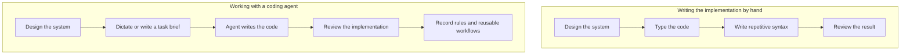

# The Conductor Pattern for High-Bandwidth Engineering

> [!IMPORTANT]
> **From typist to conductor.** When you describe a task by voice or in a short, detailed brief and let a coding agent handle the repetitive implementation, your job changes. You spend less time entering syntax and more time deciding how the system should work, reviewing what the agent built, and recording the standards it must follow next time. The rules, skills, and checks in the repository then reflect how you think about engineering.

## The main ideas

1. **Typing can limit the pace of implementation.** An experienced engineer can often describe an architecture, its failure modes, and its data contracts faster than they can type all the code. Dictation at roughly 150–200 words per minute, compared with typing at roughly 40–60, makes it easier to put that thinking into a task brief. The agent handles the syntax and repetitive work.
2. **The repository teaches the agent your standards.** Conway's Law says that a system reflects how its builders communicate. For an engineer working with agents, repository rules, tests, and reusable workflows are part of that communication. Loose prompts invite inconsistent implementations; explicit constraints and checks help keep them aligned.
3. **Reviewing a concrete result is often easier than specifying everything in advance.** Starting with an empty document and trying to cover every edge case can stall the work. Looking at an implementation makes an unindexed query, a missing timeout, or a poor abstraction much easier to point out. The original comparison of $O(N)$ generation with $O(1)$ recognition describes that difference in effort, not a literal complexity guarantee.
4. **Do not let a useful correction stay in your head.** When an agent violates a boundary, fixing that one diff by hand leaves the reason for the mistake unstated. Turn the correction into a repository rule, a reusable skill, or an automated check, and have the agent apply it.
5. **Review the first example closely; reuse the proven workflow.** The first implementation of a pattern deserves a line-by-line review. Once the approach is captured in a skill and checked by tests, later instances can be delegated with more attention on the checks and a focused diff review.

## 1. What changes when typing stops being the bottleneck

For years, writing software has meant translating a design into code through a keyboard. Typing also imposed a useful cost: if an abstraction took a lot of effort to implement, you might think twice before adding it. At the same time, it could delay a useful experiment. You could spend an afternoon writing DTOs, serializers, database mappings, and test setup for three cooperating services or an event-driven pipeline before learning whether the basic design works.

Speech-to-text tools, whether local or cloud-based, let you speak a technical brief at roughly 150–200 words per minute. A coding agent can work with conversational phrasing, technical terms, and corrections made mid-sentence. In a couple of minutes, you can lay out the domain constraints, error handling, edge cases, and things the implementation should deliberately leave out.

That frees attention for the decisions that matter: where a transaction begins and ends, whether a consumer is idempotent, what happens during a split-brain failure, and how data moves through the system. Braces and imports still have to be correct, but they no longer have to occupy most of your time.

## 2. Put your engineering standards where the agent can use them

Conway's Law describes how software tends to reflect the communication structure of the people building it. In this setup, the communication between you and the agent also leaves a mark on the code. If instructions live only in scattered chats, one task may follow a boundary that the next task ignores. If they live in the repository and are backed by checks, the agent can use the same standards on each task.

The division of work is straightforward:

| Part | Responsibility |
| :--- | :--- |
| Engineer | Decide the system design, domain rules, and trade-offs. |
| Repository rules in `.agents/rules/` | State boundaries the implementation must respect. |
| Reusable workflows in `.agents/skills/` | Capture the steps that worked for a repeatable task. |
| Linters and tests | Check the boundaries and expected behavior. |
| Coding agent | Implement within those boundaries, run the checks, and fix failures. |

The repository setup is your technical standard expressed in a form the agent can follow and, where possible, the tools can verify. A rule explains an expectation; a linter or test can catch a violation before the change reaches a reviewer. Without that shared reference, the quality of each result depends too heavily on what happened to be said in the latest prompt.

## 3. Start with a working slice, then review it

Trying to write a flawless prompt that anticipates every dependency and state transition is exhausting. You have to hold the whole implementation in your head before there is anything concrete to examine. That is where specification can stall.

A working prototype or a diff changes the task. You can see a missing database index, a network call without a timeout, an unnecessary dependency, or a class hierarchy that makes a simple change harder. Recognizing one of those problems in code can be quicker than predicting it from a blank page. That is the practical point behind the original $O(N)$ versus $O(1)$ analogy.

Give the agent a bounded brief and ask for one end-to-end slice. Review the diff against the conventions and operational risks you already know. Then ask the agent to fix the specific problems you find. When a correction expresses a rule you will need again, put it in the repository. This lets a concrete implementation drive precise feedback without requiring a perfect specification up front.

## 4. Make corrections reusable

Suppose the agent writes to the database context directly instead of going through your domain service. Or it adds a large dependency for something the standard library already handles. You could open the file, make the five-second edit, and move on. The immediate diff would improve, but the agent would have no explicit instruction to avoid the same choice next time.

When that happens, first ask why the agent chose that path. Was the boundary missing from its instructions? Was it documented only in a wiki the agent did not see? Then record the missing constraint in the form that fits it:

1. **A repeatable rule:** Add it to `.agents/rules/`, for example: `Never import infrastructure adapters directly into domain entities`.
2. **A sequence of steps:** Put the proven workflow in `.agents/skills/`.
3. **A structural boundary:** Add a linter, architecture test such as ArchUnit or TS-Arch, or a pre-commit check.

Point the agent to that new constraint and have it correct its own diff. Run the relevant checks. The goal is to turn an observed mistake into guidance or a check that applies beyond the current task. A rule can still need enforcement and maintenance; recording it alone does not guarantee that no future agent will repeat the mistake.

## 5. Review the first implementation closely, then reuse the pattern

There are two different kinds of work here. The first instance establishes a precedent; later instances can follow it.

For a new Outbox consumer, a distributed tracing interceptor, or a zero-downtime migration, read every line of the generated diff. Question the abstractions, error paths, and allocations. Iterate until the code meets your standard. Then save the steps as a skill and the boundaries as rules, with checks for the behavior that can be checked automatically.

Now imagine adding consumers for 20 more events, wiring 15 CRUD endpoints, or rolling out 30 integration test suites. Give the agent the verified workflow. Let the compiler, static analysis, and integration tests catch routine errors. You can spend less time reading repeated boilerplate and more time on a quick review of the PR diff and the results of those checks before merging. That approach depends on the first example and its verification being sound.

## 6. Agree on shared rules when several engineers use agents

With one engineer, repository instructions can grow out of personal working habits. In a shared monorepo, that becomes a problem. If one engineer asks for functional patterns and another asks for object-oriented domain models, agents may keep rewriting the same areas to match whichever preference was expressed most recently.

Separate the setup into three levels:

| Level | Location | What belongs there |
| :--- | :--- | :--- |
| Shared repository standards | `.agents/rules/` and verification checks | Agreed architectural boundaries, structural limits, and deterministic tests. |
| Shared skills | `.agents/skills/` | Task workflows that the team has tried and wants to reuse. |
| Personal preferences | Local, gitignored configuration | Dictation or written briefs, editor bindings, review layout, verbosity, and confirmation settings. |

### Shared standards need team review

Keep personal style preferences out of repository rules. Use those rules for boundaries the team has agreed to enforce. It can be especially useful to state what the code must never do: no raw SQL outside the repository layer, no dynamic allocations in a packet-processing loop. You can also specify file-size limits, layer boundaries, and test gates without dictating every syntax choice.

A change to these rules changes how future work gets written, so review it through a pull request with the same care you would give a schema migration or a breaking API change.

### Share workflows that have already worked

If an engineer spends half a day working out a dependable way to scaffold a service or run an end-to-end performance profile, keep that sequence in `.agents/skills/`. Teammates can then use the same steps for matching work instead of rebuilding the workflow in private.

### Keep the input method personal

One engineer may dictate short voice memos; another may prefer detailed Markdown specifications. Local, ignored settings such as `.agents/user.local.md` or editor configuration can hold those choices, along with verbosity and confirmation preferences. Both engineers can still work against the same shared rules and skills.

The repository structure also matters. Organize code into clear vertical slices and bounded modules that match team ownership. When domains are decoupled, several engineers can send agents into the same monorepo with fewer merge conflicts, changes to sibling dependencies, and unintended shared-state effects.

## 7. You can direct the architecture without knowing every language detail

Working with a coding agent does not require memorizing every compiler flag, language feature, or third-party API. The agent can write language-specific syntax, satisfy type requirements, and carry out routine refactors. You still need to decide the system boundaries, evaluate the trade-offs, and check the result against something more reliable than either person's memory.

Your part of the work includes deciding who owns each component and how components communicate; assessing data structures, caching, and allocation limits; supplying expected outputs and test vectors; and defining the checks that guard the architecture. The agent can turn those decisions into implementation code, tests, and documentation, then run the checks and repair failures.

### Define boundaries and ask what happens under load or failure

Give the agent narrow, versioned contracts between services instead of letting components import each other's internals. Keep modules independent enough to avoid circular dependencies. State memory and concurrency requirements explicitly: where thread safety is required, where races can arise, and whether a channel must be bounded.

You do not have to dictate each line to challenge a proposed design. Ask why it uses dynamic dispatch when a static dispatch table could remove runtime overhead and simplify the call stack. Ask what happens to a worker pool if Redis calls block for 500 ms, including backpressure and dropped work. Ask how the system recovers if a transaction fails halfway through a disk write. These questions expose assumptions the initial code may have left unanswered.

### Anchor unfamiliar code in observable results

If the language or framework is unfamiliar, do not try to validate it from memory. Give the agent test vectors, expected binary output, or example JSON payloads. Run integration tests against real databases and mock servers. Use benchmarks to catch latency spikes or excessive allocations. Those results give both you and the agent something concrete to compare with the design.

When the agent misses a type check, uses a deprecated API, or fails a build, let it fix the immediate code. Also ask whether a repository rule or verification check was missing. A linter can catch an unhandled error; an integration test can check backward compatibility of a schema. Strengthening the check makes the next run easier to assess. It does not mean that every isolated compiler error needs a new rule.

## Relationship to the Knowledge Graph

- **[[The Minimal Frame Pattern - Proving System Topology on Atomic Slices]]**: Check system boundaries on a small working slice before repeating the pattern.
- **[[Active Backlog Pruning and Context Hygiene in Agentic Roadmaps]]**: Remove completed work from the active roadmap so it does not crowd the agent's context.
- **[[The Living Engineering Chronicle and Context Compaction]]**: Keep architectural decisions available across long-running work.
- **[[Executable Architecture Tests for Coding Agent Guardrails]]**: Enforce architectural boundaries with tests.
- **[[AI Changes the Role and Training of Software Engineers]]**: Explore the move from writing each line to directing and reviewing the work.
- **[[Multi-Agent Software Development]]**: Coordinate agents and engineers working at the same time.
- **[[Software Decay and the Hidden Costs of Frictionless AI Code]]**: Examine code growth when generation is easy and architectural constraints are weak.
- **[[Agentic Coding Harness and Controlled Development Workflows]]**: Set up repository rules, boundaries, and test loops.
- **[[Learning Coding Agents Through Failure-Driven Instructions]]**: Turn corrections into instructions the agent can use again.
- **[[How AI Changes Prototyping and the Path from PoC to Production]]**: Use small end-to-end experiments before standardizing an implementation.
- **[[Developer Satisfaction, Identity, and Burnout in the Age of Coding Agents]]**: Consider the personal effect of moving from repetitive coding to architectural direction.
