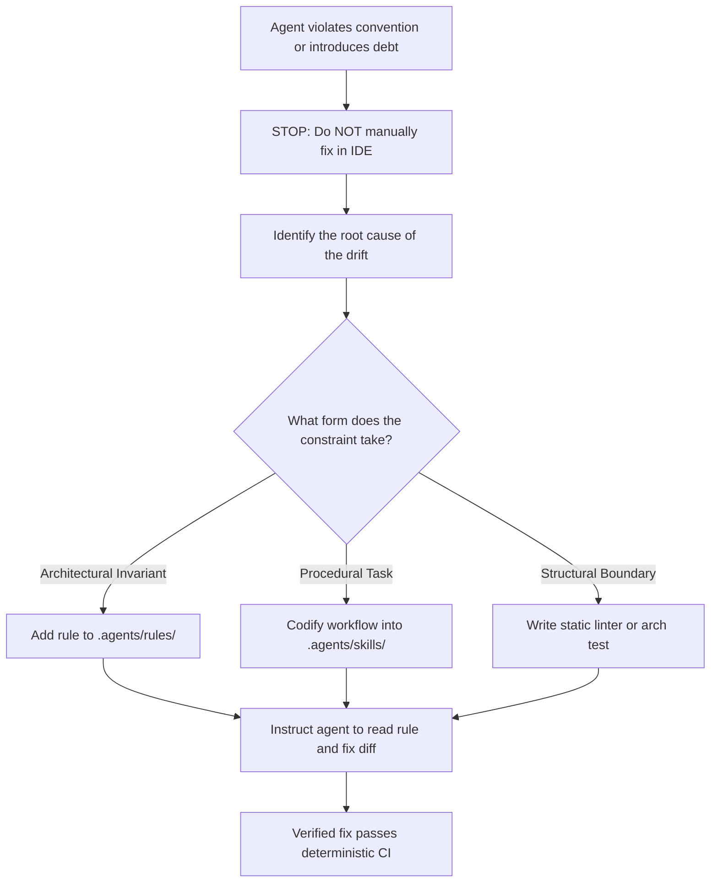

# The Conductor Pattern for High-Bandwidth Engineering

> [!IMPORTANT]
> **The Ergonomic Shift**: For decades, software engineering was gated by physical typing speed (40–60 words per minute) and the manual tax of writing boilerplate syntax. When you switch to high-bandwidth voice dictation or structured task briefs (150–200 words per minute) and offload mechanical implementation to coding agents, your operational role changes completely. You stop being **The Typist** and become **The Conductor**. In this setup, Conway's Law becomes personal: your repository harness directly mirrors your mental model, your discipline, and your technical standards.

```mermaid
flowchart TD
    subgraph TraditionalTypist["The Typist Mindset (Traditional 40–60 WPM Bottleneck)"]
        T1["System Design & Intent"] --> T2["Manual Keyboard Input (40–60 WPM)"]
        T2 --> T3["Boilerplate & Syntax Fatigue"]
        T3 --> T4["Slower Iteration Cycles"]
    end

    subgraph ModernConductor["The Conductor Mindset (High-Bandwidth 150–200 WPM)"]
        C1["High-Level System Design"] --> C2["Voice Dictation & Fast Task Briefs"]
        C2 --> C3["Coding Agent Execution"]
        C3 --> C4["Fast Architecture Review (O(1) Inspection)"]
        C4 --> C5["Codifying Standards into Rules & Skills"]
    end
```



---

## Executive Summary & Core Principles

1. **Breaking the Typing Bottleneck**: Experienced engineers reason through topologies, failure modes, and data contracts far faster than their fingers can hit keys. Typing at 40–60 WPM is an artificial throttle on system throughput. Using high-bandwidth inputs—like dictation engines or dense structured briefs—pushes your input bandwidth closer to raw thought speed (150–200 WPM), letting you focus on architecture rather than syntax assembly.
2. **Conway's Law in Human-AI Pairing**: Conway's Law states that system designs mirror the communication structures of the teams that build them. When working with agents, the repository harness is that communication channel. A loose pile of ad-hoc chat prompts produces an unmaintainable, fragmented codebase. Conversely, a disciplined harness with deterministic test suites, strict lint gates, and explicit repository rules produces rock-solid, uniform systems.
3. **The Asymmetry of Recognition vs. Generation ($O(1)$ vs. $O(N)$)**: Writing an exhaustive, zero-defect specification from an empty text file is cognitively brutal ($O(N)$ effort) and usually leads to specification paralysis. In contrast, running your eyes over a concrete implementation diff to spot an unindexed database query, a leaky abstraction, or a missing timeout is fast and instinctive ($O(1)$ visual inspection).
4. **Immediate Friction Codification (The Zero Silent Fixes Rule)**: When an agent produces code that violates an architectural boundary or introduces subtle debt, never just patch it manually in your editor and move on. If you fix it by hand, the agent will make the exact same mistake ten minutes later. Stop, capture that friction, and commit it as an explicit constraint in `.agents/rules/` or as a reusable skill.
5. **The Assembly Line Transition**: Every novel pattern starts with an exploratory spike—a single tracer bullet where you scrutinize every single line the agent emits. Once the pattern is proven and locked down with automated verification, you codify it into a skill. From that moment forward, instances 2 through 50 run down an automated assembly line where your attention shifts from reading syntax to verifying green CI checks.

---

## 1. Overcoming the Keyboard Bottleneck

For nearly fifty years, software engineering has been physically tied to the QWERTY layout. That mechanical ceiling has quietly dictated how we approach software design:

* **Typing Friction as an Accidental Filter**: Historically, typing fatigue acted as an accidental brake against runaway code bloat. If an abstraction was annoying to write by hand, engineers thought twice before introducing it. But this physical tax also throttled architectural throughput. Designing three interacting microservices or a clean event-driven pipeline meant spending an entire afternoon writing DTOs, serialization logic, database mappers, and unit test boilerplate before ever testing the core premise.
* **The High-Bandwidth Voice Channel**: Modern local and cloud speech-to-text models process natural technical speech at 150–200 words per minute. Frontier LLMs easily handle conversational phrasing, jargon, and self-corrections on the fly. This allows you to dictate comprehensive system briefs—spelling out domain constraints, error-handling contracts, edge cases, and explicit non-goals—in under two minutes.
* **Shifting Focus from Syntax to System Invariants**: When you no longer spend cognitive energy on syntax, closing braces, and import statements, your mental bandwidth goes where it belongs: verifying transaction boundaries, ensuring idempotent consumers, handling split-brain edge cases, and designing clear data lifecycles.

---

## 2. Conway's Law in Human-AI Pairing: The Harness as an Extension of Standards

Melvin Conway pointed out in 1967 that systems inevitably mirror the communication structures of the organizations that design them. In modern agentic engineering, this law applies directly to the interface between you and your coding agents:

$$\text{System Quality} = f(\text{Architect Standards} \times \text{Harness Guardrails})$$

> [!TIP]
> **The Working Standards Principle**:  
> *"The repository harness reflects the discipline of the engineer driving it."*  
> If an architect works with rigorous engineering standards, those standards show up in the repository as version-controlled rules, deterministic verification gates, and structured runbooks. If the engineer relies on loose, conversational prompts, the codebase rapidly turns into an inconsistent mess of conflicting patterns.

```text
┌────────────────────────────────────────────────────────────────────────┐
│               THE HARNESS AS AN EXTENSION OF ARCHITECT INTENT          │
├────────────────────────────────────────────────────────────────────────┤
│ HUMAN ARCHITECT (The Conductor):                                       │
│ - System design, domain invariants, architectural trade-offs           │
│                                                                        │
│                      │                                                 │
│                      ▼ (Continuous Friction Codification)             │
│                                                                        │
│ IN-REPOSITORY HARNESS (.agents/):                                      │
│ ├── rules/               <-- Explicit non-negotiable standards         │
│ ├── skills/              <-- Proven multi-step execution workflows     │
│ └── linters / test gates <-- Deterministic verification checkpoints    │
│                                                                        │
│                      │                                                 │
│                      ▼ (Automated Execution)                           │
│                                                                        │
│ AUTONOMOUS AGENTS (The Implementation Engine):                         │
│ - Implements features within boundaries, runs tests, fixes errors     │
└────────────────────────────────────────────────────────────────────────┘
```

The repository harness—the `.agents/rules/` directory, multi-step skills, custom static linters, and integration test suites—is not administrative overhead. It is your **technical standard made machine-executable**. When your expectations are concrete, they belong in repository rules. When an agent drifts, the harness catches the regression immediately and forces the agent to resolve it before the code ever lands in front of a human.

---

## 3. Ergonomics of Review: Recognition vs. Generation Asymmetry

A common failure mode in agentic development is trying to write an all-encompassing, flawless prompt upfront that accounts for every edge case. This runs straight into the cognitive asymmetry between generating text and evaluating results:

| Dimension | Generative Mode ($O(N)$) | Recognition Mode ($O(1)$) |
| :--- | :--- | :--- |
| **Starting Context** | Blank prompt or an empty specification doc. | A concrete, running code diff or working prototype. |
| **Effort Required** | Exhaustive mental synthesis: tracking edge cases, state transitions, syntax, and dependencies simultaneously. | Instant visual pattern matching against production conventions and known operational hazards. |
| **Review Overhead** | High cognitive drag; leads to hesitation and specification paralysis. | Low friction; enables rapid, highly targeted feedback loops. |
| **Agent Synergy** | Throttles throughput at the prompt stage; treats the agent like an expensive typewriter. | Leverages the model's raw generation speed to surface a draft for human architectural critique. |

The Conductor pattern leans directly into this asymmetry:
1. **Fire a Tracer Bullet**: Hand the agent a bounded task brief and let it construct an initial end-to-end slice across the stack.
2. **Review the Diff**: Visually inspect the changes. You will instantly spot the subtle problems: an unnecessary dependency, missing database indexes, unhandled network timeouts, or an awkward class hierarchy.
3. **Course-Correct and Codify**: Push the agent to resolve those specific architectural misses, then immediately encode that feedback into the repository's rule base so the model never repeats the mistake.

---

## 4. Immediate Friction Codification: The Rule of Zero Silent Fixes

The dividing line between teams running robust agentic workflows and those constantly fighting model regressions comes down to how they handle mistakes:

> [!CAUTION]
> **The Anti-Pattern of Silent Manual Fixes**: An agent introduces a change that breaks a subtle convention—like bypassing your domain service layer to write directly to the database context, or introducing a heavy external library for something standard library covers. You open the file in your IDE, manually clean up the code, and keep moving.  
> **This is an operational failure.** The agent has no visibility into your private manual edit, which guarantees it will make the exact same mistake on the next task.

### The Codification Workflow
Every time an agent deviates from expectations or introduces technical debt, follow a strict codification loop:



1. **Do Not Touch the File Manually**: Resist the temptation to fix the syntax yourself, even if it takes five seconds.
2. **Diagnose the Missing Constraint**: Why did the agent take that path? Did the system prompt lack an explicit negative boundary? Was the domain boundary documented only in a wiki, completely hidden from the agent's context window?
3. **Commit the Constraint to the Harness**:
   - **For repeatable rules**: Have the agent append or update an entry in `.agents/rules/` (e.g., `"Never import infrastructure adapters directly into domain entities"`).
   - **For multi-step workflows**: Package the operational sequence into a deterministic skill in `.agents/skills/`.
   - **For structural limits**: Write a custom linter check, an architecture unit test (e.g., using ArchUnit or TS-Arch), or a pre-commit hook.
4. **Make the Agent Fix the Diff**: Point the agent to the newly codified constraint and demand it refactor its own code to comply. Once it passes, that friction point is permanently solved for every future task.

---

## 5. The Assembly Line Transition: High-Throughput Delegation

Software development under the Conductor Pattern operates in two distinct modes depending on how familiar the pattern is:

```text
Precedent Setting (Instance 1)               Assembly Line (Instances 2–50)
┌────────────────────────────────┐           ┌────────────────────────────────┐
│ Detailed Review: Read the Code │           │ High-Throughput Delegation     │
│ Scrutinize patterns and edges  │ ────────► │ Agent executes verified skill  │
│ Codify Skill & Test Gate       │           │ Human checks green CI gates    │
└────────────────────────────────┘           └────────────────────────────────┘
```

### Phase 1: Setting the Precedent (Read Every Line)
When you introduce a brand-new architectural component—such as building your first Outbox pattern consumer, wiring up a distributed tracing interceptor, or setting up a zero-downtime database migration strategy—you work in high-scrutiny mode:
- You read every single line of the generated diff.
- You interrogate every abstraction, error boundary, and memory allocation.
- You iterate until the implementation matches your exact standard.
- You lock the pattern down by saving the execution sequence as a **Skill** and the constraints as a **Rule**.

### Phase 2: The Assembly Line (Trust the Gates)
For instances 2 through 50 of that same pattern (adding event consumers for 20 other domain events, wiring up 15 CRUD endpoints, or rolling out 30 integration test suites):
- You dispatch the task using the verified skill.
- The agent follows the established blueprint.
- You stop reading every single line of mechanical boilerplate.
- Your verification shifts to automated checkpoints: compilers, static analysis passes, and green integration suites. You do a fast $O(1)$ sanity check on the PR diff, confirm the tests pass, and merge.

---

## 6. The Symphony Problem: Scaling to Multi-Operator Teams

When you work alone, the repository harness naturally mirrors your personal development habits. But once multiple senior engineers and tech leads start deploying agents against the same monorepo, chaos can erupt if there is no structure. Engineer A wants functional patterns; Engineer B prefers object-oriented domain models. Without clear boundaries, agents will endlessly refactor the codebase back and forth depending on who prompted them.

To scale agentic engineering across teams, you must split the harness into three distinct tiers:

```text
┌────────────────────────────────────────────────────────────────────────┐
│                   THE 3-TIER TEAM HARNESS ARCHITECTURE                 │
├────────────────────────────────────────────────────────────────────────┤
│ TIER 1: REPOSITORY STANDARDS (Shared / Version-Controlled)             │
│ .agents/rules/ (Agreed team architectural invariants & quality gates)   │
│ - Strict negative bounds (e.g., zero memory allocations in hot paths)  │
│ - Structural boundaries (file size limits, layering separation)        │
│ - Automated verification gates and deterministic test suites           │
│ ────────────────────────────────────────────────────────────────────── │
│ TIER 2: SHARED SKILLS CATALOG (Team Execution Playbooks)               │
│ .agents/skills/ (Standardized, repeatable task workflows)              │
│ - Patterns proven through initial exploratory passes                   │
│ - Shared across the team for consistent feature implementation         │
│ ────────────────────────────────────────────────────────────────────── │
│ TIER 3: PERSONAL OPERATOR PREFERENCES (Local Configuration)            │
│ Local, gitignored tool configurations                                  │
│ - Personal input workflows (voice dictation vs. written prompts)       │
│ - Preferred review layouts, plan verbosity, and confirmation modes     │
└────────────────────────────────────────────────────────────────────────┘
```

### 1. Tier 1: Repository Standards (Decoupling Invariants from Personal Habits)
Shared repository rules (`.agents/rules/`) must never become a dump for personal code styling preferences. They must be reserved for non-negotiable architectural boundaries:
- **Prioritize Negative Bounds**: Focus heavily on what code must *never* do (e.g., `"Do not execute raw SQL queries outside the repository layer"`, `"Do not perform dynamic allocations inside the packet processing loop"`). Negative bounds provide strict guardrails without micromanaging the agent's syntax choices.
- **Rules Require Code Review**: Changes to Tier 1 rules must go through standard pull request reviews, treated with the same architectural scrutiny as a schema migration or an API breaking change.

### 2. Tier 2: Shared Skills (Scaling Proven Solutions)
When an engineer spends half a day dialing in an airtight agentic workflow to scaffold a microservice or run an end-to-end performance profile, that effort should not remain trapped on their local machine. It should be committed to `.agents/skills/`. The entire engineering organization immediately inherits that capability, allowing any engineer to spin up matching, reliable implementations using the exact same workflow.

### 3. Tier 3: Personal Operator Preferences (Local Ergonomics)
Engineers must have complete autonomy over their local interaction loop:
- Dictation setups, agent verbosity settings, interactive confirmation prompts, and custom editor bindings belong strictly in local, gitignored user profiles (e.g., `.agents/user.local.md` or editor-specific configs).
- An engineer who prefers fast voice memos should not interfere with a teammate who prefers writing detailed Markdown specs. Both workflows converge onto the same Tier 1 rules and Tier 2 skills.

### 4. Conway's Law in Team Topologies
To prevent multi-operator collisions, repository structure must reflect team ownership. Organize codebases around **clean vertical slices and well-bounded modules**. When domain contexts are strictly decoupled, multiple engineers can unleash autonomous agents simultaneously without running into merge conflicts, breaking sibling dependencies, or polluting shared state.

---

## 7. The Non-Omniscient Conductor: Architectural Leverage Without Language Omniscience

A common misconception is that directing coding agents requires you to be an encyclopedic master of every language standard, compiler flag, and low-level API.

In real-world engineering, the dynamic is very different:

> [!IMPORTANT]
> **Decoupling Architecture from Syntax**: Coding agents **completely decouple system design and domain architecture from the mental burden of memorizing syntax trivia and third-party APIs**. You do not need ten years of day-to-day experience in a specific language to guide the construction of high-performance, maintainable software. Your true leverage comes from **enforcing component boundaries, validating trade-offs, and building airtight verification harnesses**.

```text
┌────────────────────────────────────────────────────────────────────────┐
│                   THE ARCHITECTURAL DIVISION OF LABOR                  │
├────────────────────────────────────────────────────────────────────────┤
│ HUMAN CONDUCTOR (System Architect & Reviewer):                         │
│ - Defines component boundaries, ownership models, and topology.        │
│ - Evaluates trade-offs: data structures, caching, allocation limits.   │
│ - Provides golden reference data and expected test vectors.            │
│ - Builds the verification harness and automated architecture rules.    │
│ - Minimizes manual code edits in favor of harness improvements.        │
│                                                                        │
│                      │                                                 │
│                      ▼ (Natural Language Guidance & Iteration)         │
│                                                                        │
│ AUTONOMOUS AGENT (Implementation Engine):                              │
│ - Generates implementation code, unit tests, and documentation.        │
│ - Handles language-specific syntax, types, and compiler requirements.  │
│ - Converts test cases and decision tables into test suites.            │
│ - Executes routine refactorings across sibling components.             │
└────────────────────────────────────────────────────────────────────────┘
```

### The Three Pillars of High-Level Orchestration

1. **System Boundaries and Topology**:
   You anchor the agent to fundamental software engineering principles rather than library syntax:
   - Defining strict component boundaries so services communicate through narrow, versioned contracts rather than sprawling internal imports.
   - Enforcing decoupled module layouts that prevent circular dependencies.
   - Demanding strict memory and concurrency guarantees (e.g., declaring thread safety boundaries, preventing race conditions, or enforcing bounded channels).

2. **The Architect as a Sparring Partner**:
   Instead of spoon-feeding the agent line-by-line instructions, you challenge its technical proposals with targeted architectural critiques:
   - *"Why are you using a dynamic dispatch pattern here when a static dispatch table eliminates runtime overhead and simplifies the call stack?"*
   - *"What happens to this worker pool if downstream Redis operations suddenly block for 500ms? Show me the backpressure and drop behavior."*
   - *"Walk me through the recovery path if this transaction fails halfway through writing to disk."*  
   These targeted questions immediately expose fragile assumptions, forcing the agent to implement robust failure handling and defensible designs.

3. **Anchoring to External Reference Truth**:
   When you guide an agent through an unfamiliar language or framework, you do not rely on your own memory for syntax validation. You anchor the agent to **external, unyielding verification**:
   - Provide concrete test vectors, expected binary outputs, or sample JSON payloads representing ground truth.
   - Build integration tests that exercise the code against real databases and mock servers.
   - Run automated benchmarks to detect latency spikes or excessive heap allocations.

### Fix the Harness, Never the Symptom
Every time an agent fails a build, misses a type check, or uses a deprecated API, resist the urge to jump in and write the code yourself. A manual edit fixes one line once; an update to your verification harness fixes that problem across the entire codebase forever.

Ask yourself what verification check was missing: Did the linter fail to catch an unhandled error? Was there no integration test verifying schema backwards compatibility? Add the missing test assertion or repository rule, hit rerun, and let the agent fix its own code. Over time, this discipline builds an exceptionally resilient codebase that gets easier to maintain with every commit.

---

## Relationship to the Knowledge Graph

- **[[The Minimal Frame Pattern - Proving System Topology on Atomic Slices]]**: Validating system boundaries on atomic operational slices before scaling out under conductor direction.
- **[[Active Backlog Pruning and Context Hygiene in Agentic Roadmaps]]**: Preventing context window saturation by systematically pruning completed tasks from active agent roadmaps.
- **[[The Living Engineering Chronicle and Context Compaction]]**: How the conductor maintains persistent architectural memory across long running engineering campaigns.
- **[[Executable Architecture Tests for Coding Agent Guardrails]]**: The programmatic test harness that enforces non-negotiable architectural boundaries and structural standards.
- **[[AI Changes the Role and Training of Software Engineers]]**: The industry-wide transition from code typist to architectural conductor.
- **[[Multi-Agent Software Development]]**: Coordinating multi-operator teams and agent topologies within structured execution harnesses.
- **[[Software Decay and the Hidden Costs of Frictionless AI Code]]**: The operational mechanics of why unconstrained agent generation leads to code bloat unless tightly bounded by architectural rules.
- **[[Agentic Coding Harness and Controlled Development Workflows]]**: The physical implementation of in-repo rules, negative bounds, and automated test loops directed by the conductor.
- **[[Learning Coding Agents Through Failure-Driven Instructions]]**: The practical loop of immediate friction codification, converting transient agent failures into permanent repository rules.
- **[[How AI Changes Prototyping and the Path from PoC to Production]]**: Running fast tracer bullets to de-risk architecture before hardening patterns for production assembly lines.
- **[[Developer Satisfaction, Identity, and Burnout in the Age of Coding Agents]]**: The psychological shift that occurs when developers stop grinding out boilerplate and move entirely to high-leverage architectural orchestration.
