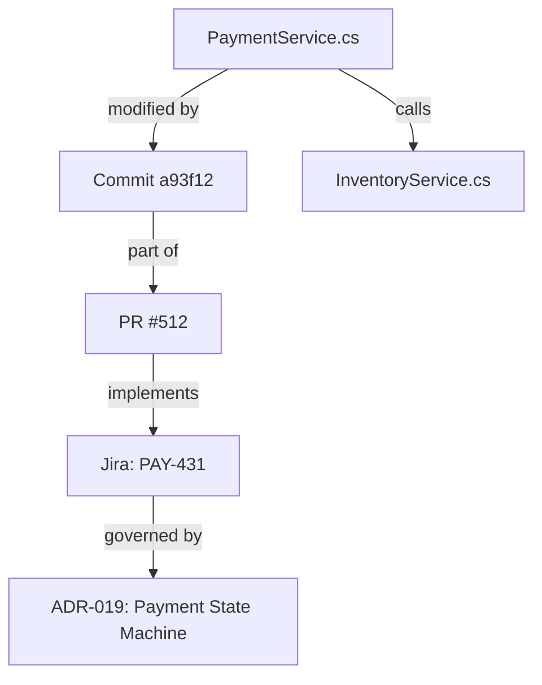

# Advanced RAG Architectures

This note explores modern architectural paradigms for Retrieval-Augmented Generation, ranging from Agentic RAG and Graph RAG to local deployment stacks and permission-aware enterprise security.

It builds upon [[RAG Ingestion and Chunking Strategies]] and [[RAG Retrieval and Search]], serving as an advanced architectural reference for [[Introduction to RAG]].

---

## 1. Main Classes of RAG Systems

RAG architectures have evolved across four distinct generations:

```text
1. Naive RAG:
   Documents ──> Chunks ──> Embeddings ──> Vector DB ──> Prompt Context ──> LLM

2. Hybrid RAG:
   Query ──> [Dense Vector + Sparse BM25 + Filters] ──> RRF Fusion ──> Reranker ──> LLM

3. Agentic RAG:
   Agent Loop ──(Query Formulation)──> Tool / Retriever ──(Analyze Results)──> Next Step ──> Synthesis

4. Graph RAG:
   Knowledge Graph (Nodes & Typed Edges) + Vector Index ──> Subgraph Extraction & Path Reasoning ──> LLM
```

### Agentic RAG
In Agentic RAG, retrieval is not a single shot, but an iterative investigation guided by an autonomous agent loop:
```text
1. Analyze user request
2. Search codebase for target service ("PaymentProcessor")
3. Find suspicious commit SHA in git blame
4. Retrieve corresponding Jira ticket via ID
5. Read linked Architectural Decision Record (ADR)
6. Cross-reference unit tests
7. Synthesize complete root-cause answer
```
The agent controls query formulation, evaluates whether retrieved context is sufficient, and backtracks or issues follow-up queries dynamically.

### Graph RAG
Software engineering knowledge forms an interconnected natural graph rather than isolated text snippets:



Graph RAG combines structured knowledge graphs (e.g. Neo4j) with vector embeddings, allowing models to traverse explicit dependencies (`calls`, `implements`, `authored_by`, `breaks`) before generating answers.

---

## 2. RAG as a Project Knowledge Layer

For software engineering teams, RAG is moving beyond simple document question-answering into a unified **Project Knowledge Layer**:

```text
                          Autonomous Agent
                                 │
                          Context Planner
                                 │
         ┌───────────────────────┼───────────────────────┐
         │                       │                       │
   Hybrid Search           Graph Traversal         MCP / Live Tools
  (Code & Docs)         (Dependencies & Git)     (Current State & CLI)
         │                       │                       │
         └───────────────────────┼───────────────────────┘
                                 ↓
                    Project Knowledge Substrate
```

This substrate allows agents to answer high-level architectural queries:
- *Why was this abstraction introduced rather than a direct database call?*
- *Which Jira tickets and pull requests influenced this service contract?*
- *Are current runtime configurations consistent with the architectural specs?*

---

## 3. Example Local RAG Stack

For enterprise environments with strict confidentiality, the entire RAG pipeline can be deployed on-premises:

```text
Document / Code Sources
          ↓
  Docling (Layout Parser)
          ↓
  Chunking & Metadata Pipeline
          ↓
  SentenceTransformers (Local Embeddings)
          ↓
  Qdrant / pgvector (Vector & Hybrid Store)
          ↓
  Haystack / LlamaIndex (Pipeline Orchestrator)
          ↓
  Ollama / vLLM (Local LLM Inference)
```

### Component Landscape
- **Parsing:** Docling, Unstructured, Apache Tika
- **Vector & Hybrid Stores:** Qdrant, OpenSearch, Weaviate, Milvus, pgvector
- **Orchestration:** Haystack, LlamaIndex, LangChain
- **Graph Backends:** Neo4j, GraphRAG, Memgraph
- **Local Model Serving:** Ollama, vLLM, LocalAI

---

## 4. Security: Permission-Aware Retrieval

A production RAG system cannot simply expose all indexed enterprise chunks to every user or agent prompt.

Knowledge bases frequently index sensitive data across boundaries:
- Source code repositories (internal vs. public)
- Executive strategy documents
- Human Resources & compensation records
- Customer financial data

```text
User / Agent Query
        ↓
    Retriever
        ↓
[ Permission Filter ] ──(Validates ACLs against user identity)
        ↓
Filtered Safe Context Chunks
        ↓
       LLM
```

### Critical Security Requirements
1. **Document- and Chunk-Level ACLs:** Chunks must inherit access lists from original source systems (e.g. GitHub teams, Jira project permissions, SharePoint groups).
2. **Post-Retrieval Truncation vs. Pre-Filtering:** Filter candidates by tenant and permission group *prior* to vector ranking to prevent leakage through side-channel search results.
3. **Audit Logging:** Every retrieved chunk passed to an agent must be logged with user and tenant correlation IDs.

Related foundational overview: [[Introduction to RAG]].
